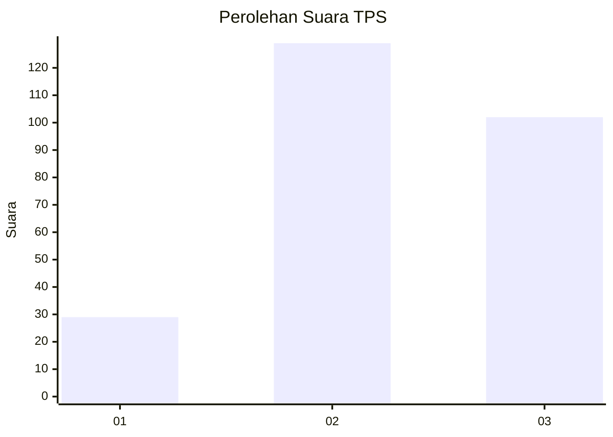
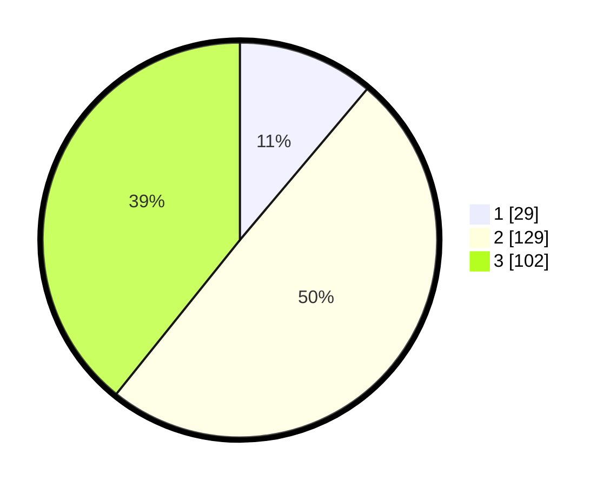

# Hasil

## Grafik

## Tabel

| No. | Nama Paslon    | Suara | Suara (raw) | Persentase |
|:--- |:-------------- | -----:| -----------:| ----------:|
| 1   | ANIES MUHAIMIN | 29    | [29][p-1]   | 11,15      |
| 2   | PRABOWO GIBRAN | 129   | [129][p-2]  | 49,62      |
| 3   | GANJAR MAHFUD  | 102   | [102][p-3]  | 39,23      |

[p-1]: https://github.com/gigit-pemilu/pemilu-2024-34-di-yogyakarta/blob/main/pilpres/hitung-suara/sub/34-di-yogyakarta/sub/04-sleman/sub/02-godean/sub/2005-sidokarto/sub/004-tps/sub/paslon-1.txt
[p-2]: https://github.com/gigit-pemilu/pemilu-2024-34-di-yogyakarta/blob/main/pilpres/hitung-suara/sub/34-di-yogyakarta/sub/04-sleman/sub/02-godean/sub/2005-sidokarto/sub/004-tps/sub/paslon-2.txt
[p-3]: https://github.com/gigit-pemilu/pemilu-2024-34-di-yogyakarta/blob/main/pilpres/hitung-suara/sub/34-di-yogyakarta/sub/04-sleman/sub/02-godean/sub/2005-sidokarto/sub/004-tps/sub/paslon-3.txt

## Foto C Plano

https://sirekap-obj-formc.kpu.go.id/4d75/pemilu/ppwp/34/04/02/20/05/3404022005004-20240215-004328--5a33cba4-c6ec-481f-a313-0a552d293636.jpg

https://sirekap-obj-formc.kpu.go.id/4d75/pemilu/ppwp/34/04/02/20/05/3404022005004-20240215-004526--16b6e03f-4f37-47ac-b0c5-a15b8c3ae778.jpg

https://sirekap-obj-formc.kpu.go.id/4d75/pemilu/ppwp/34/04/02/20/05/3404022005004-20240215-004628--64b59550-fcaf-4e4c-8b39-4f290fd87abc.jpg

## Metadata

| Key        | Value               |
| ---------- | ------------------- |
| Time Stamp | 2024-02-24 22:31:28 |

