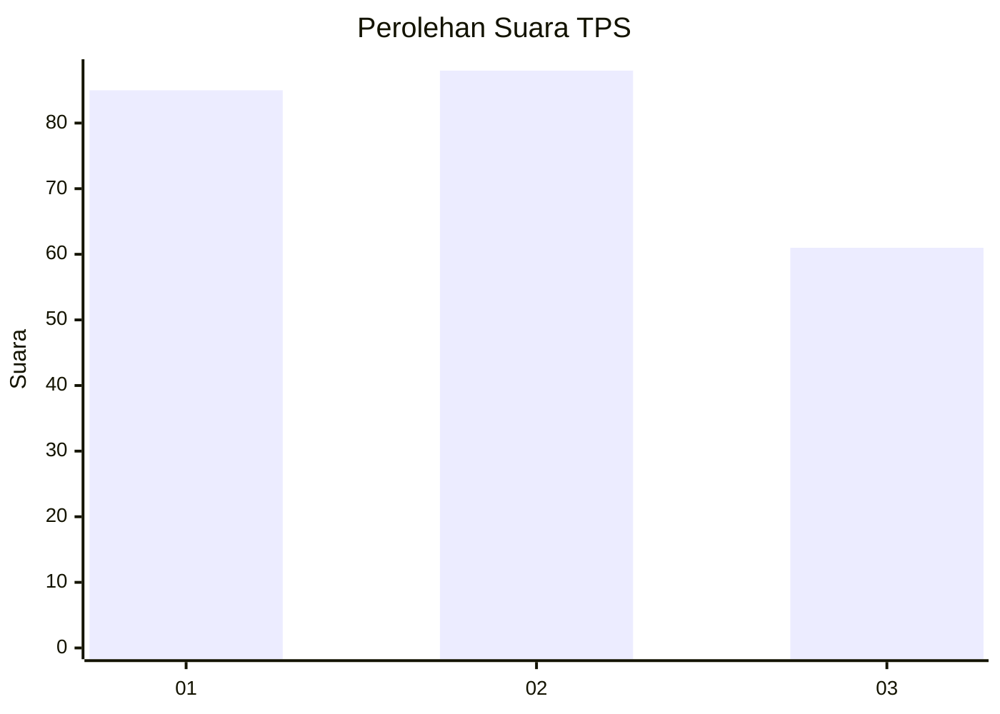
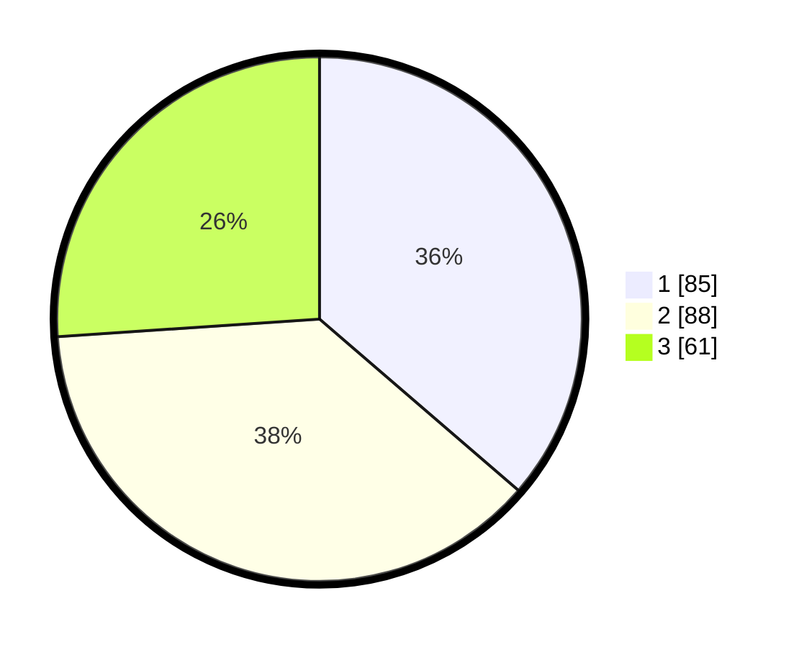

# Hasil

## Grafik

## Tabel

| No. | Nama Paslon    | Suara | Suara (raw) | Persentase |
|:--- |:-------------- | -----:| -----------:| ----------:|
| 1   | ANIES MUHAIMIN | 85    | [85][p-1]   | 36,32      |
| 2   | PRABOWO GIBRAN | 88    | [88][p-2]   | 37,61      |
| 3   | GANJAR MAHFUD  | 61    | [61][p-3]   | 26,07      |

[p-1]: https://github.com/gigit-pemilu/pemilu-2024-34-di-yogyakarta/blob/main/pilpres/hitung-suara/sub/34-di-yogyakarta/sub/04-sleman/sub/02-godean/sub/2005-sidokarto/sub/007-tps/sub/paslon-1.txt
[p-2]: https://github.com/gigit-pemilu/pemilu-2024-34-di-yogyakarta/blob/main/pilpres/hitung-suara/sub/34-di-yogyakarta/sub/04-sleman/sub/02-godean/sub/2005-sidokarto/sub/007-tps/sub/paslon-2.txt
[p-3]: https://github.com/gigit-pemilu/pemilu-2024-34-di-yogyakarta/blob/main/pilpres/hitung-suara/sub/34-di-yogyakarta/sub/04-sleman/sub/02-godean/sub/2005-sidokarto/sub/007-tps/sub/paslon-3.txt

## Foto C Plano

https://sirekap-obj-formc.kpu.go.id/b0a5/pemilu/ppwp/34/04/02/20/05/3404022005007-20240214-193506--f1352686-d03c-4874-8169-bd37673b2544.jpg

https://sirekap-obj-formc.kpu.go.id/b0a5/pemilu/ppwp/34/04/02/20/05/3404022005007-20240214-193626--c4451cde-9a04-4fde-8f2b-c654afc2f067.jpg

https://sirekap-obj-formc.kpu.go.id/b0a5/pemilu/ppwp/34/04/02/20/05/3404022005007-20240214-193738--e6e86f1f-15d4-4183-bf1f-86b2d222da47.jpg

## Metadata

| Key        | Value               |
| ---------- | ------------------- |
| Time Stamp | 2024-02-25 15:00:00 |

