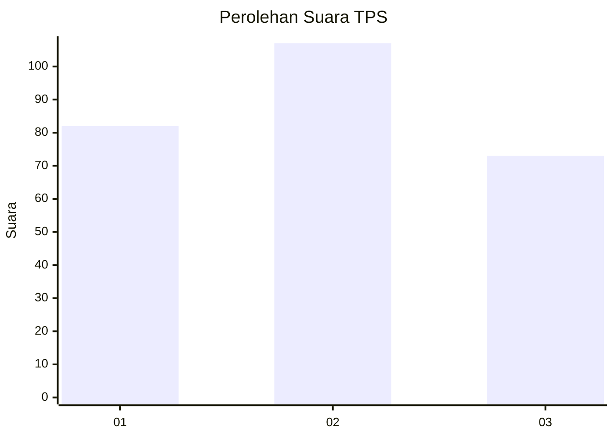
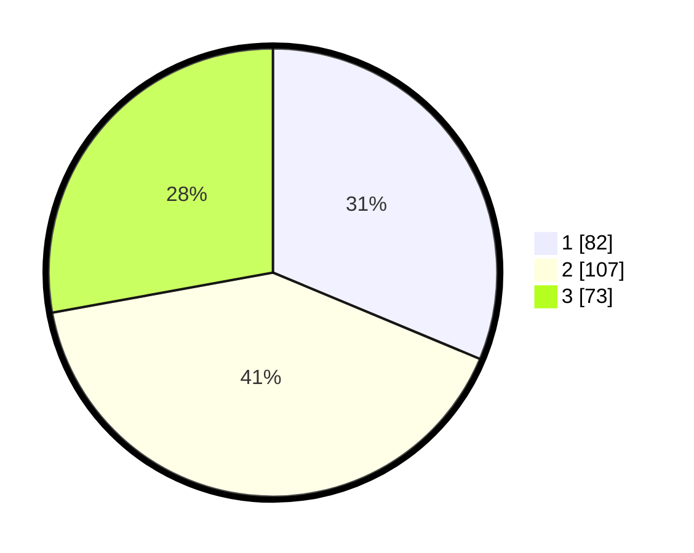

# Hasil

## Grafik

## Tabel

| No. | Nama Paslon    | Suara | Suara (raw) | Persentase |
|:--- |:-------------- | -----:| -----------:| ----------:|
| 1   | ANIES MUHAIMIN | 82    | [82][p-1]   | 31,30      |
| 2   | PRABOWO GIBRAN | 107   | [107][p-2]  | 40,84      |
| 3   | GANJAR MAHFUD  | 73    | [73][p-3]   | 27,86      |

[p-1]: https://github.com/gigit-pemilu/pemilu-2024-34-di-yogyakarta/blob/main/pilpres/hitung-suara/sub/34-di-yogyakarta/sub/04-sleman/sub/02-godean/sub/2005-sidokarto/sub/008-tps/sub/paslon-1.txt
[p-2]: https://github.com/gigit-pemilu/pemilu-2024-34-di-yogyakarta/blob/main/pilpres/hitung-suara/sub/34-di-yogyakarta/sub/04-sleman/sub/02-godean/sub/2005-sidokarto/sub/008-tps/sub/paslon-2.txt
[p-3]: https://github.com/gigit-pemilu/pemilu-2024-34-di-yogyakarta/blob/main/pilpres/hitung-suara/sub/34-di-yogyakarta/sub/04-sleman/sub/02-godean/sub/2005-sidokarto/sub/008-tps/sub/paslon-3.txt

## Foto C Plano

https://sirekap-obj-formc.kpu.go.id/ec5b/pemilu/ppwp/34/04/02/20/05/3404022005008-20240214-191720--48949c3e-8d56-4e4d-85b3-0385ffa1ef16.jpg

https://sirekap-obj-formc.kpu.go.id/ec5b/pemilu/ppwp/34/04/02/20/05/3404022005008-20240214-191727--1000f401-2b03-44a9-b97d-fa152dcd07d1.jpg

https://sirekap-obj-formc.kpu.go.id/ec5b/pemilu/ppwp/34/04/02/20/05/3404022005008-20240214-191732--0411ea83-a4a2-4109-956c-378288e0f9da.jpg

## Metadata

| Key        | Value               |
| ---------- | ------------------- |
| Time Stamp | 2024-02-15 00:41:44 |

## DATA PEMILIH TETAP

Jumlah pemilih dalam DPT: **267**.
 * L: **125**.
 * P: **142**.

## DATA PENGGUNA HAK PILIH

Jumlah pengguna hak pilih dalam DPT: **249**.
 * L: **118**.
 * P: **131**.

Jumlah pengguna hak pilih dalam DPTb: **3**.
 * L: **1**.
 * P: **2**.

Jumlah pengguna hak pilih dalam DPK: **14**.
 * L: **6**.
 * P: **8**.

Jumlah pengguna hak pilih: **266**.
 * L: **125**.
 * P: **141**.

## JUMLAH SUARA SAH DAN TIDAK SAH

JUMLAH SELURUH SUARA SAH: **262**.

JUMLAH SUARA TIDAK SAH: **4**.

JUMLAH SELURUH SUARA SAH DAN SUARA TIDAK SAH: **266**.

