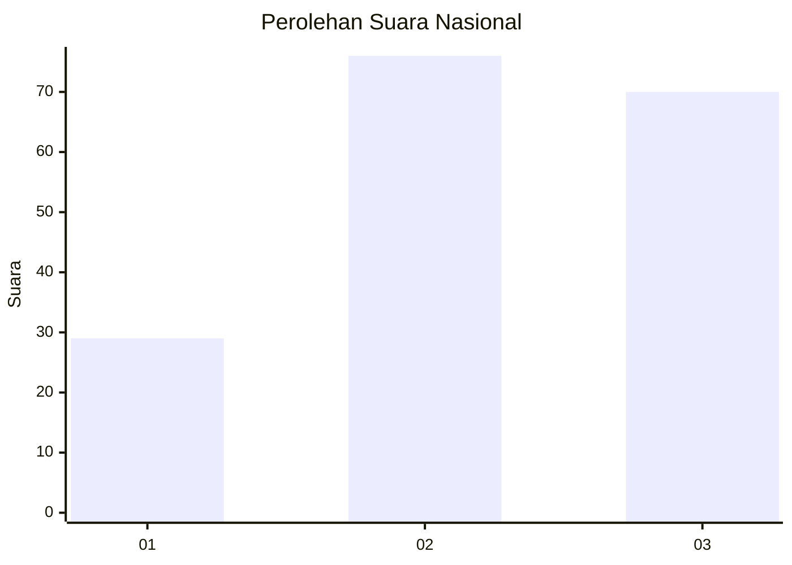
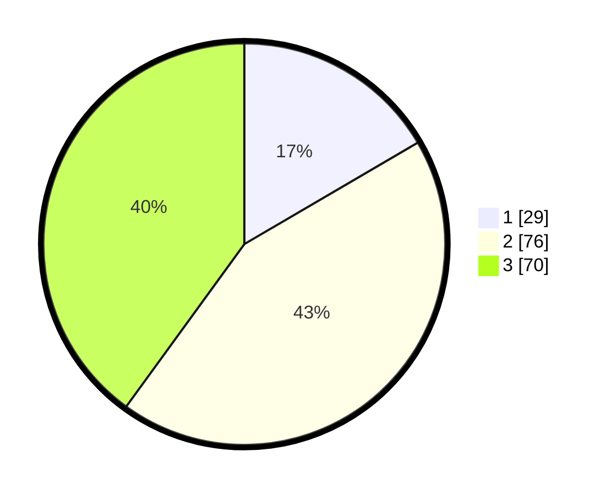

# Hasil

## Grafik

## Tabel

| No. | Nama Paslon    | Suara | Suara (raw) | Persentase |
|:--- |:-------------- | -----:| -----------:| ----------:|
| 1   | ANIES MUHAIMIN | 29    | [29][p-1]   | 16,57      |
| 2   | PRABOWO GIBRAN | 76    | [76][p-2]   | 43,43      |
| 3   | GANJAR MAHFUD  | 70    | [70][p-3]   | 40,00      |

[p-1]: https://github.com/gigit-pemilu/pemilu-2024/blob/main/pilpres/hitung-suara/sub/34-di-yogyakarta/sub/04-sleman/sub/02-godean/sub/2005-sidokarto/sub/014-tps/sub/paslon-1.txt
[p-2]: https://github.com/gigit-pemilu/pemilu-2024/blob/main/pilpres/hitung-suara/sub/34-di-yogyakarta/sub/04-sleman/sub/02-godean/sub/2005-sidokarto/sub/014-tps/sub/paslon-2.txt
[p-3]: https://github.com/gigit-pemilu/pemilu-2024/blob/main/pilpres/hitung-suara/sub/34-di-yogyakarta/sub/04-sleman/sub/02-godean/sub/2005-sidokarto/sub/014-tps/sub/paslon-3.txt

## Foto C Plano

https://sirekap-obj-formc.kpu.go.id/cb79/pemilu/ppwp/34/04/02/20/05/3404022005014-20240215-010607--872ef9b2-2f3f-4978-995a-4bf2dc57f4ad.jpg

https://sirekap-obj-formc.kpu.go.id/cb79/pemilu/ppwp/34/04/02/20/05/3404022005014-20240215-010856--78df81a1-1a8d-4c2e-953d-9100344a23e0.jpg

https://sirekap-obj-formc.kpu.go.id/cb79/pemilu/ppwp/34/04/02/20/05/3404022005014-20240215-011107--fa928161-b227-4b81-bdf1-a8f980525fd7.jpg

## Metadata

| Key        | Value               |
| ---------- | ------------------- |
| Time Stamp | 2024-02-15 15:00:29 |

