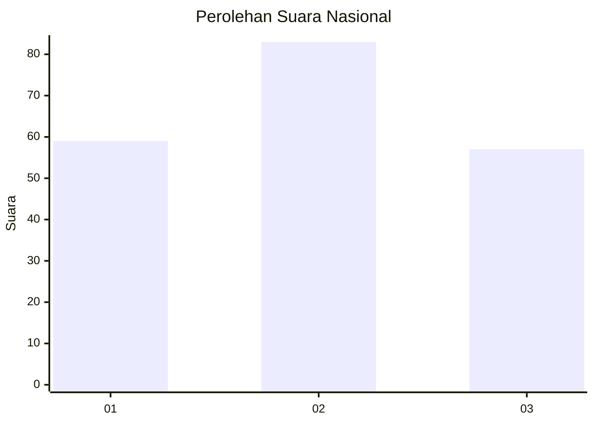
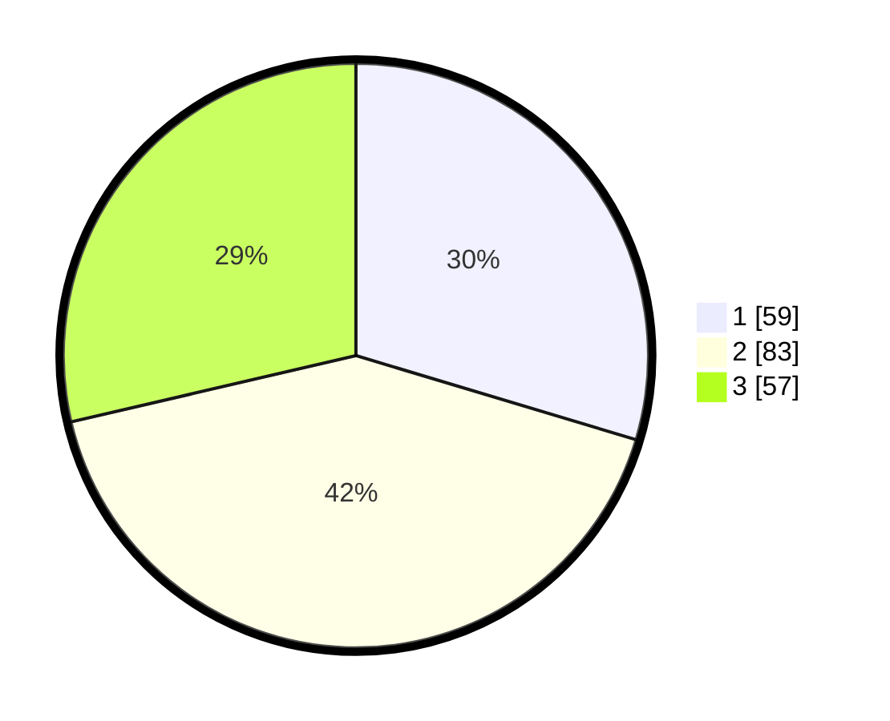

# Hasil

## Grafik

## Tabel

| No. | Nama Paslon    | Suara | Suara (raw) | Persentase |
|:--- |:-------------- | -----:| -----------:| ----------:|
| 1   | ANIES MUHAIMIN | 59    | [59][p-1]   | 29,65      |
| 2   | PRABOWO GIBRAN | 83    | [83][p-2]   | 41,71      |
| 3   | GANJAR MAHFUD  | 57    | [57][p-3]   | 28,64      |

[p-1]: https://github.com/gigit-pemilu/pemilu-2024/blob/main/pilpres/hitung-suara/sub/34-di-yogyakarta/sub/04-sleman/sub/02-godean/sub/2005-sidokarto/sub/028-tps/sub/paslon-1.txt
[p-2]: https://github.com/gigit-pemilu/pemilu-2024/blob/main/pilpres/hitung-suara/sub/34-di-yogyakarta/sub/04-sleman/sub/02-godean/sub/2005-sidokarto/sub/028-tps/sub/paslon-2.txt
[p-3]: https://github.com/gigit-pemilu/pemilu-2024/blob/main/pilpres/hitung-suara/sub/34-di-yogyakarta/sub/04-sleman/sub/02-godean/sub/2005-sidokarto/sub/028-tps/sub/paslon-3.txt

## Foto C Plano

https://sirekap-obj-formc.kpu.go.id/2620/pemilu/ppwp/34/04/02/20/05/3404022005028-20240215-010423--edab8c55-eab3-42cb-9548-966d535eb8dd.jpg

https://sirekap-obj-formc.kpu.go.id/2620/pemilu/ppwp/34/04/02/20/05/3404022005028-20240215-010744--b32a0b20-1adf-40b1-acbe-24a9cbda90ff.jpg

https://sirekap-obj-formc.kpu.go.id/2620/pemilu/ppwp/34/04/02/20/05/3404022005028-20240215-011118--96159210-32a7-4ca5-a816-aa15b1526181.jpg

## Metadata

| Key        | Value               |
| ---------- | ------------------- |
| Time Stamp | 2024-02-15 15:00:29 |

