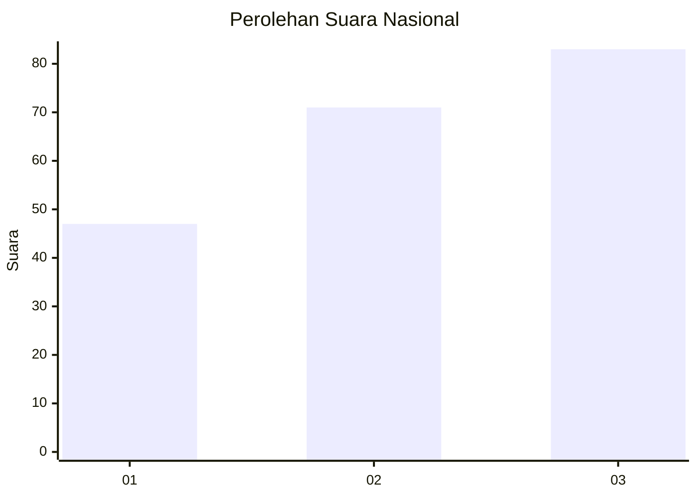
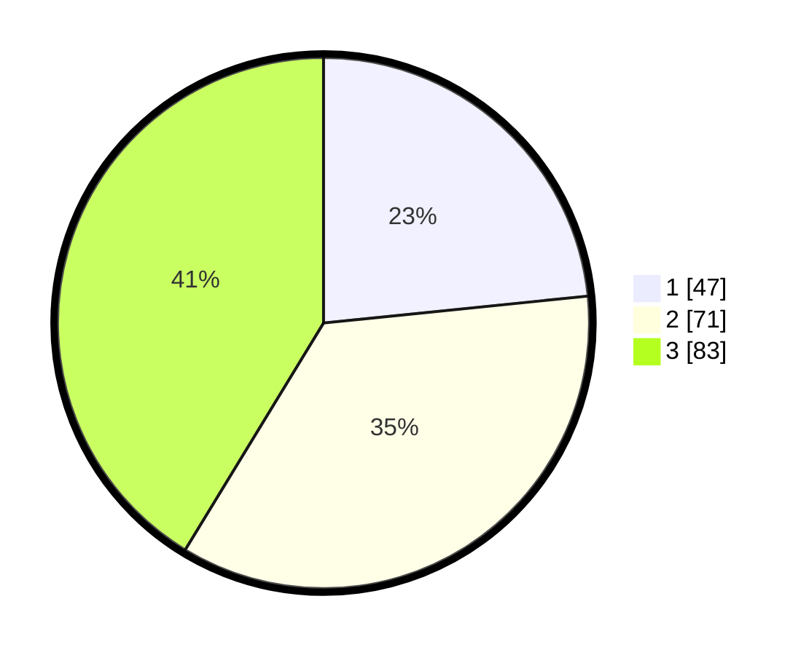

# Hasil

## Grafik

## Tabel

| No. | Nama Paslon    | Suara | Suara (raw) | Persentase |
|:--- |:-------------- | -----:| -----------:| ----------:|
| 1   | ANIES MUHAIMIN | 47    | [47][p-1]   | 23,38      |
| 2   | PRABOWO GIBRAN | 71    | [71][p-2]   | 35,32      |
| 3   | GANJAR MAHFUD  | 83    | [83][p-3]   | 41,29      |

[p-1]: https://github.com/gigit-pemilu/pemilu-2024/blob/main/pilpres/hitung-suara/sub/34-di-yogyakarta/sub/04-sleman/sub/02-godean/sub/2006-sidoarum/sub/005-tps/sub/paslon-1.txt
[p-2]: https://github.com/gigit-pemilu/pemilu-2024/blob/main/pilpres/hitung-suara/sub/34-di-yogyakarta/sub/04-sleman/sub/02-godean/sub/2006-sidoarum/sub/005-tps/sub/paslon-2.txt
[p-3]: https://github.com/gigit-pemilu/pemilu-2024/blob/main/pilpres/hitung-suara/sub/34-di-yogyakarta/sub/04-sleman/sub/02-godean/sub/2006-sidoarum/sub/005-tps/sub/paslon-3.txt

## Foto C Plano

https://sirekap-obj-formc.kpu.go.id/b0df/pemilu/ppwp/34/04/02/20/06/3404022006005-20240215-180614--56247802-49d4-4a5f-8ccd-9f04eff221ab.jpg

https://sirekap-obj-formc.kpu.go.id/b0df/pemilu/ppwp/34/04/02/20/06/3404022006005-20240214-155517--f7c9008a-9aa4-4f86-ad73-8fad5d46ace4.jpg

https://sirekap-obj-formc.kpu.go.id/b0df/pemilu/ppwp/34/04/02/20/06/3404022006005-20240214-155618--f49e0c74-396d-4a4d-b459-7a7601e82237.jpg

## Metadata

| Key        | Value               |
| ---------- | ------------------- |
| Time Stamp | 2024-02-15 19:30:26 |

