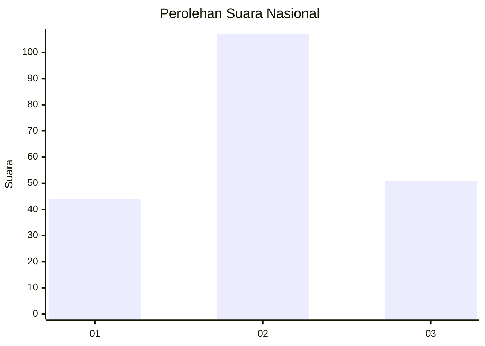
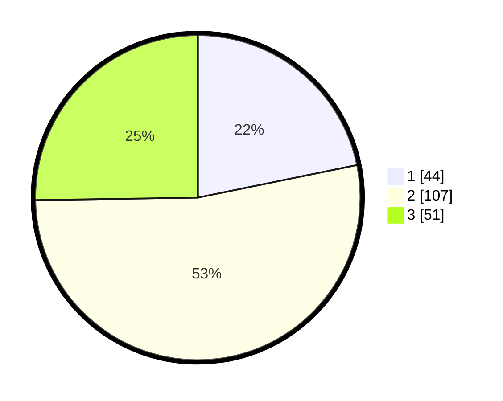

# Hasil

## Grafik

## Tabel

| No. | Nama Paslon    | Suara | Suara (raw) | Persentase |
|:--- |:-------------- | -----:| -----------:| ----------:|
| 1   | ANIES MUHAIMIN | 44    | [44][p-1]   | 21,78      |
| 2   | PRABOWO GIBRAN | 107   | [107][p-2]  | 52,97      |
| 3   | GANJAR MAHFUD  | 51    | [51][p-3]   | 25,25      |

[p-1]: https://github.com/gigit-pemilu/pemilu-2024/blob/main/pilpres/hitung-suara/sub/34-di-yogyakarta/sub/04-sleman/sub/02-godean/sub/2006-sidoarum/sub/006-tps/sub/paslon-1.txt
[p-2]: https://github.com/gigit-pemilu/pemilu-2024/blob/main/pilpres/hitung-suara/sub/34-di-yogyakarta/sub/04-sleman/sub/02-godean/sub/2006-sidoarum/sub/006-tps/sub/paslon-2.txt
[p-3]: https://github.com/gigit-pemilu/pemilu-2024/blob/main/pilpres/hitung-suara/sub/34-di-yogyakarta/sub/04-sleman/sub/02-godean/sub/2006-sidoarum/sub/006-tps/sub/paslon-3.txt

## Foto C Plano

https://sirekap-obj-formc.kpu.go.id/2497/pemilu/ppwp/34/04/02/20/06/3404022006006-20240214-141025--4b8c9c85-fa75-4e26-802c-e811c8aa998f.jpg

https://sirekap-obj-formc.kpu.go.id/2497/pemilu/ppwp/34/04/02/20/06/3404022006006-20240214-141117--a3ee475d-29fe-47c2-a4c8-6d4a89d65498.jpg

https://sirekap-obj-formc.kpu.go.id/2497/pemilu/ppwp/34/04/02/20/06/3404022006006-20240214-141216--643ec4f2-f0ca-4e00-8a90-5600e520ac02.jpg

## Metadata

| Key        | Value               |
| ---------- | ------------------- |
| Time Stamp | 2024-02-15 15:00:29 |

