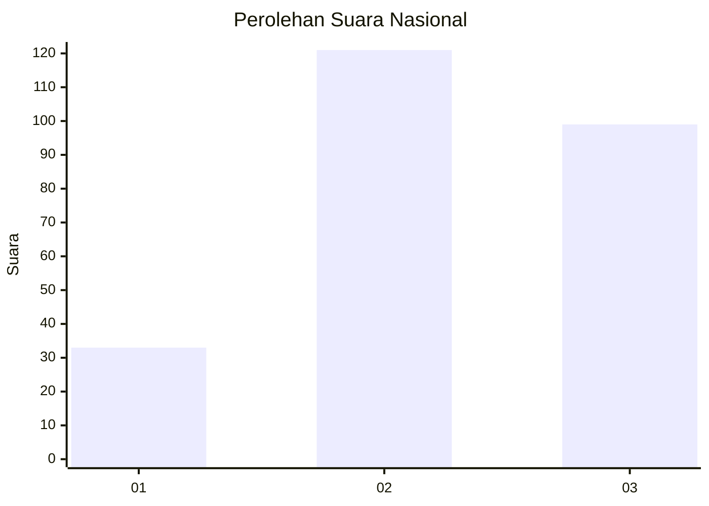
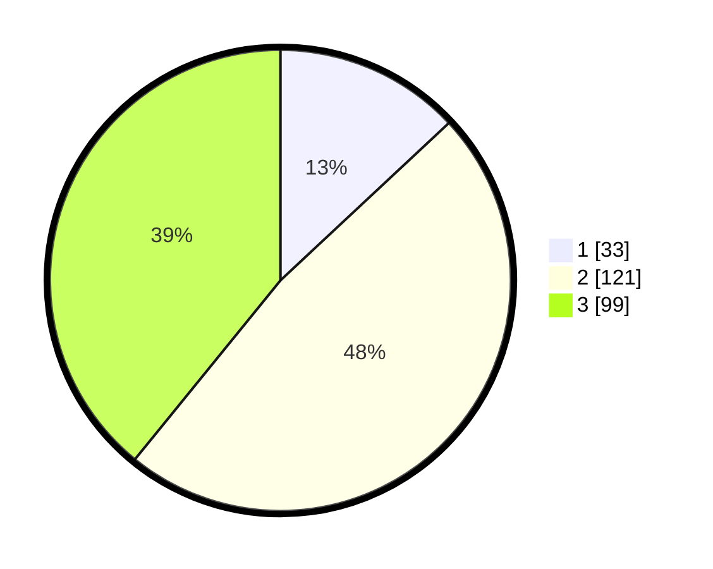

# Hasil

## Grafik

## Tabel

| No. | Nama Paslon    | Suara | Suara (raw) | Persentase |
|:--- |:-------------- | -----:| -----------:| ----------:|
| 1   | ANIES MUHAIMIN | 33    | [33][p-1]   | 13,04      |
| 2   | PRABOWO GIBRAN | 121   | [121][p-2]  | 47,83      |
| 3   | GANJAR MAHFUD  | 99    | [99][p-3]   | 39,13      |

[p-1]: https://github.com/gigit-pemilu/pemilu-2024/blob/main/pilpres/hitung-suara/sub/34-di-yogyakarta/sub/04-sleman/sub/02-godean/sub/2006-sidoarum/sub/008-tps/sub/paslon-1.txt
[p-2]: https://github.com/gigit-pemilu/pemilu-2024/blob/main/pilpres/hitung-suara/sub/34-di-yogyakarta/sub/04-sleman/sub/02-godean/sub/2006-sidoarum/sub/008-tps/sub/paslon-2.txt
[p-3]: https://github.com/gigit-pemilu/pemilu-2024/blob/main/pilpres/hitung-suara/sub/34-di-yogyakarta/sub/04-sleman/sub/02-godean/sub/2006-sidoarum/sub/008-tps/sub/paslon-3.txt

## Foto C Plano

https://sirekap-obj-formc.kpu.go.id/b2c4/pemilu/ppwp/34/04/02/20/06/3404022006008-20240214-224547--3d85d8c9-2ceb-4999-85e5-00bb647d8305.jpg

https://sirekap-obj-formc.kpu.go.id/b2c4/pemilu/ppwp/34/04/02/20/06/3404022006008-20240214-224651--af2afed2-5186-4f65-b12f-79c9885c704d.jpg

https://sirekap-obj-formc.kpu.go.id/b2c4/pemilu/ppwp/34/04/02/20/06/3404022006008-20240214-224745--697980a8-b8bb-4620-ab72-058403f634d8.jpg

## Metadata

| Key        | Value               |
| ---------- | ------------------- |
| Time Stamp | 2024-02-15 15:00:29 |

