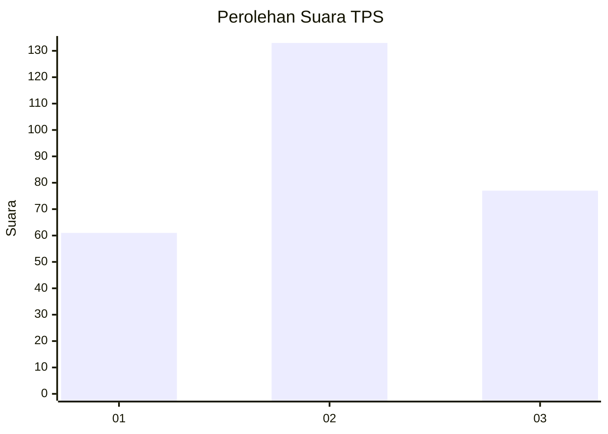
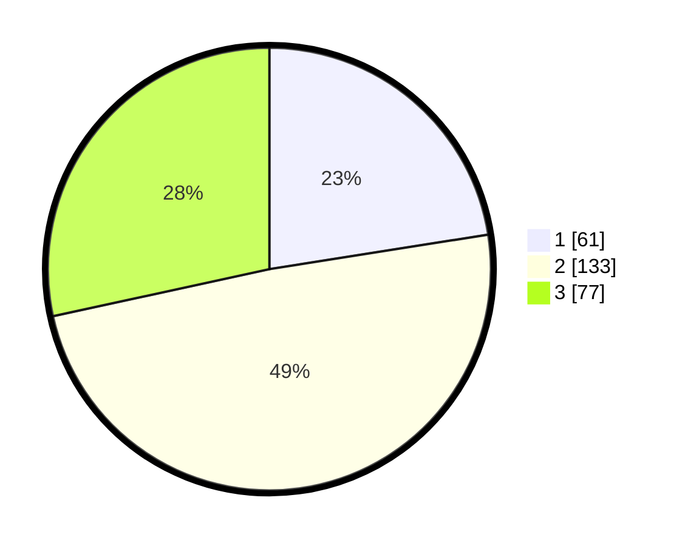

# Hasil

## Grafik

## Tabel

| No. | Nama Paslon    | Suara | Suara (raw) | Persentase |
|:--- |:-------------- | -----:| -----------:| ----------:|
| 1   | ANIES MUHAIMIN | 61    | [61][p-1]   | 22,51      |
| 2   | PRABOWO GIBRAN | 133   | [133][p-2]  | 49,08      |
| 3   | GANJAR MAHFUD  | 77    | [77][p-3]   | 28,41      |

[p-1]: https://github.com/gigit-pemilu/pemilu-2024-34-di-yogyakarta/blob/main/pilpres/hitung-suara/sub/34-di-yogyakarta/sub/04-sleman/sub/02-godean/sub/2006-sidoarum/sub/015-tps/sub/paslon-1.txt
[p-2]: https://github.com/gigit-pemilu/pemilu-2024-34-di-yogyakarta/blob/main/pilpres/hitung-suara/sub/34-di-yogyakarta/sub/04-sleman/sub/02-godean/sub/2006-sidoarum/sub/015-tps/sub/paslon-2.txt
[p-3]: https://github.com/gigit-pemilu/pemilu-2024-34-di-yogyakarta/blob/main/pilpres/hitung-suara/sub/34-di-yogyakarta/sub/04-sleman/sub/02-godean/sub/2006-sidoarum/sub/015-tps/sub/paslon-3.txt

## Foto C Plano

https://sirekap-obj-formc.kpu.go.id/fedd/pemilu/ppwp/34/04/02/20/06/3404022006015-20240214-204257--83906e60-12ac-4f62-a416-bbee5ff43df8.jpg

https://sirekap-obj-formc.kpu.go.id/fedd/pemilu/ppwp/34/04/02/20/06/3404022006015-20240214-204348--56985b82-e898-4953-b35b-b05733edb812.jpg

https://sirekap-obj-formc.kpu.go.id/fedd/pemilu/ppwp/34/04/02/20/06/3404022006015-20240214-204215--91061180-6960-4511-a546-78b257f0371b.jpg

## Metadata

| Key        | Value               |
| ---------- | ------------------- |
| Time Stamp | 2024-02-15 15:00:29 |

