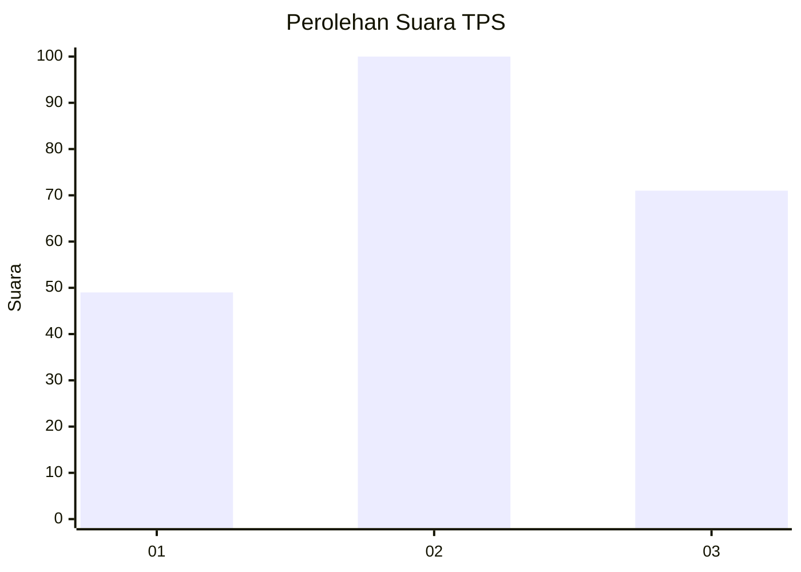
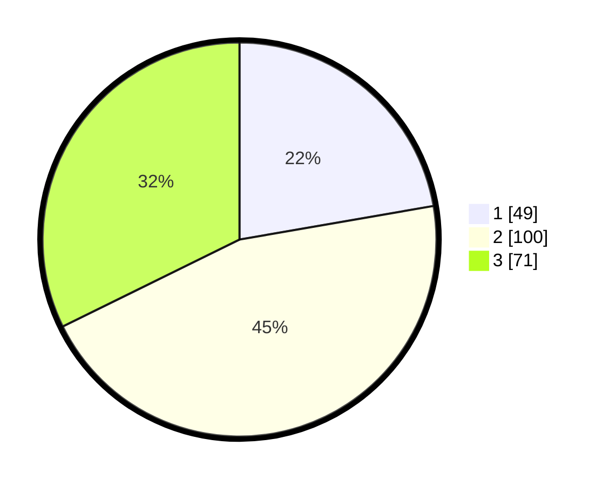

# Hasil

## Grafik

## Tabel

| No. | Nama Paslon    | Suara | Suara (raw) | Persentase |
|:--- |:-------------- | -----:| -----------:| ----------:|
| 1   | ANIES MUHAIMIN | 49    | [49][p-1]   | 22,27      |
| 2   | PRABOWO GIBRAN | 100   | [100][p-2]  | 45,45      |
| 3   | GANJAR MAHFUD  | 71    | [71][p-3]   | 32,27      |

[p-1]: https://github.com/gigit-pemilu/pemilu-2024-34-di-yogyakarta/blob/main/pilpres/hitung-suara/sub/34-di-yogyakarta/sub/04-sleman/sub/02-godean/sub/2006-sidoarum/sub/025-tps/sub/paslon-1.txt
[p-2]: https://github.com/gigit-pemilu/pemilu-2024-34-di-yogyakarta/blob/main/pilpres/hitung-suara/sub/34-di-yogyakarta/sub/04-sleman/sub/02-godean/sub/2006-sidoarum/sub/025-tps/sub/paslon-2.txt
[p-3]: https://github.com/gigit-pemilu/pemilu-2024-34-di-yogyakarta/blob/main/pilpres/hitung-suara/sub/34-di-yogyakarta/sub/04-sleman/sub/02-godean/sub/2006-sidoarum/sub/025-tps/sub/paslon-3.txt

## Foto C Plano

https://sirekap-obj-formc.kpu.go.id/91f4/pemilu/ppwp/34/04/02/20/06/3404022006025-20240215-103038--038ae912-da72-4b53-b645-acb18b14d896.jpg

https://sirekap-obj-formc.kpu.go.id/91f4/pemilu/ppwp/34/04/02/20/06/3404022006025-20240215-103106--27e554bb-2819-4bd6-bf6d-6699ad78b198.jpg

https://sirekap-obj-formc.kpu.go.id/91f4/pemilu/ppwp/34/04/02/20/06/3404022006025-20240215-103126--58cb463a-c30e-4c8a-a045-e0b920b91f26.jpg

## Metadata

| Key        | Value               |
| ---------- | ------------------- |
| Time Stamp | 2024-02-24 22:31:28 |

