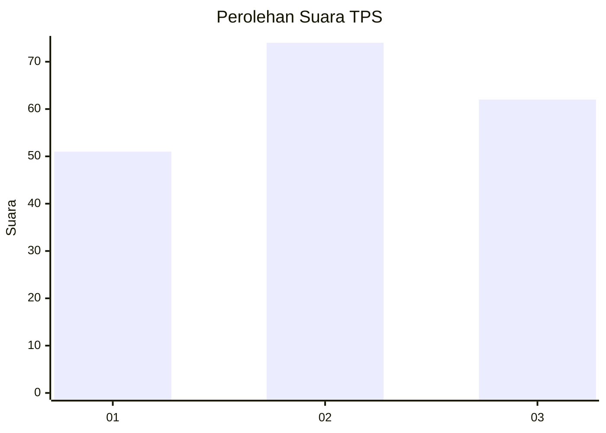
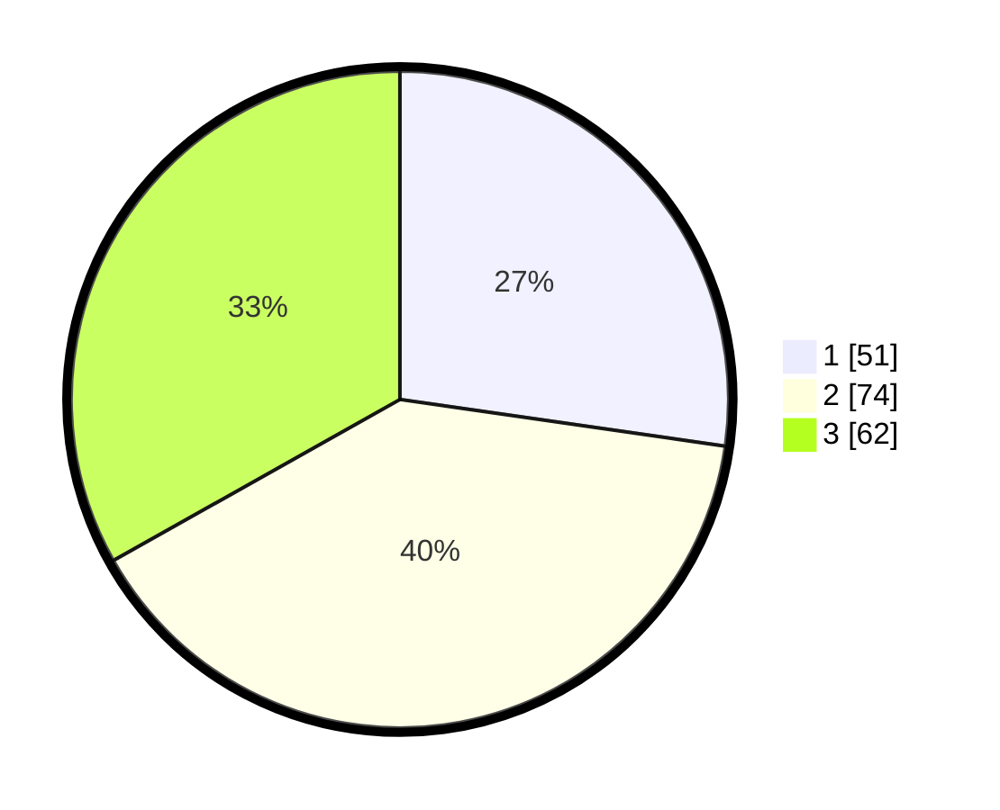

# Hasil

## Grafik

## Tabel

| No. | Nama Paslon    | Suara | Suara (raw) | Persentase |
|:--- |:-------------- | -----:| -----------:| ----------:|
| 1   | ANIES MUHAIMIN | 51    | [51][p-1]   | 27,27      |
| 2   | PRABOWO GIBRAN | 74    | [74][p-2]   | 39,57      |
| 3   | GANJAR MAHFUD  | 62    | [62][p-3]   | 33,16      |

[p-1]: https://github.com/gigit-pemilu/pemilu-2024-34-di-yogyakarta/blob/main/pilpres/hitung-suara/sub/34-di-yogyakarta/sub/04-sleman/sub/02-godean/sub/2006-sidoarum/sub/030-tps/sub/paslon-1.txt
[p-2]: https://github.com/gigit-pemilu/pemilu-2024-34-di-yogyakarta/blob/main/pilpres/hitung-suara/sub/34-di-yogyakarta/sub/04-sleman/sub/02-godean/sub/2006-sidoarum/sub/030-tps/sub/paslon-2.txt
[p-3]: https://github.com/gigit-pemilu/pemilu-2024-34-di-yogyakarta/blob/main/pilpres/hitung-suara/sub/34-di-yogyakarta/sub/04-sleman/sub/02-godean/sub/2006-sidoarum/sub/030-tps/sub/paslon-3.txt

## Foto C Plano

https://sirekap-obj-formc.kpu.go.id/3743/pemilu/ppwp/34/04/02/20/06/3404022006030-20240214-214347--557674b4-e0de-4d9e-9886-f124f3f2a00f.jpg

https://sirekap-obj-formc.kpu.go.id/3743/pemilu/ppwp/34/04/02/20/06/3404022006030-20240214-214509--68d9291a-572d-44ce-af45-2b68afbfe7dc.jpg

https://sirekap-obj-formc.kpu.go.id/3743/pemilu/ppwp/34/04/02/20/06/3404022006030-20240214-214609--d1a77dfb-5ecb-4489-999d-e3faab5155a8.jpg

## Metadata

| Key        | Value               |
| ---------- | ------------------- |
| Time Stamp | 2024-02-15 15:00:29 |

