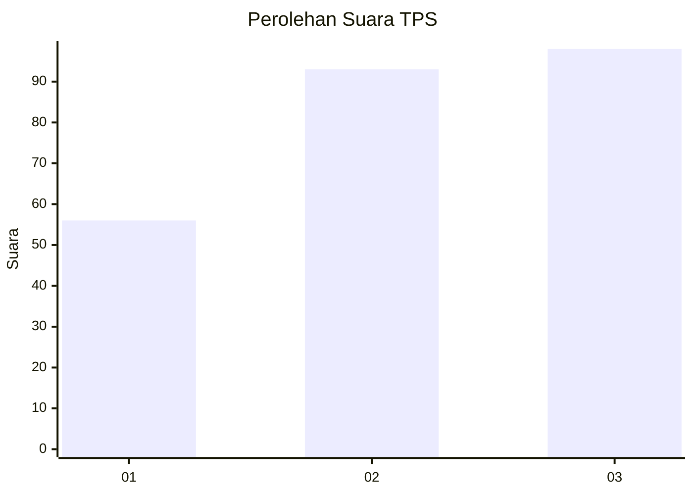
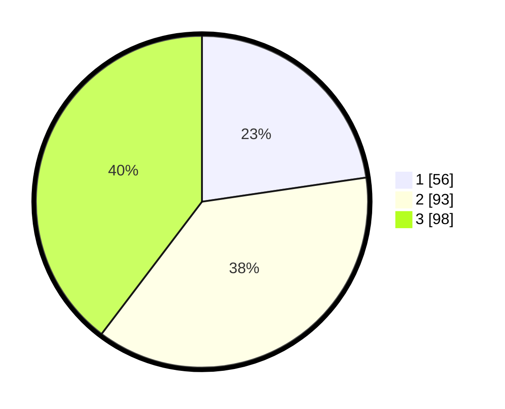

# Hasil

## Grafik

## Tabel

| No. | Nama Paslon    | Suara | Suara (raw) | Persentase |
|:--- |:-------------- | -----:| -----------:| ----------:|
| 1   | ANIES MUHAIMIN | 56    | [56][p-1]   | 22,67      |
| 2   | PRABOWO GIBRAN | 93    | [93][p-2]   | 37,65      |
| 3   | GANJAR MAHFUD  | 98    | [98][p-3]   | 39,68      |

[p-1]: https://github.com/gigit-pemilu/pemilu-2024-34-di-yogyakarta/blob/main/pilpres/hitung-suara/sub/34-di-yogyakarta/sub/04-sleman/sub/02-godean/sub/2006-sidoarum/sub/036-tps/sub/paslon-1.txt
[p-2]: https://github.com/gigit-pemilu/pemilu-2024-34-di-yogyakarta/blob/main/pilpres/hitung-suara/sub/34-di-yogyakarta/sub/04-sleman/sub/02-godean/sub/2006-sidoarum/sub/036-tps/sub/paslon-2.txt
[p-3]: https://github.com/gigit-pemilu/pemilu-2024-34-di-yogyakarta/blob/main/pilpres/hitung-suara/sub/34-di-yogyakarta/sub/04-sleman/sub/02-godean/sub/2006-sidoarum/sub/036-tps/sub/paslon-3.txt

## Foto C Plano

https://sirekap-obj-formc.kpu.go.id/d341/pemilu/ppwp/34/04/02/20/06/3404022006036-20240215-011125--3ceebd05-c504-4f4d-bfd3-c8b385517be5.jpg

https://sirekap-obj-formc.kpu.go.id/d341/pemilu/ppwp/34/04/02/20/06/3404022006036-20240215-011332--7eaa5dae-3d97-4115-b5d5-697120c4edd8.jpg

https://sirekap-obj-formc.kpu.go.id/d341/pemilu/ppwp/34/04/02/20/06/3404022006036-20240215-042418--28c720e7-99a1-42a0-99af-2150b9722d47.jpg

## Metadata

| Key        | Value               |
| ---------- | ------------------- |
| Time Stamp | 2024-02-15 20:30:46 |

