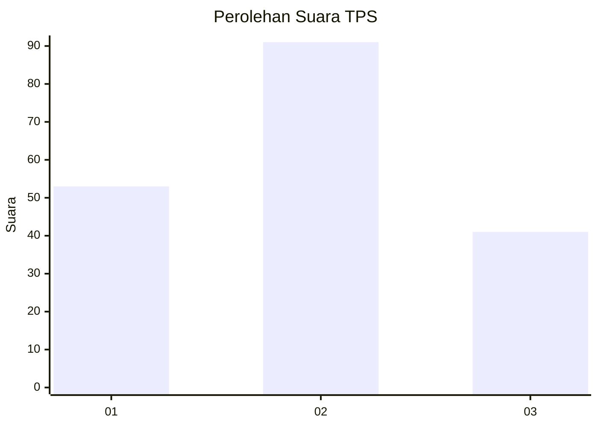
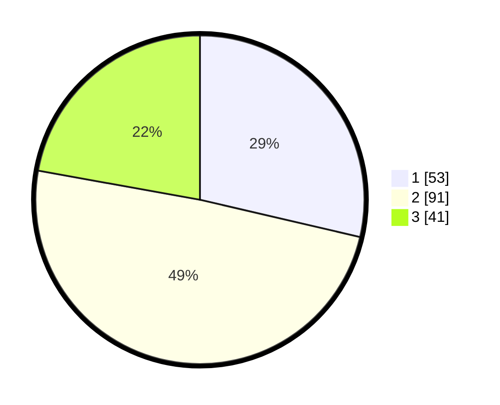

# Hasil

## Grafik

## Tabel

| No. | Nama Paslon    | Suara | Suara (raw) | Persentase |
|:--- |:-------------- | -----:| -----------:| ----------:|
| 1   | ANIES MUHAIMIN | 53    | [53][p-1]   | 28,65      |
| 2   | PRABOWO GIBRAN | 91    | [91][p-2]   | 49,19      |
| 3   | GANJAR MAHFUD  | 41    | [41][p-3]   | 22,16      |

[p-1]: https://github.com/gigit-pemilu/pemilu-2024-34-di-yogyakarta/blob/main/pilpres/hitung-suara/sub/34-di-yogyakarta/sub/04-sleman/sub/02-godean/sub/2006-sidoarum/sub/041-tps/sub/paslon-1.txt
[p-2]: https://github.com/gigit-pemilu/pemilu-2024-34-di-yogyakarta/blob/main/pilpres/hitung-suara/sub/34-di-yogyakarta/sub/04-sleman/sub/02-godean/sub/2006-sidoarum/sub/041-tps/sub/paslon-2.txt
[p-3]: https://github.com/gigit-pemilu/pemilu-2024-34-di-yogyakarta/blob/main/pilpres/hitung-suara/sub/34-di-yogyakarta/sub/04-sleman/sub/02-godean/sub/2006-sidoarum/sub/041-tps/sub/paslon-3.txt

## Foto C Plano

https://sirekap-obj-formc.kpu.go.id/51de/pemilu/ppwp/34/04/02/20/06/3404022006041-20240215-033818--91620a7f-25df-475e-83f5-3fc4bee0d4c1.jpg

https://sirekap-obj-formc.kpu.go.id/51de/pemilu/ppwp/34/04/02/20/06/3404022006041-20240215-034128--e90c8b3a-fe7f-4bc1-9087-9d112ff73313.jpg

https://sirekap-obj-formc.kpu.go.id/51de/pemilu/ppwp/34/04/02/20/06/3404022006041-20240215-034143--757b594e-ba65-4322-b6b5-cd57c480f68c.jpg

## Metadata

| Key        | Value               |
| ---------- | ------------------- |
| Time Stamp | 2024-02-15 15:00:29 |

