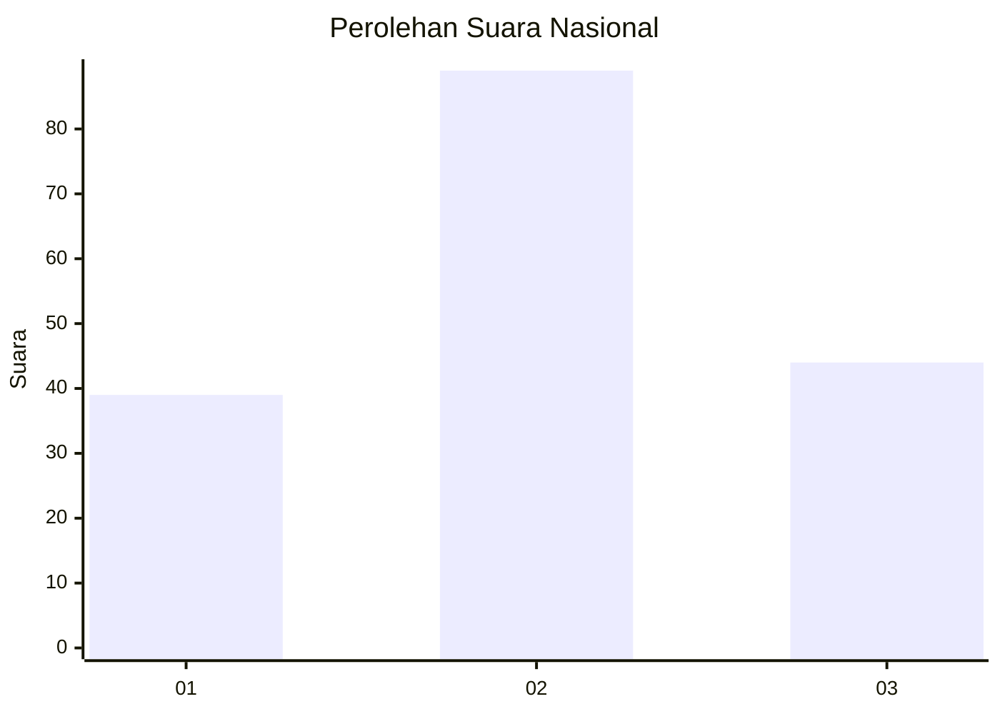
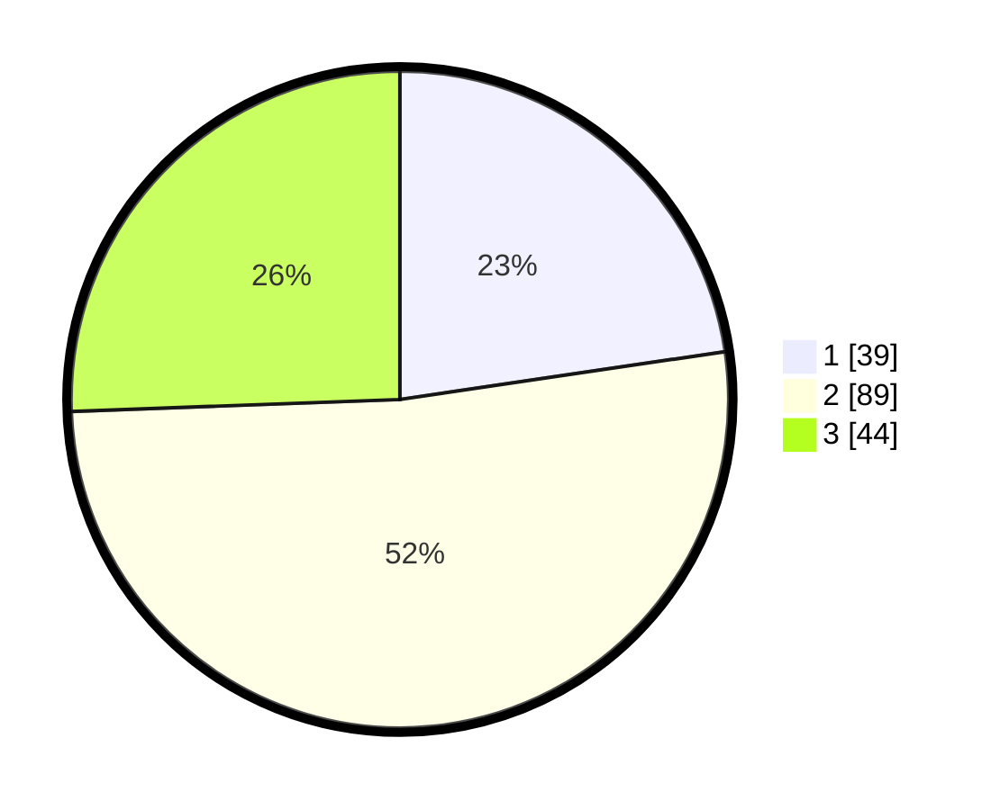

# Hasil

## Grafik

## Tabel

| No. | Nama Paslon    | Suara | Suara (raw) | Persentase |
|:--- |:-------------- | -----:| -----------:| ----------:|
| 1   | ANIES MUHAIMIN | 39    | [39][p-1]   | 22,67      |
| 2   | PRABOWO GIBRAN | 89    | [89][p-2]   | 51,74      |
| 3   | GANJAR MAHFUD  | 44    | [44][p-3]   | 25,58      |

[p-1]: https://github.com/gigit-pemilu/pemilu-2024/blob/main/pilpres/hitung-suara/sub/34-di-yogyakarta/sub/04-sleman/sub/02-godean/sub/2007-sidomoyo/sub/001-tps/sub/paslon-1.txt
[p-2]: https://github.com/gigit-pemilu/pemilu-2024/blob/main/pilpres/hitung-suara/sub/34-di-yogyakarta/sub/04-sleman/sub/02-godean/sub/2007-sidomoyo/sub/001-tps/sub/paslon-2.txt
[p-3]: https://github.com/gigit-pemilu/pemilu-2024/blob/main/pilpres/hitung-suara/sub/34-di-yogyakarta/sub/04-sleman/sub/02-godean/sub/2007-sidomoyo/sub/001-tps/sub/paslon-3.txt

## Foto C Plano

https://sirekap-obj-formc.kpu.go.id/119d/pemilu/ppwp/34/04/02/20/07/3404022007001-20240214-214127--87a6dbea-be3b-448b-a0db-d0c615f4cdce.jpg

https://sirekap-obj-formc.kpu.go.id/119d/pemilu/ppwp/34/04/02/20/07/3404022007001-20240214-214303--0b9f2d04-6584-44e6-abf2-9bfbe4fe236a.jpg

https://sirekap-obj-formc.kpu.go.id/119d/pemilu/ppwp/34/04/02/20/07/3404022007001-20240214-214400--b51e73a6-637b-4526-b733-d575eb42c0c5.jpg

## Metadata

| Key        | Value               |
| ---------- | ------------------- |
| Time Stamp | 2024-02-15 15:00:29 |

