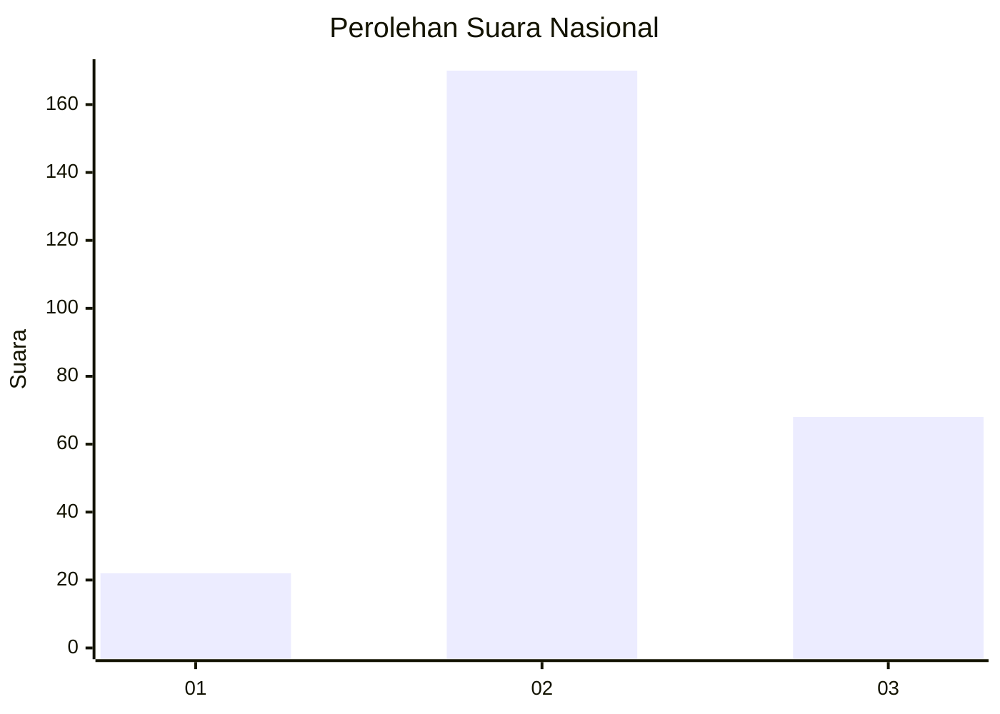
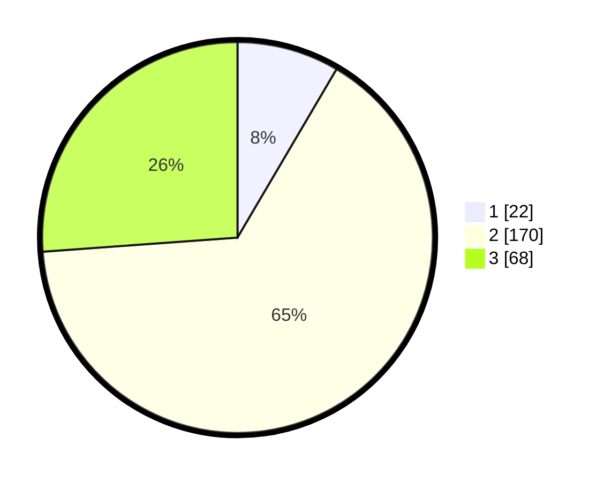

# Hasil

## Grafik

## Tabel

| No. | Nama Paslon    | Suara | Suara (raw) | Persentase |
|:--- |:-------------- | -----:| -----------:| ----------:|
| 1   | ANIES MUHAIMIN | 22    | [22][p-1]   | 8,46       |
| 2   | PRABOWO GIBRAN | 170   | [170][p-2]  | 65,38      |
| 3   | GANJAR MAHFUD  | 68    | [68][p-3]   | 26,15      |

[p-1]: https://github.com/gigit-pemilu/pemilu-2024/blob/main/pilpres/hitung-suara/sub/34-di-yogyakarta/sub/04-sleman/sub/02-godean/sub/2007-sidomoyo/sub/010-tps/sub/paslon-1.txt
[p-2]: https://github.com/gigit-pemilu/pemilu-2024/blob/main/pilpres/hitung-suara/sub/34-di-yogyakarta/sub/04-sleman/sub/02-godean/sub/2007-sidomoyo/sub/010-tps/sub/paslon-2.txt
[p-3]: https://github.com/gigit-pemilu/pemilu-2024/blob/main/pilpres/hitung-suara/sub/34-di-yogyakarta/sub/04-sleman/sub/02-godean/sub/2007-sidomoyo/sub/010-tps/sub/paslon-3.txt

## Foto C Plano

https://sirekap-obj-formc.kpu.go.id/e3dd/pemilu/ppwp/34/04/02/20/07/3404022007010-20240214-155723--c8a5e6e0-574f-4123-86a4-18339c3d4ce3.jpg

https://sirekap-obj-formc.kpu.go.id/e3dd/pemilu/ppwp/34/04/02/20/07/3404022007010-20240214-160132--823834fc-6ff0-4e03-aeb0-9b0b7458c970.jpg

https://sirekap-obj-formc.kpu.go.id/e3dd/pemilu/ppwp/34/04/02/20/07/3404022007010-20240214-155221--8f0cca53-db81-42f2-99de-7882de32e7a7.jpg

## Metadata

| Key        | Value               |
| ---------- | ------------------- |
| Time Stamp | 2024-02-15 15:00:29 |

