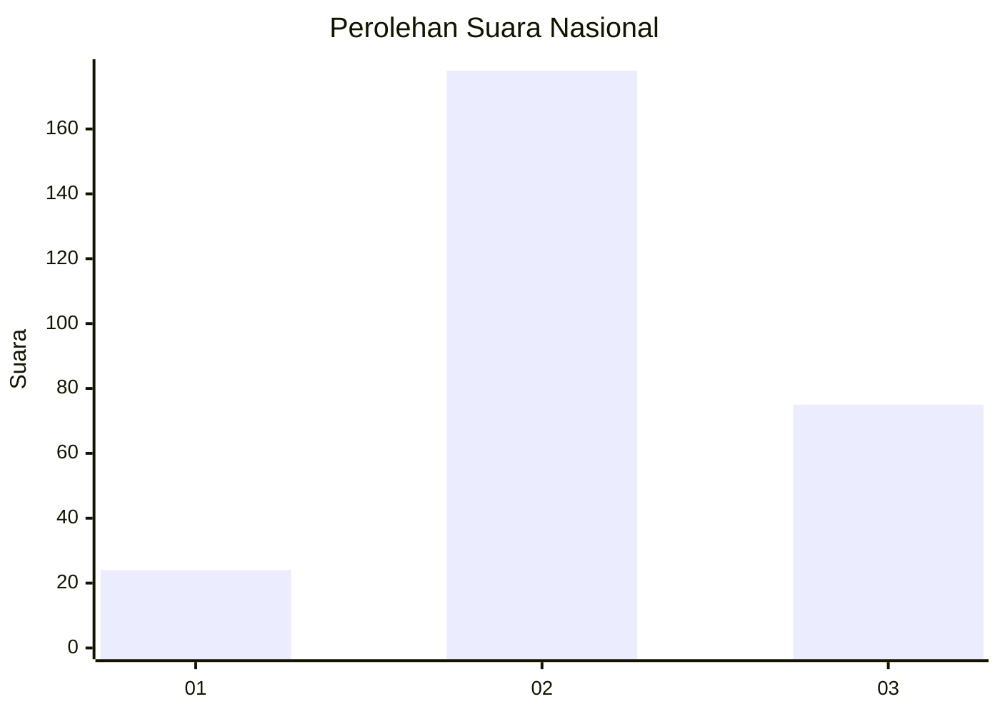

# Hasil

## Grafik

## Tabel

| No. | Nama Paslon    | Suara | Suara (raw) | Persentase |
|:--- |:-------------- | -----:| -----------:| ----------:|
| 1   | ANIES MUHAIMIN | 24    | [24][p-1]   | 8,66       |
| 2   | PRABOWO GIBRAN | 178   | [178][p-2]  | 64,26      |
| 3   | GANJAR MAHFUD  | 75    | [75][p-3]   | 27,08      |

[p-1]: https://github.com/gigit-pemilu/pemilu-2024/blob/main/pilpres/hitung-suara/sub/34-di-yogyakarta/sub/04-sleman/sub/02-godean/sub/2007-sidomoyo/sub/015-tps/sub/paslon-1.txt
[p-2]: https://github.com/gigit-pemilu/pemilu-2024/blob/main/pilpres/hitung-suara/sub/34-di-yogyakarta/sub/04-sleman/sub/02-godean/sub/2007-sidomoyo/sub/015-tps/sub/paslon-2.txt
[p-3]: https://github.com/gigit-pemilu/pemilu-2024/blob/main/pilpres/hitung-suara/sub/34-di-yogyakarta/sub/04-sleman/sub/02-godean/sub/2007-sidomoyo/sub/015-tps/sub/paslon-3.txt

## Foto C Plano

https://sirekap-obj-formc.kpu.go.id/5b9b/pemilu/ppwp/34/04/02/20/07/3404022007015-20240214-233657--271b6939-4c2f-4bb2-88a4-fe214077146c.jpg

https://sirekap-obj-formc.kpu.go.id/5b9b/pemilu/ppwp/34/04/02/20/07/3404022007015-20240214-234100--98838d3c-77b6-4715-bbb8-c0169a3453cc.jpg

https://sirekap-obj-formc.kpu.go.id/5b9b/pemilu/ppwp/34/04/02/20/07/3404022007015-20240214-233904--8e09e045-1f5b-4548-873b-664ee6a04d5d.jpg

## Metadata

| Key        | Value               |
| ---------- | ------------------- |
| Time Stamp | 2024-02-15 22:40:13 |

