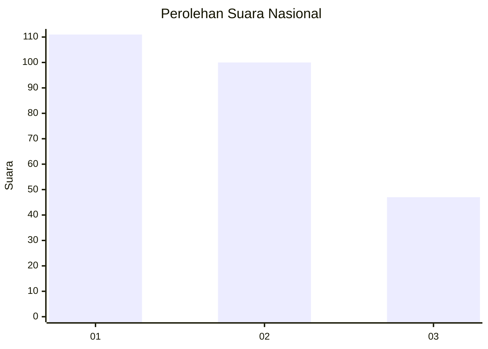
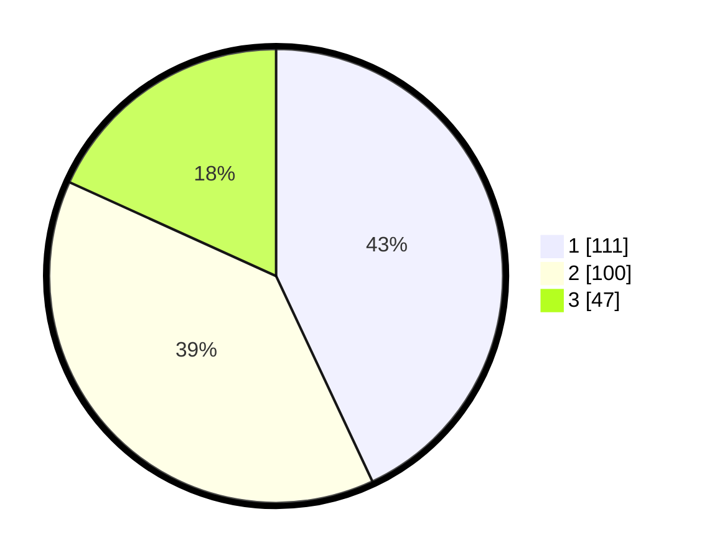

# Hasil

## Grafik

## Tabel

| No. | Nama Paslon    | Suara | Suara (raw) | Persentase |
|:--- |:-------------- | -----:| -----------:| ----------:|
| 1   | ANIES MUHAIMIN | 111   | [111][p-1]  | 43,02      |
| 2   | PRABOWO GIBRAN | 100   | [100][p-2]  | 38,76      |
| 3   | GANJAR MAHFUD  | 47    | [47][p-3]   | 18,22      |

[p-1]: https://github.com/gigit-pemilu/pemilu-2024/blob/main/pilpres/hitung-suara/sub/34-di-yogyakarta/sub/04-sleman/sub/03-moyudan/sub/2001-sumberrahayu/sub/001-tps/sub/paslon-1.txt
[p-2]: https://github.com/gigit-pemilu/pemilu-2024/blob/main/pilpres/hitung-suara/sub/34-di-yogyakarta/sub/04-sleman/sub/03-moyudan/sub/2001-sumberrahayu/sub/001-tps/sub/paslon-2.txt
[p-3]: https://github.com/gigit-pemilu/pemilu-2024/blob/main/pilpres/hitung-suara/sub/34-di-yogyakarta/sub/04-sleman/sub/03-moyudan/sub/2001-sumberrahayu/sub/001-tps/sub/paslon-3.txt

## Foto C Plano

https://sirekap-obj-formc.kpu.go.id/11e9/pemilu/ppwp/34/04/03/20/01/3404032001001-20240216-145602--976a9963-1f44-4c4a-a356-e2f99b37ecf7.jpg

https://sirekap-obj-formc.kpu.go.id/11e9/pemilu/ppwp/34/04/03/20/01/3404032001001-20240216-145603--86d70aa3-df44-4fac-933f-01d6a37af972.jpg

https://sirekap-obj-formc.kpu.go.id/11e9/pemilu/ppwp/34/04/03/20/01/3404032001001-20240216-145603--4579c1d1-e57b-4e1a-aefc-5c52006921b5.jpg

## Metadata

| Key        | Value               |
| ---------- | ------------------- |
| Time Stamp | 2024-02-16 21:01:00 |

## DATA PEMILIH TETAP

Jumlah pemilih dalam DPT: **274**.
 * L: **137**.
 * P: **137**.

## DATA PENGGUNA HAK PILIH

Jumlah pengguna hak pilih dalam DPT: **254**.
 * L: **123**.
 * P: **131**.

Jumlah pengguna hak pilih dalam DPTb: **3**.
 * L: **1**.
 * P: **2**.

Jumlah pengguna hak pilih dalam DPK: **4**.
 * L: **1**.
 * P: **3**.

Jumlah pengguna hak pilih: **261**.
 * L: **125**.
 * P: **136**.

## JUMLAH SUARA SAH DAN TIDAK SAH

JUMLAH SELURUH SUARA SAH: **258**.

JUMLAH SUARA TIDAK SAH: **3**.

JUMLAH SELURUH SUARA SAH DAN SUARA TIDAK SAH: **261**.

