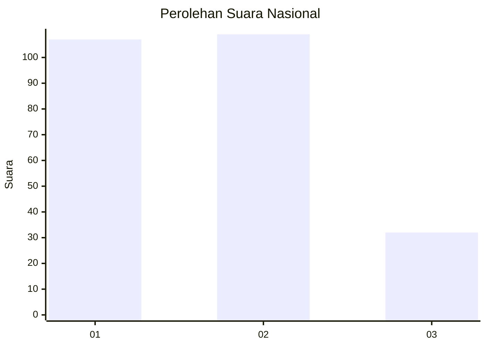
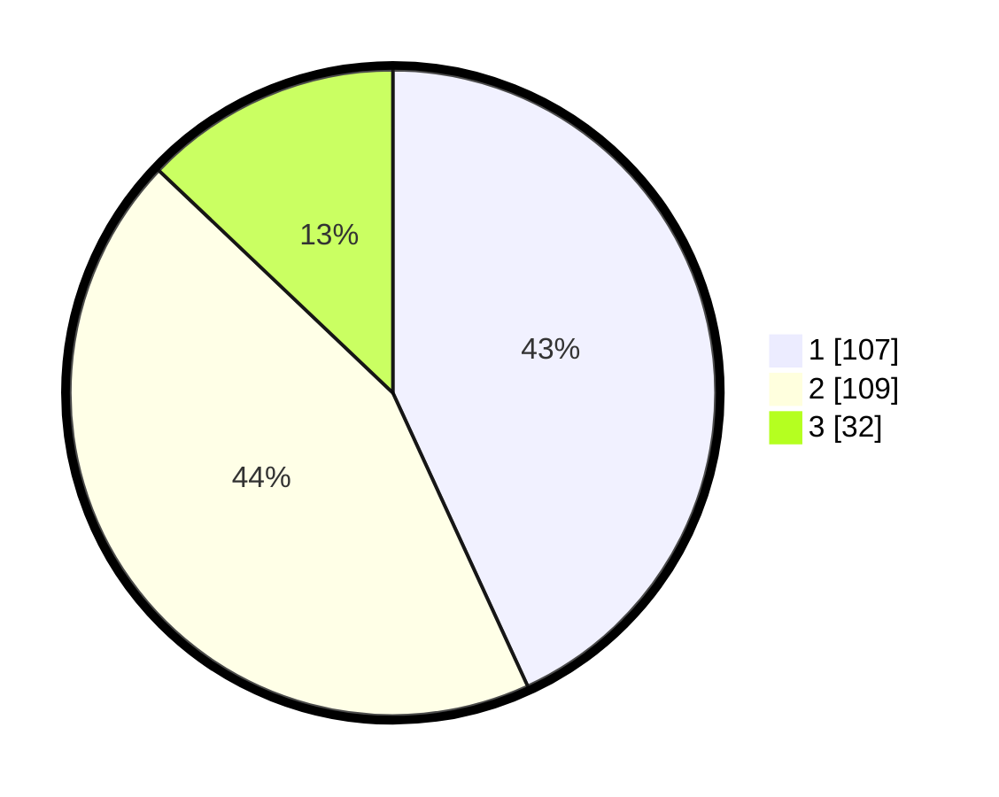

# Hasil

## Grafik

## Tabel

| No. | Nama Paslon    | Suara | Suara (raw) | Persentase |
|:--- |:-------------- | -----:| -----------:| ----------:|
| 1   | ANIES MUHAIMIN | 107   | [107][p-1]  | 43,15      |
| 2   | PRABOWO GIBRAN | 109   | [109][p-2]  | 43,95      |
| 3   | GANJAR MAHFUD  | 32    | [32][p-3]   | 12,90      |

[p-1]: https://github.com/gigit-pemilu/pemilu-2024/blob/main/pilpres/hitung-suara/sub/34-di-yogyakarta/sub/04-sleman/sub/03-moyudan/sub/2001-sumberrahayu/sub/002-tps/sub/paslon-1.txt
[p-2]: https://github.com/gigit-pemilu/pemilu-2024/blob/main/pilpres/hitung-suara/sub/34-di-yogyakarta/sub/04-sleman/sub/03-moyudan/sub/2001-sumberrahayu/sub/002-tps/sub/paslon-2.txt
[p-3]: https://github.com/gigit-pemilu/pemilu-2024/blob/main/pilpres/hitung-suara/sub/34-di-yogyakarta/sub/04-sleman/sub/03-moyudan/sub/2001-sumberrahayu/sub/002-tps/sub/paslon-3.txt

## Foto C Plano

https://sirekap-obj-formc.kpu.go.id/e66c/pemilu/ppwp/34/04/03/20/01/3404032001002-20240215-211739--9be423c7-f868-4538-958e-f61022e78cf2.jpg

https://sirekap-obj-formc.kpu.go.id/e66c/pemilu/ppwp/34/04/03/20/01/3404032001002-20240215-211742--ae0fd284-53d3-4c9f-9c46-95fd24b335d7.jpg

https://sirekap-obj-formc.kpu.go.id/e66c/pemilu/ppwp/34/04/03/20/01/3404032001002-20240215-211740--5f36483a-ca7f-46be-aa17-c18b7a776a2e.jpg

## Metadata

| Key        | Value               |
| ---------- | ------------------- |
| Time Stamp | 2024-02-15 22:00:27 |

## DATA PEMILIH TETAP

Jumlah pemilih dalam DPT: **265**.
 * L: **128**.
 * P: **137**.

## DATA PENGGUNA HAK PILIH

Jumlah pengguna hak pilih dalam DPT: **244**.
 * L: **119**.
 * P: **125**.

Jumlah pengguna hak pilih dalam DPTb: **5**.
 * L: **1**.
 * P: **4**.

Jumlah pengguna hak pilih dalam DPK: **2**.
 * L: **0**.
 * P: **2**.

Jumlah pengguna hak pilih: **251**.
 * L: **120**.
 * P: **131**.

## JUMLAH SUARA SAH DAN TIDAK SAH

JUMLAH SELURUH SUARA SAH: **248**.

JUMLAH SUARA TIDAK SAH: **3**.

JUMLAH SELURUH SUARA SAH DAN SUARA TIDAK SAH: **251**.

