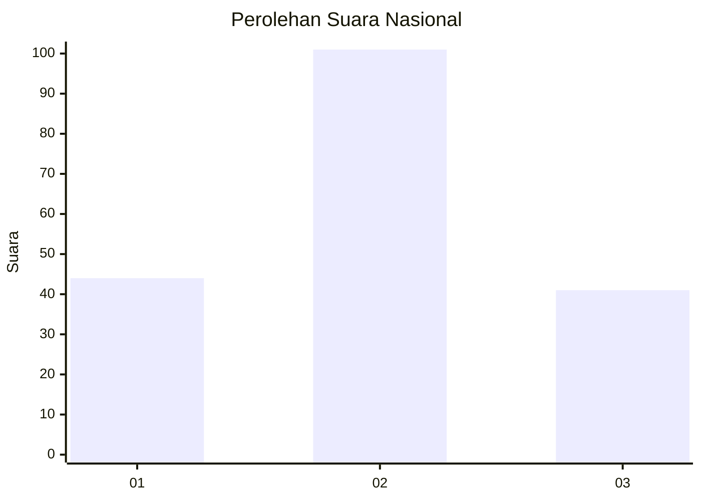
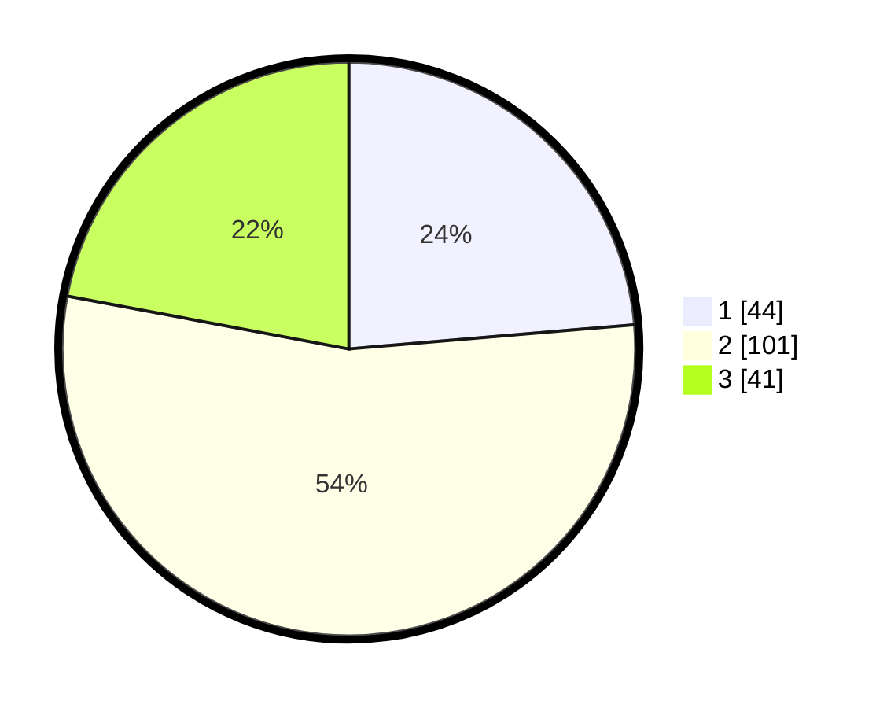

# Hasil

## Grafik

## Tabel

| No. | Nama Paslon    | Suara | Suara (raw) | Persentase |
|:--- |:-------------- | -----:| -----------:| ----------:|
| 1   | ANIES MUHAIMIN | 44    | [44][p-1]   | 23,66      |
| 2   | PRABOWO GIBRAN | 101   | [101][p-2]  | 54,30      |
| 3   | GANJAR MAHFUD  | 41    | [41][p-3]   | 22,04      |

[p-1]: https://github.com/gigit-pemilu/pemilu-2024/blob/main/pilpres/hitung-suara/sub/34-di-yogyakarta/sub/04-sleman/sub/03-moyudan/sub/2001-sumberrahayu/sub/003-tps/sub/paslon-1.txt
[p-2]: https://github.com/gigit-pemilu/pemilu-2024/blob/main/pilpres/hitung-suara/sub/34-di-yogyakarta/sub/04-sleman/sub/03-moyudan/sub/2001-sumberrahayu/sub/003-tps/sub/paslon-2.txt
[p-3]: https://github.com/gigit-pemilu/pemilu-2024/blob/main/pilpres/hitung-suara/sub/34-di-yogyakarta/sub/04-sleman/sub/03-moyudan/sub/2001-sumberrahayu/sub/003-tps/sub/paslon-3.txt

## Foto C Plano

https://sirekap-obj-formc.kpu.go.id/f3e4/pemilu/ppwp/34/04/03/20/01/3404032001003-20240216-145343--94024ddd-4cec-4879-8743-b35f67f10358.jpg

https://sirekap-obj-formc.kpu.go.id/f3e4/pemilu/ppwp/34/04/03/20/01/3404032001003-20240216-145344--d0795062-2fd1-457a-9ae8-955d8f53d2f2.jpg

https://sirekap-obj-formc.kpu.go.id/f3e4/pemilu/ppwp/34/04/03/20/01/3404032001003-20240216-145343--ddf38dd9-7ee0-41c7-af89-859d483993fe.jpg

## Metadata

| Key        | Value               |
| ---------- | ------------------- |
| Time Stamp | 2024-02-16 21:01:00 |

## DATA PEMILIH TETAP

Jumlah pemilih dalam DPT: **200**.
 * L: **100**.
 * P: **100**.

## DATA PENGGUNA HAK PILIH

Jumlah pengguna hak pilih dalam DPT: **186**.
 * L: **94**.
 * P: **92**.

Jumlah pengguna hak pilih dalam DPTb: **2**.
 * L: **1**.
 * P: **1**.

Jumlah pengguna hak pilih dalam DPK: **2**.
 * L: **2**.
 * P: **0**.

Jumlah pengguna hak pilih: **190**.
 * L: **97**.
 * P: **93**.

## JUMLAH SUARA SAH DAN TIDAK SAH

JUMLAH SELURUH SUARA SAH: **186**.

JUMLAH SUARA TIDAK SAH: **4**.

JUMLAH SELURUH SUARA SAH DAN SUARA TIDAK SAH: **190**.

