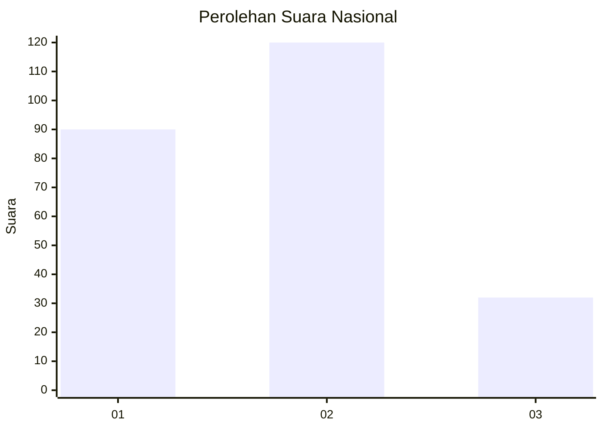
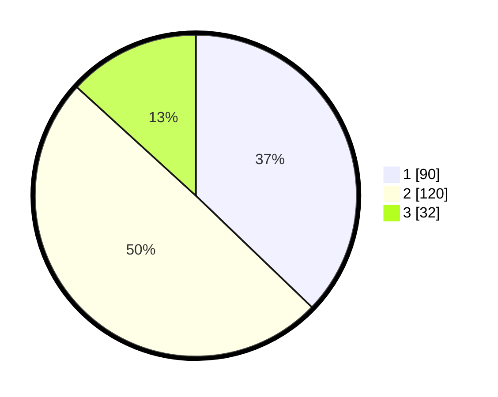

# Hasil

## Grafik

## Tabel

| No. | Nama Paslon    | Suara | Suara (raw) | Persentase |
|:--- |:-------------- | -----:| -----------:| ----------:|
| 1   | ANIES MUHAIMIN | 90    | [90][p-1]   | 37,19      |
| 2   | PRABOWO GIBRAN | 120   | [120][p-2]  | 49,59      |
| 3   | GANJAR MAHFUD  | 32    | [32][p-3]   | 13,22      |

[p-1]: https://github.com/gigit-pemilu/pemilu-2024/blob/main/pilpres/hitung-suara/sub/34-di-yogyakarta/sub/04-sleman/sub/03-moyudan/sub/2002-sumbersari/sub/003-tps/sub/paslon-1.txt
[p-2]: https://github.com/gigit-pemilu/pemilu-2024/blob/main/pilpres/hitung-suara/sub/34-di-yogyakarta/sub/04-sleman/sub/03-moyudan/sub/2002-sumbersari/sub/003-tps/sub/paslon-2.txt
[p-3]: https://github.com/gigit-pemilu/pemilu-2024/blob/main/pilpres/hitung-suara/sub/34-di-yogyakarta/sub/04-sleman/sub/03-moyudan/sub/2002-sumbersari/sub/003-tps/sub/paslon-3.txt

## Foto C Plano

https://sirekap-obj-formc.kpu.go.id/f210/pemilu/ppwp/34/04/03/20/02/3404032002003-20240216-012942--a8864634-dddd-4c16-b776-14d6e134e379.jpg

https://sirekap-obj-formc.kpu.go.id/f210/pemilu/ppwp/34/04/03/20/02/3404032002003-20240216-012944--9d969662-8564-470d-ad71-958328d13c34.jpg

https://sirekap-obj-formc.kpu.go.id/f210/pemilu/ppwp/34/04/03/20/02/3404032002003-20240216-012943--b2e87823-466f-4c47-9bf4-f956cd2496af.jpg

## Metadata

| Key        | Value               |
| ---------- | ------------------- |
| Time Stamp | 2024-02-16 14:00:34 |

## DATA PEMILIH TETAP

Jumlah pemilih dalam DPT: **252**.
 * L: **114**.
 * P: **138**.

## DATA PENGGUNA HAK PILIH

Jumlah pengguna hak pilih dalam DPT: **233**.
 * L: **106**.
 * P: **127**.

Jumlah pengguna hak pilih dalam DPTb: **5**.
 * L: **2**.
 * P: **3**.

Jumlah pengguna hak pilih dalam DPK: **8**.
 * L: **4**.
 * P: **4**.

Jumlah pengguna hak pilih: **246**.
 * L: **112**.
 * P: **134**.

## JUMLAH SUARA SAH DAN TIDAK SAH

JUMLAH SELURUH SUARA SAH: **242**.

JUMLAH SUARA TIDAK SAH: **4**.

JUMLAH SELURUH SUARA SAH DAN SUARA TIDAK SAH: **246**.

