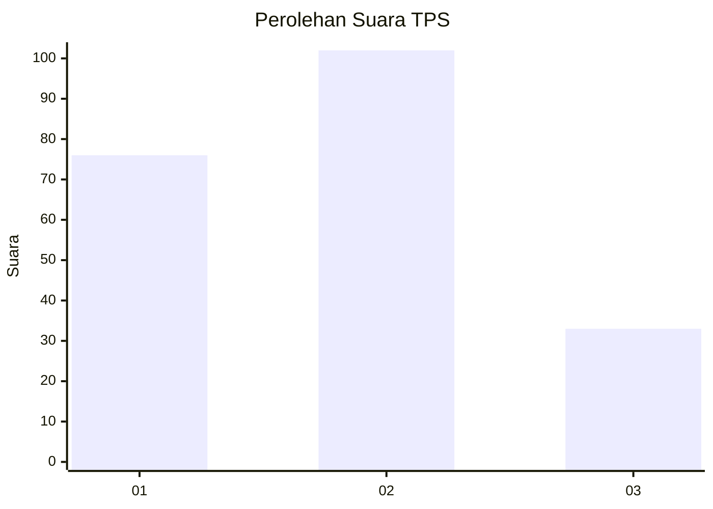
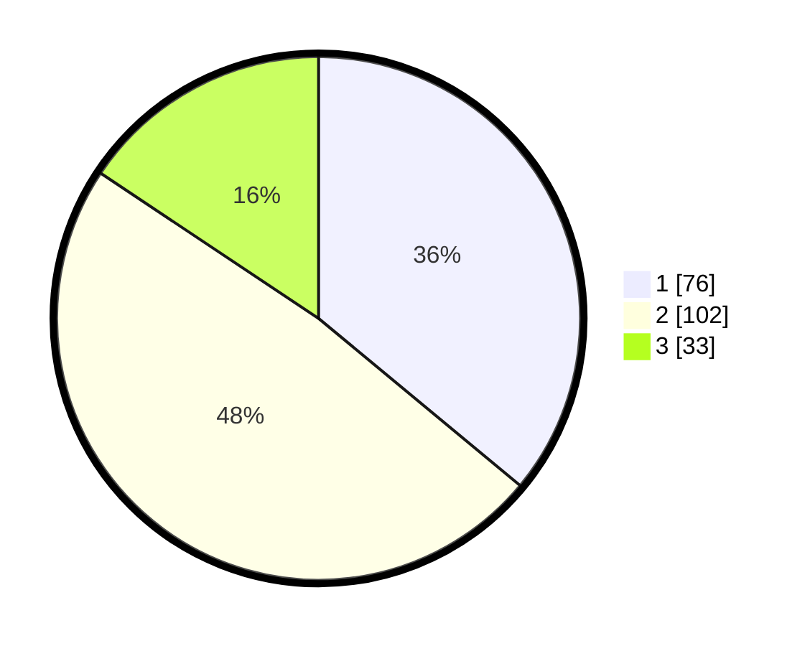

# Hasil

## Grafik

## Tabel

| No. | Nama Paslon    | Suara | Suara (raw) | Persentase |
|:--- |:-------------- | -----:| -----------:| ----------:|
| 1   | ANIES MUHAIMIN | 76    | [76][p-1]   | 36,02      |
| 2   | PRABOWO GIBRAN | 102   | [102][p-2]  | 48,34      |
| 3   | GANJAR MAHFUD  | 33    | [33][p-3]   | 15,64      |

[p-1]: https://github.com/gigit-pemilu/pemilu-2024-34-di-yogyakarta/blob/main/pilpres/hitung-suara/sub/34-di-yogyakarta/sub/04-sleman/sub/03-moyudan/sub/2003-sumberagung/sub/038-tps/sub/paslon-1.txt
[p-2]: https://github.com/gigit-pemilu/pemilu-2024-34-di-yogyakarta/blob/main/pilpres/hitung-suara/sub/34-di-yogyakarta/sub/04-sleman/sub/03-moyudan/sub/2003-sumberagung/sub/038-tps/sub/paslon-2.txt
[p-3]: https://github.com/gigit-pemilu/pemilu-2024-34-di-yogyakarta/blob/main/pilpres/hitung-suara/sub/34-di-yogyakarta/sub/04-sleman/sub/03-moyudan/sub/2003-sumberagung/sub/038-tps/sub/paslon-3.txt

## Foto C Plano

https://sirekap-obj-formc.kpu.go.id/e9b4/pemilu/ppwp/34/04/03/20/03/3404032003038-20240216-134220--3b528a82-91e5-4f26-8245-264257b0ef80.jpg

https://sirekap-obj-formc.kpu.go.id/e9b4/pemilu/ppwp/34/04/03/20/03/3404032003038-20240214-200353--fdebbcfc-18f5-448d-9e9d-d95a7dd8c16a.jpg

https://sirekap-obj-formc.kpu.go.id/e9b4/pemilu/ppwp/34/04/03/20/03/3404032003038-20240214-200237--ee5202d8-40ee-4683-b8fa-0f538719eaf5.jpg

## Metadata

| Key        | Value               |
| ---------- | ------------------- |
| Time Stamp | 2024-02-16 14:00:34 |

