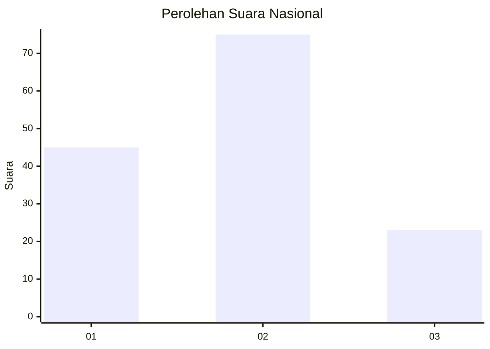
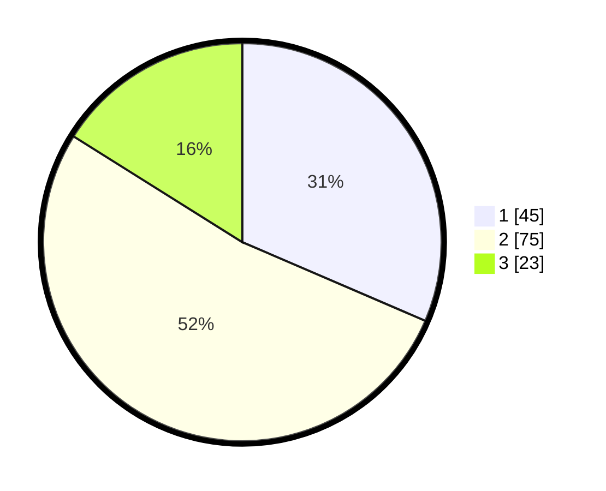

# Hasil

## Grafik

## Tabel

| No. | Nama Paslon    | Suara | Suara (raw) | Persentase |
|:--- |:-------------- | -----:| -----------:| ----------:|
| 1   | ANIES MUHAIMIN | 45    | [45][p-1]   | 31,47      |
| 2   | PRABOWO GIBRAN | 75    | [75][p-2]   | 52,45      |
| 3   | GANJAR MAHFUD  | 23    | [23][p-3]   | 16,08      |

[p-1]: https://github.com/gigit-pemilu/pemilu-2024/blob/main/pilpres/hitung-suara/sub/34-di-yogyakarta/sub/04-sleman/sub/03-moyudan/sub/2004-sumberarum/sub/007-tps/sub/paslon-1.txt
[p-2]: https://github.com/gigit-pemilu/pemilu-2024/blob/main/pilpres/hitung-suara/sub/34-di-yogyakarta/sub/04-sleman/sub/03-moyudan/sub/2004-sumberarum/sub/007-tps/sub/paslon-2.txt
[p-3]: https://github.com/gigit-pemilu/pemilu-2024/blob/main/pilpres/hitung-suara/sub/34-di-yogyakarta/sub/04-sleman/sub/03-moyudan/sub/2004-sumberarum/sub/007-tps/sub/paslon-3.txt

## Foto C Plano

https://sirekap-obj-formc.kpu.go.id/bf55/pemilu/ppwp/34/04/03/20/04/3404032004007-20240214-141437--6b9ca9e4-fe54-4a6a-8534-80e6d50b3609.jpg

https://sirekap-obj-formc.kpu.go.id/bf55/pemilu/ppwp/34/04/03/20/04/3404032004007-20240214-141723--02fa15a9-1184-4a4c-8bff-9098b0c75c3b.jpg

https://sirekap-obj-formc.kpu.go.id/bf55/pemilu/ppwp/34/04/03/20/04/3404032004007-20240214-141901--d6f3fb4e-463a-47d9-b300-dd73c706c587.jpg

## Metadata

| Key        | Value               |
| ---------- | ------------------- |
| Time Stamp | 2024-02-15 18:00:26 |

## DATA PEMILIH TETAP

Jumlah pemilih dalam DPT: **153**.
 * L: **77**.
 * P: **76**.

## DATA PENGGUNA HAK PILIH

Jumlah pengguna hak pilih dalam DPT: **140**.
 * L: **4**.
 * P: **71**.

Jumlah pengguna hak pilih dalam DPTb: **5**.
 * L: **0**.
 * P: **5**.

Jumlah pengguna hak pilih dalam DPK: **0**.
 * L: **0**.
 * P: **20**.

Jumlah pengguna hak pilih: **145**.
 * L: **67**.
 * P: **76**.

## JUMLAH SUARA SAH DAN TIDAK SAH

JUMLAH SELURUH SUARA SAH: **143**.

JUMLAH SUARA TIDAK SAH: **2**.

JUMLAH SELURUH SUARA SAH DAN SUARA TIDAK SAH: **145**.

