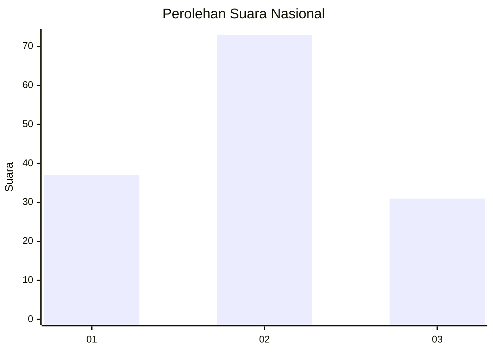
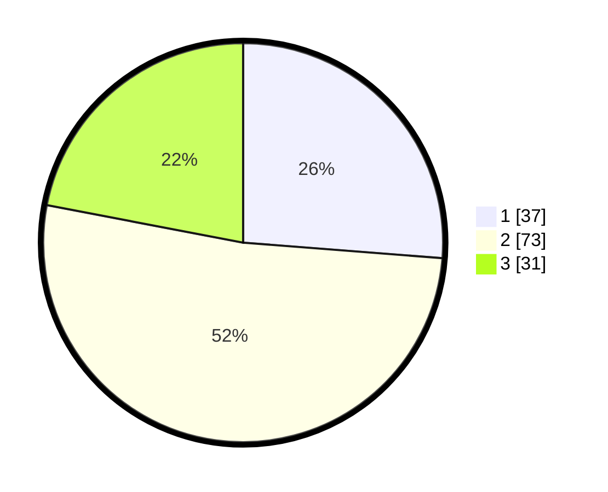

# Hasil

## Grafik

## Tabel

| No. | Nama Paslon    | Suara | Suara (raw) | Persentase |
|:--- |:-------------- | -----:| -----------:| ----------:|
| 1   | ANIES MUHAIMIN | 37    | [37][p-1]   | 26,24      |
| 2   | PRABOWO GIBRAN | 73    | [73][p-2]   | 51,77      |
| 3   | GANJAR MAHFUD  | 31    | [31][p-3]   | 21,99      |

[p-1]: https://github.com/gigit-pemilu/pemilu-2024/blob/main/pilpres/hitung-suara/sub/34-di-yogyakarta/sub/04-sleman/sub/03-moyudan/sub/2004-sumberarum/sub/024-tps/sub/paslon-1.txt
[p-2]: https://github.com/gigit-pemilu/pemilu-2024/blob/main/pilpres/hitung-suara/sub/34-di-yogyakarta/sub/04-sleman/sub/03-moyudan/sub/2004-sumberarum/sub/024-tps/sub/paslon-2.txt
[p-3]: https://github.com/gigit-pemilu/pemilu-2024/blob/main/pilpres/hitung-suara/sub/34-di-yogyakarta/sub/04-sleman/sub/03-moyudan/sub/2004-sumberarum/sub/024-tps/sub/paslon-3.txt

## Foto C Plano

https://sirekap-obj-formc.kpu.go.id/9d0f/pemilu/ppwp/34/04/03/20/04/3404032004024-20240215-004013--7c7f2f1b-8b6e-4d5a-9251-79ced3943c45.jpg

https://sirekap-obj-formc.kpu.go.id/9d0f/pemilu/ppwp/34/04/03/20/04/3404032004024-20240215-004226--83fee52c-976a-4366-8673-d25f3d83848d.jpg

https://sirekap-obj-formc.kpu.go.id/9d0f/pemilu/ppwp/34/04/03/20/04/3404032004024-20240215-004418--e17711df-1214-4364-b769-d9c690d29717.jpg

## Metadata

| Key        | Value               |
| ---------- | ------------------- |
| Time Stamp | 2024-02-15 22:00:27 |

