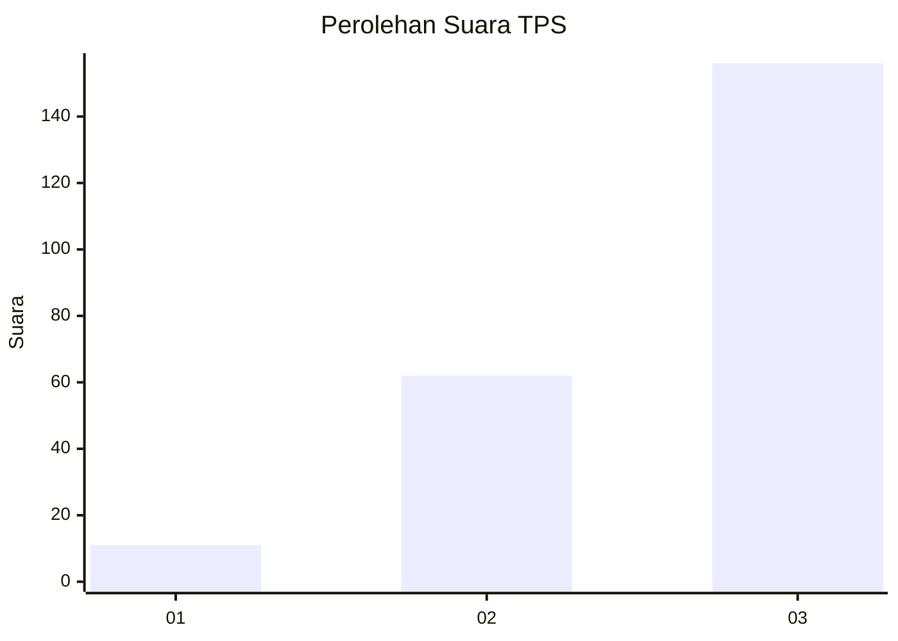
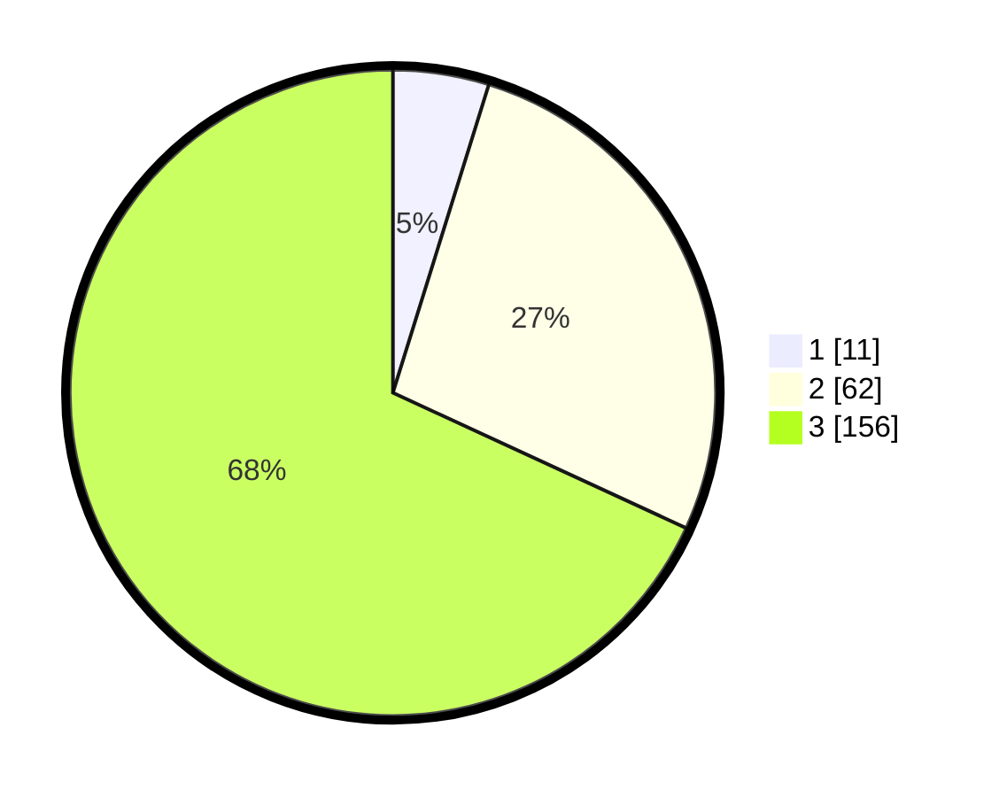

# Hasil

## Grafik

## Tabel

| No. | Nama Paslon    | Suara | Suara (raw) | Persentase |
|:--- |:-------------- | -----:| -----------:| ----------:|
| 1   | ANIES MUHAIMIN | 11    | [11][p-1]   | 4,80       |
| 2   | PRABOWO GIBRAN | 62    | [62][p-2]   | 27,07      |
| 3   | GANJAR MAHFUD  | 156   | [156][p-3]  | 68,12      |

[p-1]: https://github.com/gigit-pemilu/pemilu-2024-34-di-yogyakarta/blob/main/pilpres/hitung-suara/sub/34-di-yogyakarta/sub/04-sleman/sub/04-minggir/sub/2001-sendangarum/sub/001-tps/sub/paslon-1.txt
[p-2]: https://github.com/gigit-pemilu/pemilu-2024-34-di-yogyakarta/blob/main/pilpres/hitung-suara/sub/34-di-yogyakarta/sub/04-sleman/sub/04-minggir/sub/2001-sendangarum/sub/001-tps/sub/paslon-2.txt
[p-3]: https://github.com/gigit-pemilu/pemilu-2024-34-di-yogyakarta/blob/main/pilpres/hitung-suara/sub/34-di-yogyakarta/sub/04-sleman/sub/04-minggir/sub/2001-sendangarum/sub/001-tps/sub/paslon-3.txt

## Foto C Plano

https://sirekap-obj-formc.kpu.go.id/f2af/pemilu/ppwp/34/04/04/20/01/3404042001001-20240214-155251--24a69d36-f618-40a9-b8a4-73237d74bb6e.jpg

https://sirekap-obj-formc.kpu.go.id/f2af/pemilu/ppwp/34/04/04/20/01/3404042001001-20240214-194127--e63dc14c-c6df-4eb2-99cb-9ceb0fa3bdb7.jpg

https://sirekap-obj-formc.kpu.go.id/f2af/pemilu/ppwp/34/04/04/20/01/3404042001001-20240214-194516--5e3cd03b-0195-4eb5-a717-70d4e548b045.jpg

## Metadata

| Key        | Value               |
| ---------- | ------------------- |
| Time Stamp | 2024-02-14 21:46:01 |

## DATA PEMILIH TETAP

Jumlah pemilih dalam DPT: **271**.
 * L: **129**.
 * P: **142**.

## DATA PENGGUNA HAK PILIH

Jumlah pengguna hak pilih dalam DPT: **224**.
 * L: **110**.
 * P: **114**.

Jumlah pengguna hak pilih dalam DPTb: **9**.
 * L: **7**.
 * P: **2**.

Jumlah pengguna hak pilih dalam DPK: **2**.
 * L: **1**.
 * P: **1**.

Jumlah pengguna hak pilih: **235**.
 * L: **118**.
 * P: **117**.

## JUMLAH SUARA SAH DAN TIDAK SAH

JUMLAH SELURUH SUARA SAH: **229**.

JUMLAH SUARA TIDAK SAH: **6**.

JUMLAH SELURUH SUARA SAH DAN SUARA TIDAK SAH: **235**.

