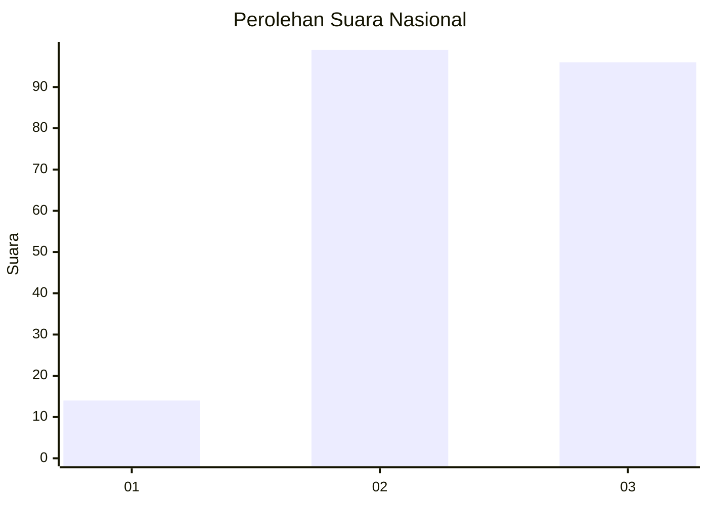
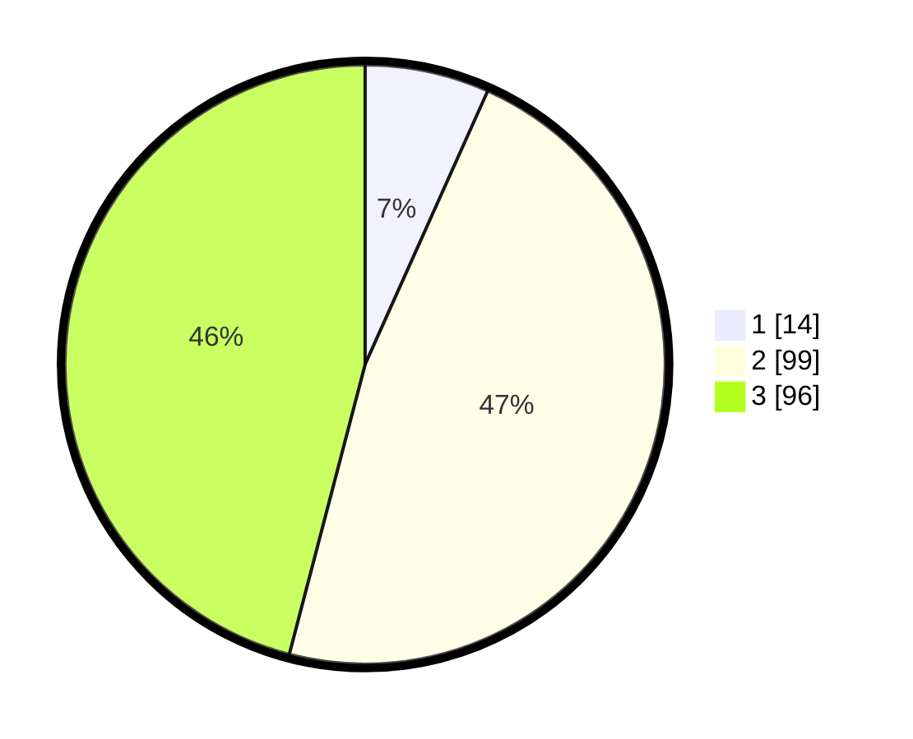

# Hasil

## Grafik

## Tabel

| No. | Nama Paslon    | Suara | Suara (raw) | Persentase |
|:--- |:-------------- | -----:| -----------:| ----------:|
| 1   | ANIES MUHAIMIN | 14    | [14][p-1]   | 6,70       |
| 2   | PRABOWO GIBRAN | 99    | [99][p-2]   | 47,37      |
| 3   | GANJAR MAHFUD  | 96    | [96][p-3]   | 45,93      |

[p-1]: https://github.com/gigit-pemilu/pemilu-2024/blob/main/pilpres/hitung-suara/sub/34-di-yogyakarta/sub/04-sleman/sub/04-minggir/sub/2001-sendangarum/sub/002-tps/sub/paslon-1.txt
[p-2]: https://github.com/gigit-pemilu/pemilu-2024/blob/main/pilpres/hitung-suara/sub/34-di-yogyakarta/sub/04-sleman/sub/04-minggir/sub/2001-sendangarum/sub/002-tps/sub/paslon-2.txt
[p-3]: https://github.com/gigit-pemilu/pemilu-2024/blob/main/pilpres/hitung-suara/sub/34-di-yogyakarta/sub/04-sleman/sub/04-minggir/sub/2001-sendangarum/sub/002-tps/sub/paslon-3.txt

## Foto C Plano

https://sirekap-obj-formc.kpu.go.id/23e5/pemilu/ppwp/34/04/04/20/01/3404042001002-20240215-035927--e89089a3-a384-4017-9433-43798c275f56.jpg

https://sirekap-obj-formc.kpu.go.id/23e5/pemilu/ppwp/34/04/04/20/01/3404042001002-20240215-040010--2bc4c7eb-a9bb-4c91-9537-ed738d3b7377.jpg

https://sirekap-obj-formc.kpu.go.id/23e5/pemilu/ppwp/34/04/04/20/01/3404042001002-20240215-040041--e26d3b46-38de-49dc-9f1e-2217d00e465f.jpg

## Metadata

| Key        | Value               |
| ---------- | ------------------- |
| Time Stamp | 2024-02-15 15:00:29 |

## DATA PEMILIH TETAP

Jumlah pemilih dalam DPT: **211**.
 * L: **106**.
 * P: **105**.

## DATA PENGGUNA HAK PILIH

Jumlah pengguna hak pilih dalam DPT: **198**.
 * L: **98**.
 * P: **100**.

Jumlah pengguna hak pilih dalam DPTb: **11**.
 * L: **3**.
 * P: **8**.

Jumlah pengguna hak pilih dalam DPK: **2**.
 * L: **2**.
 * P: **0**.

Jumlah pengguna hak pilih: **211**.
 * L: **103**.
 * P: **108**.

## JUMLAH SUARA SAH DAN TIDAK SAH

JUMLAH SELURUH SUARA SAH: **209**.

JUMLAH SUARA TIDAK SAH: **2**.

JUMLAH SELURUH SUARA SAH DAN SUARA TIDAK SAH: **211**.

