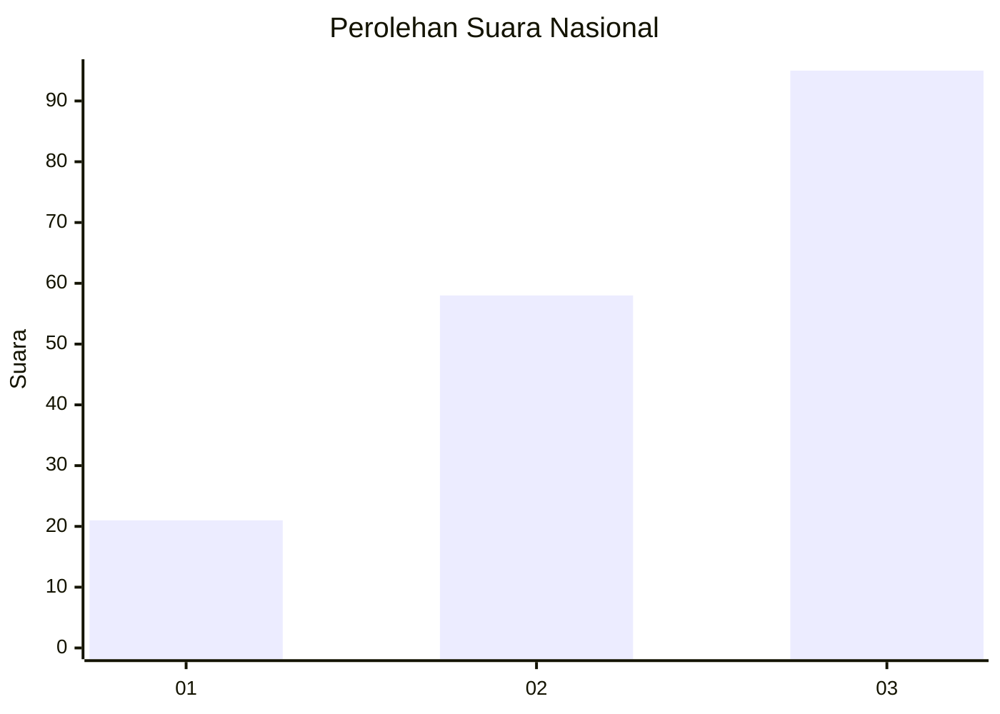
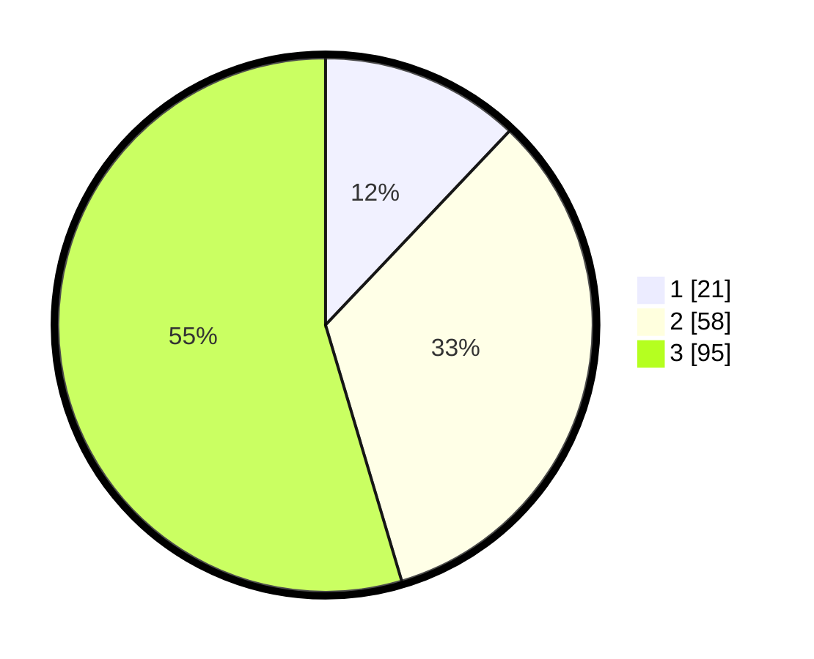

# Hasil

## Grafik

## Tabel

| No. | Nama Paslon    | Suara | Suara (raw) | Persentase |
|:--- |:-------------- | -----:| -----------:| ----------:|
| 1   | ANIES MUHAIMIN | 21    | [21][p-1]   | 12,07      |
| 2   | PRABOWO GIBRAN | 58    | [58][p-2]   | 33,33      |
| 3   | GANJAR MAHFUD  | 95    | [95][p-3]   | 54,60      |

[p-1]: https://github.com/gigit-pemilu/pemilu-2024/blob/main/pilpres/hitung-suara/sub/34-di-yogyakarta/sub/04-sleman/sub/04-minggir/sub/2001-sendangarum/sub/003-tps/sub/paslon-1.txt
[p-2]: https://github.com/gigit-pemilu/pemilu-2024/blob/main/pilpres/hitung-suara/sub/34-di-yogyakarta/sub/04-sleman/sub/04-minggir/sub/2001-sendangarum/sub/003-tps/sub/paslon-2.txt
[p-3]: https://github.com/gigit-pemilu/pemilu-2024/blob/main/pilpres/hitung-suara/sub/34-di-yogyakarta/sub/04-sleman/sub/04-minggir/sub/2001-sendangarum/sub/003-tps/sub/paslon-3.txt

## Foto C Plano

https://sirekap-obj-formc.kpu.go.id/2e7b/pemilu/ppwp/34/04/04/20/01/3404042001003-20240214-155607--46fdbb82-3cfd-48f0-816f-4dfdd973d78c.jpg

https://sirekap-obj-formc.kpu.go.id/2e7b/pemilu/ppwp/34/04/04/20/01/3404042001003-20240214-155128--2222ef60-0bef-4bfd-bbbf-acd6ad558a66.jpg

https://sirekap-obj-formc.kpu.go.id/2e7b/pemilu/ppwp/34/04/04/20/01/3404042001003-20240214-155134--1a81e7a5-2c36-46e3-bcb9-c5eba30098e8.jpg

## Metadata

| Key        | Value               |
| ---------- | ------------------- |
| Time Stamp | 2024-02-14 21:46:01 |

## DATA PEMILIH TETAP

Jumlah pemilih dalam DPT: **184**.
 * L: **93**.
 * P: **91**.

## DATA PENGGUNA HAK PILIH

Jumlah pengguna hak pilih dalam DPT: **168**.
 * L: **83**.
 * P: **85**.

Jumlah pengguna hak pilih dalam DPTb: **6**.
 * L: **0**.
 * P: **6**.

Jumlah pengguna hak pilih dalam DPK: **1**.
 * L: **0**.
 * P: **1**.

Jumlah pengguna hak pilih: **175**.
 * L: **83**.
 * P: **92**.

## JUMLAH SUARA SAH DAN TIDAK SAH

JUMLAH SELURUH SUARA SAH: **174**.

JUMLAH SUARA TIDAK SAH: **1**.

JUMLAH SELURUH SUARA SAH DAN SUARA TIDAK SAH: **175**.

