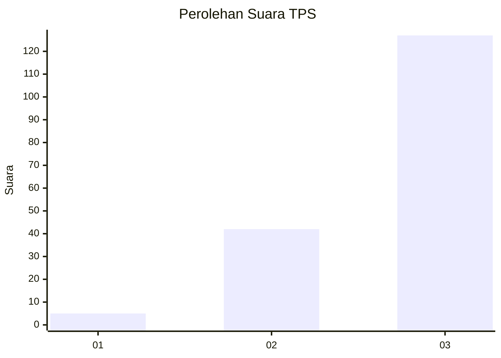
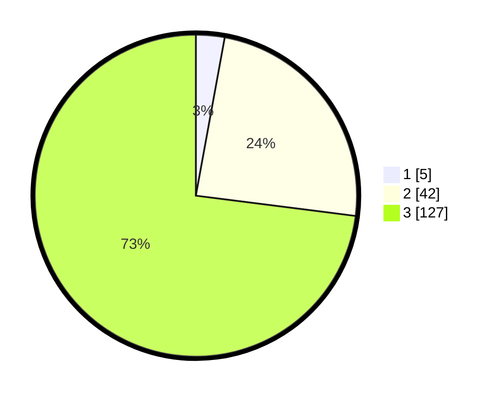

# Hasil

## Grafik

## Tabel

| No. | Nama Paslon    | Suara | Suara (raw) | Persentase |
|:--- |:-------------- | -----:| -----------:| ----------:|
| 1   | ANIES MUHAIMIN | 5     | [5][p-1]    | 2,87       |
| 2   | PRABOWO GIBRAN | 42    | [42][p-2]   | 24,14      |
| 3   | GANJAR MAHFUD  | 127   | [127][p-3]  | 72,99      |

[p-1]: https://github.com/gigit-pemilu/pemilu-2024-34-di-yogyakarta/blob/main/pilpres/hitung-suara/sub/34-di-yogyakarta/sub/04-sleman/sub/04-minggir/sub/2001-sendangarum/sub/004-tps/sub/paslon-1.txt
[p-2]: https://github.com/gigit-pemilu/pemilu-2024-34-di-yogyakarta/blob/main/pilpres/hitung-suara/sub/34-di-yogyakarta/sub/04-sleman/sub/04-minggir/sub/2001-sendangarum/sub/004-tps/sub/paslon-2.txt
[p-3]: https://github.com/gigit-pemilu/pemilu-2024-34-di-yogyakarta/blob/main/pilpres/hitung-suara/sub/34-di-yogyakarta/sub/04-sleman/sub/04-minggir/sub/2001-sendangarum/sub/004-tps/sub/paslon-3.txt

## Foto C Plano

https://sirekap-obj-formc.kpu.go.id/5602/pemilu/ppwp/34/04/04/20/01/3404042001004-20240214-155711--b4209aab-53b3-4aa0-a083-9a5f61212724.jpg

https://sirekap-obj-formc.kpu.go.id/5602/pemilu/ppwp/34/04/04/20/01/3404042001004-20240214-212212--b7ff5169-b287-4efb-95a8-d0a13d8b1e51.jpg

https://sirekap-obj-formc.kpu.go.id/5602/pemilu/ppwp/34/04/04/20/01/3404042001004-20240214-222631--aeaf5457-9e06-4682-b83e-31d2e5a40519.jpg

## Metadata

| Key        | Value               |
| ---------- | ------------------- |
| Time Stamp | 2024-02-15 19:00:26 |

## DATA PEMILIH TETAP

Jumlah pemilih dalam DPT: **187**.
 * L: **90**.
 * P: **97**.

## DATA PENGGUNA HAK PILIH

Jumlah pengguna hak pilih dalam DPT: **167**.
 * L: **79**.
 * P: **88**.

Jumlah pengguna hak pilih dalam DPTb: **9**.
 * L: **3**.
 * P: **6**.

Jumlah pengguna hak pilih dalam DPK: **3**.
 * L: **2**.
 * P: **1**.

Jumlah pengguna hak pilih: **179**.
 * L: **84**.
 * P: **95**.

## JUMLAH SUARA SAH DAN TIDAK SAH

JUMLAH SELURUH SUARA SAH: **174**.

JUMLAH SUARA TIDAK SAH: **5**.

JUMLAH SELURUH SUARA SAH DAN SUARA TIDAK SAH: **179**.

