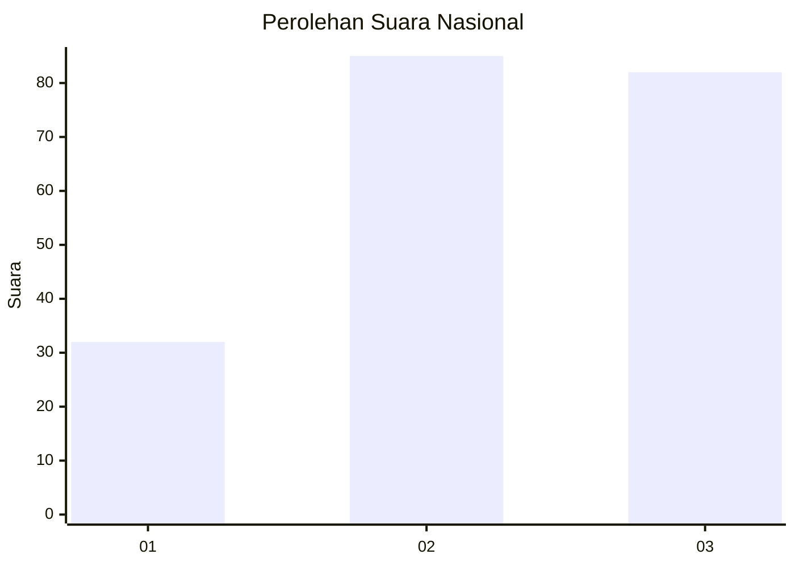
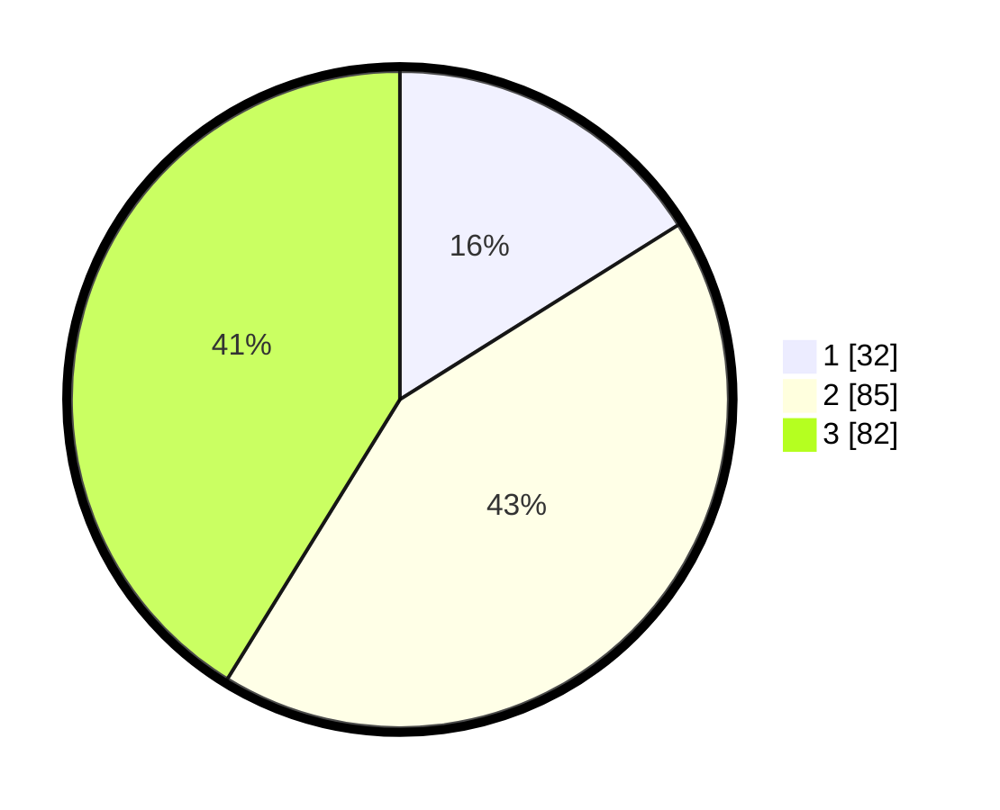

# Hasil

## Grafik

## Tabel

| No. | Nama Paslon    | Suara | Suara (raw) | Persentase |
|:--- |:-------------- | -----:| -----------:| ----------:|
| 1   | ANIES MUHAIMIN | 32    | [32][p-1]   | 16,08      |
| 2   | PRABOWO GIBRAN | 85    | [85][p-2]   | 42,71      |
| 3   | GANJAR MAHFUD  | 82    | [82][p-3]   | 41,21      |

[p-1]: https://github.com/gigit-pemilu/pemilu-2024/blob/main/pilpres/hitung-suara/sub/34-di-yogyakarta/sub/04-sleman/sub/04-minggir/sub/2001-sendangarum/sub/005-tps/sub/paslon-1.txt
[p-2]: https://github.com/gigit-pemilu/pemilu-2024/blob/main/pilpres/hitung-suara/sub/34-di-yogyakarta/sub/04-sleman/sub/04-minggir/sub/2001-sendangarum/sub/005-tps/sub/paslon-2.txt
[p-3]: https://github.com/gigit-pemilu/pemilu-2024/blob/main/pilpres/hitung-suara/sub/34-di-yogyakarta/sub/04-sleman/sub/04-minggir/sub/2001-sendangarum/sub/005-tps/sub/paslon-3.txt

## Foto C Plano

https://sirekap-obj-formc.kpu.go.id/2867/pemilu/ppwp/34/04/04/20/01/3404042001005-20240214-231225--91eb354b-60ea-43f1-9ea6-ff166f2ce068.jpg

https://sirekap-obj-formc.kpu.go.id/2867/pemilu/ppwp/34/04/04/20/01/3404042001005-20240214-232407--cd340ec0-f030-49ca-9f45-978d7929daff.jpg

https://sirekap-obj-formc.kpu.go.id/2867/pemilu/ppwp/34/04/04/20/01/3404042001005-20240214-232721--37609f6a-a8d5-4cef-a6a1-43de2428dc45.jpg

## Metadata

| Key        | Value               |
| ---------- | ------------------- |
| Time Stamp | 2024-02-15 18:30:25 |

