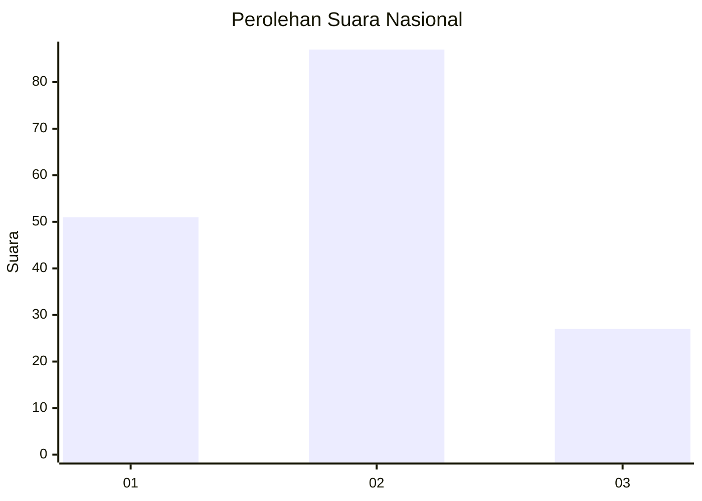
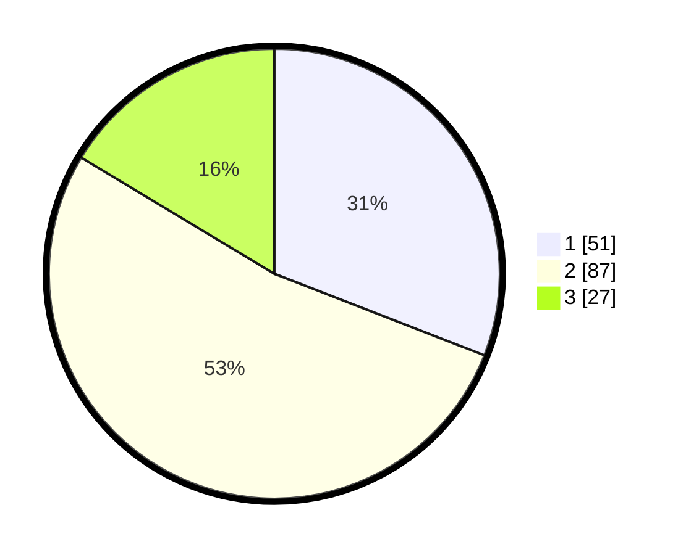

# Hasil

## Grafik

## Tabel

| No. | Nama Paslon    | Suara | Suara (raw) | Persentase |
|:--- |:-------------- | -----:| -----------:| ----------:|
| 1   | ANIES MUHAIMIN | 51    | [51][p-1]   | 30,91      |
| 2   | PRABOWO GIBRAN | 87    | [87][p-2]   | 52,73      |
| 3   | GANJAR MAHFUD  | 27    | [27][p-3]   | 16,36      |

[p-1]: https://github.com/gigit-pemilu/pemilu-2024/blob/main/pilpres/hitung-suara/sub/34-di-yogyakarta/sub/04-sleman/sub/04-minggir/sub/2001-sendangarum/sub/008-tps/sub/paslon-1.txt
[p-2]: https://github.com/gigit-pemilu/pemilu-2024/blob/main/pilpres/hitung-suara/sub/34-di-yogyakarta/sub/04-sleman/sub/04-minggir/sub/2001-sendangarum/sub/008-tps/sub/paslon-2.txt
[p-3]: https://github.com/gigit-pemilu/pemilu-2024/blob/main/pilpres/hitung-suara/sub/34-di-yogyakarta/sub/04-sleman/sub/04-minggir/sub/2001-sendangarum/sub/008-tps/sub/paslon-3.txt

## Foto C Plano

https://sirekap-obj-formc.kpu.go.id/6773/pemilu/ppwp/34/04/04/20/01/3404042001008-20240214-225316--52d58b80-0baf-49d0-8a60-4a4c84cc485b.jpg

https://sirekap-obj-formc.kpu.go.id/6773/pemilu/ppwp/34/04/04/20/01/3404042001008-20240214-225345--745bc7cf-1463-4daf-b258-4eb10697fb76.jpg

https://sirekap-obj-formc.kpu.go.id/6773/pemilu/ppwp/34/04/04/20/01/3404042001008-20240214-225401--f51efdfd-b9d8-49e1-9c4a-60d5c895379c.jpg

## Metadata

| Key        | Value               |
| ---------- | ------------------- |
| Time Stamp | 2024-02-15 16:00:26 |

