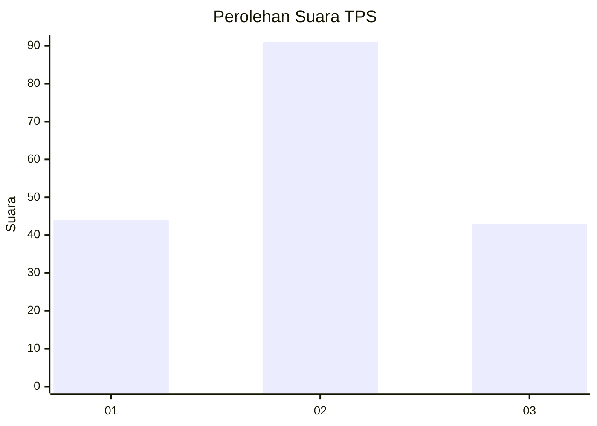
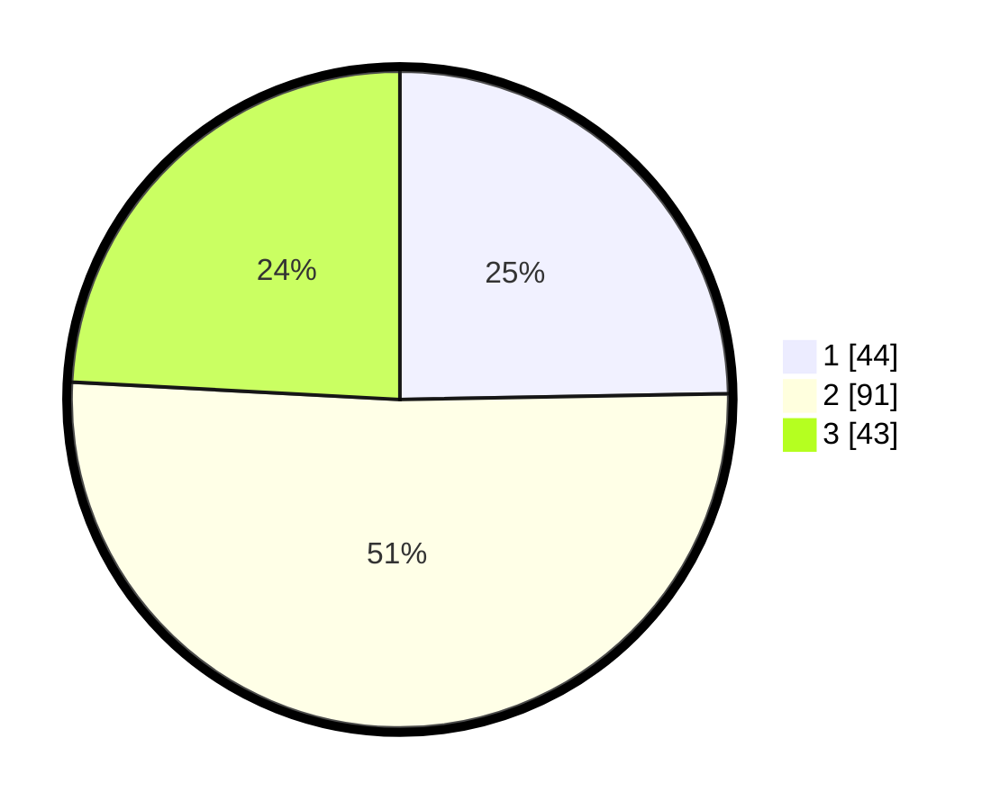

# Hasil

## Grafik

## Tabel

| No. | Nama Paslon    | Suara | Suara (raw) | Persentase |
|:--- |:-------------- | -----:| -----------:| ----------:|
| 1   | ANIES MUHAIMIN | 44    | [44][p-1]   | 24,72      |
| 2   | PRABOWO GIBRAN | 91    | [91][p-2]   | 51,12      |
| 3   | GANJAR MAHFUD  | 43    | [43][p-3]   | 24,16      |

[p-1]: https://github.com/gigit-pemilu/pemilu-2024-34-di-yogyakarta/blob/main/pilpres/hitung-suara/sub/34-di-yogyakarta/sub/04-sleman/sub/04-minggir/sub/2002-sendangmulyo/sub/006-tps/sub/paslon-1.txt
[p-2]: https://github.com/gigit-pemilu/pemilu-2024-34-di-yogyakarta/blob/main/pilpres/hitung-suara/sub/34-di-yogyakarta/sub/04-sleman/sub/04-minggir/sub/2002-sendangmulyo/sub/006-tps/sub/paslon-2.txt
[p-3]: https://github.com/gigit-pemilu/pemilu-2024-34-di-yogyakarta/blob/main/pilpres/hitung-suara/sub/34-di-yogyakarta/sub/04-sleman/sub/04-minggir/sub/2002-sendangmulyo/sub/006-tps/sub/paslon-3.txt

## Foto C Plano

https://sirekap-obj-formc.kpu.go.id/0c7f/pemilu/ppwp/34/04/04/20/02/3404042002006-20240215-005129--c35f571c-3d8f-474a-bc17-19bf39196350.jpg

https://sirekap-obj-formc.kpu.go.id/0c7f/pemilu/ppwp/34/04/04/20/02/3404042002006-20240215-005208--a958f988-a18f-4d22-8e21-ca23d627072d.jpg

https://sirekap-obj-formc.kpu.go.id/0c7f/pemilu/ppwp/34/04/04/20/02/3404042002006-20240215-005308--574c7d1e-6ba5-47b2-8089-f4a9cdcf782a.jpg

## Metadata

| Key        | Value               |
| ---------- | ------------------- |
| Time Stamp | 2024-02-15 15:00:29 |

