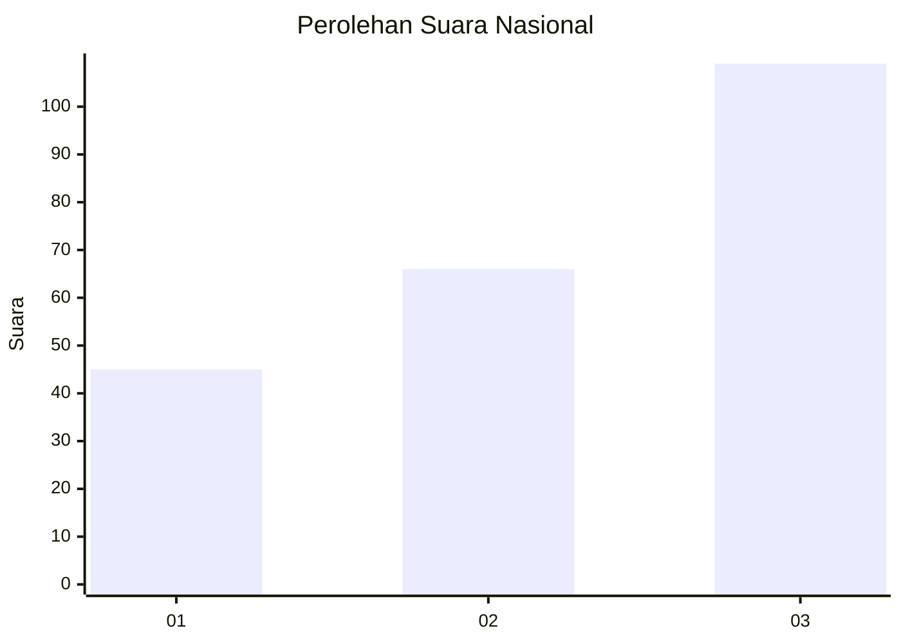
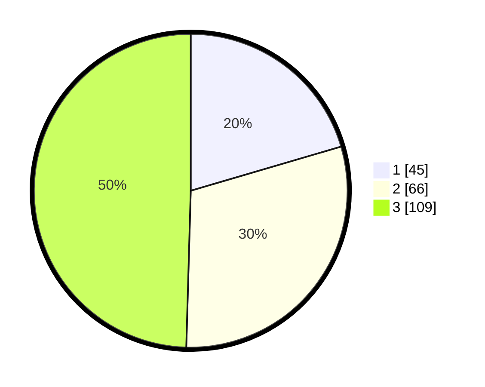

# Hasil

## Grafik

## Tabel

| No. | Nama Paslon    | Suara | Suara (raw) | Persentase |
|:--- |:-------------- | -----:| -----------:| ----------:|
| 1   | ANIES MUHAIMIN | 45    | [45][p-1]   | 20,45      |
| 2   | PRABOWO GIBRAN | 66    | [66][p-2]   | 30,00      |
| 3   | GANJAR MAHFUD  | 109   | [109][p-3]  | 49,55      |

[p-1]: https://github.com/gigit-pemilu/pemilu-2024/blob/main/pilpres/hitung-suara/sub/34-di-yogyakarta/sub/04-sleman/sub/04-minggir/sub/2002-sendangmulyo/sub/010-tps/sub/paslon-1.txt
[p-2]: https://github.com/gigit-pemilu/pemilu-2024/blob/main/pilpres/hitung-suara/sub/34-di-yogyakarta/sub/04-sleman/sub/04-minggir/sub/2002-sendangmulyo/sub/010-tps/sub/paslon-2.txt
[p-3]: https://github.com/gigit-pemilu/pemilu-2024/blob/main/pilpres/hitung-suara/sub/34-di-yogyakarta/sub/04-sleman/sub/04-minggir/sub/2002-sendangmulyo/sub/010-tps/sub/paslon-3.txt

## Foto C Plano

https://sirekap-obj-formc.kpu.go.id/ad5c/pemilu/ppwp/34/04/04/20/02/3404042002010-20240214-221807--d2177e06-26b6-4d23-95b7-c5f55fe33bb7.jpg

https://sirekap-obj-formc.kpu.go.id/ad5c/pemilu/ppwp/34/04/04/20/02/3404042002010-20240214-221910--ce9e5236-571e-4c20-bd8b-5b527a071900.jpg

https://sirekap-obj-formc.kpu.go.id/ad5c/pemilu/ppwp/34/04/04/20/02/3404042002010-20240214-222112--fdc4841e-1b9c-4231-a608-8b9589b7d5c7.jpg

## Metadata

| Key        | Value               |
| ---------- | ------------------- |
| Time Stamp | 2024-02-15 21:01:18 |

