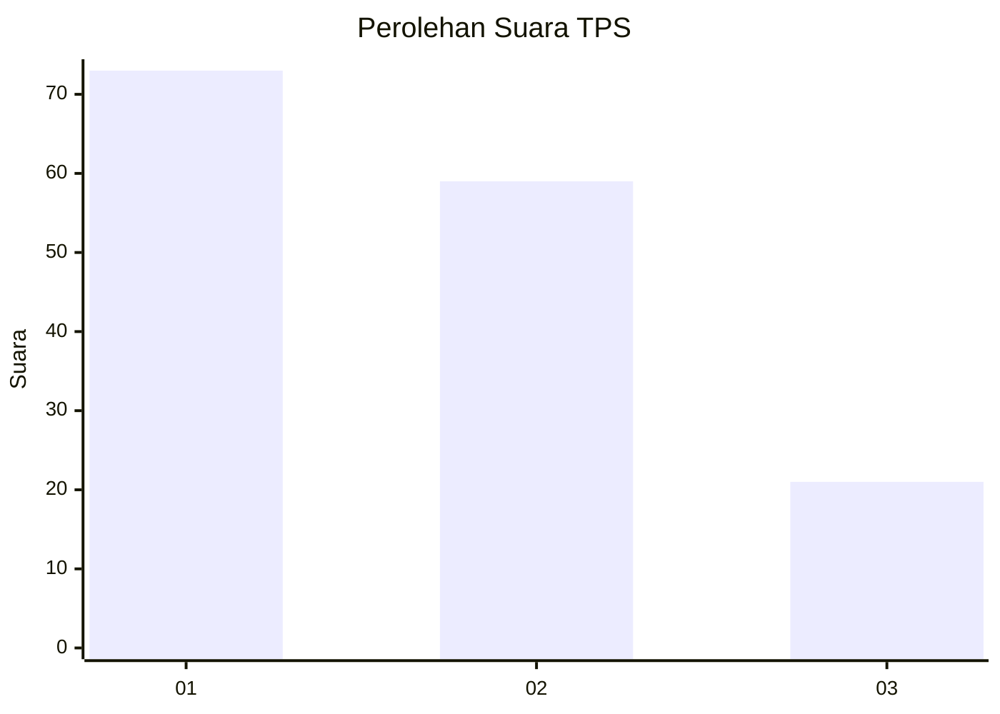
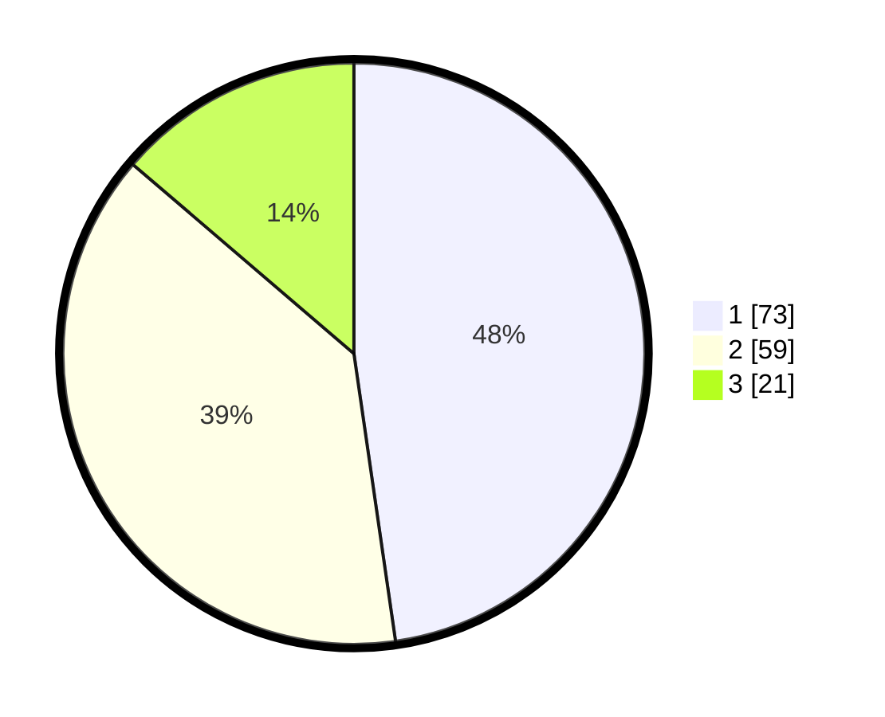

# Hasil

## Grafik

## Tabel

| No. | Nama Paslon    | Suara | Suara (raw) | Persentase |
|:--- |:-------------- | -----:| -----------:| ----------:|
| 1   | ANIES MUHAIMIN | 73    | [73][p-1]   | 47,71      |
| 2   | PRABOWO GIBRAN | 59    | [59][p-2]   | 38,56      |
| 3   | GANJAR MAHFUD  | 21    | [21][p-3]   | 13,73      |

[p-1]: https://github.com/gigit-pemilu/pemilu-2024-34-di-yogyakarta/blob/main/pilpres/hitung-suara/sub/34-di-yogyakarta/sub/04-sleman/sub/04-minggir/sub/2002-sendangmulyo/sub/015-tps/sub/paslon-1.txt
[p-2]: https://github.com/gigit-pemilu/pemilu-2024-34-di-yogyakarta/blob/main/pilpres/hitung-suara/sub/34-di-yogyakarta/sub/04-sleman/sub/04-minggir/sub/2002-sendangmulyo/sub/015-tps/sub/paslon-2.txt
[p-3]: https://github.com/gigit-pemilu/pemilu-2024-34-di-yogyakarta/blob/main/pilpres/hitung-suara/sub/34-di-yogyakarta/sub/04-sleman/sub/04-minggir/sub/2002-sendangmulyo/sub/015-tps/sub/paslon-3.txt

## Foto C Plano

https://sirekap-obj-formc.kpu.go.id/09c8/pemilu/ppwp/34/04/04/20/02/3404042002015-20240214-210849--34eef4cf-f828-4ab0-bbf1-8f4b632069d6.jpg

https://sirekap-obj-formc.kpu.go.id/09c8/pemilu/ppwp/34/04/04/20/02/3404042002015-20240214-211039--80649bc4-9c48-415e-9989-c52c4a83fb48.jpg

https://sirekap-obj-formc.kpu.go.id/09c8/pemilu/ppwp/34/04/04/20/02/3404042002015-20240214-211152--87b74c87-6294-4119-8010-4b5d4aad5d8c.jpg

## Metadata

| Key        | Value               |
| ---------- | ------------------- |
| Time Stamp | 2024-02-15 00:41:44 |

