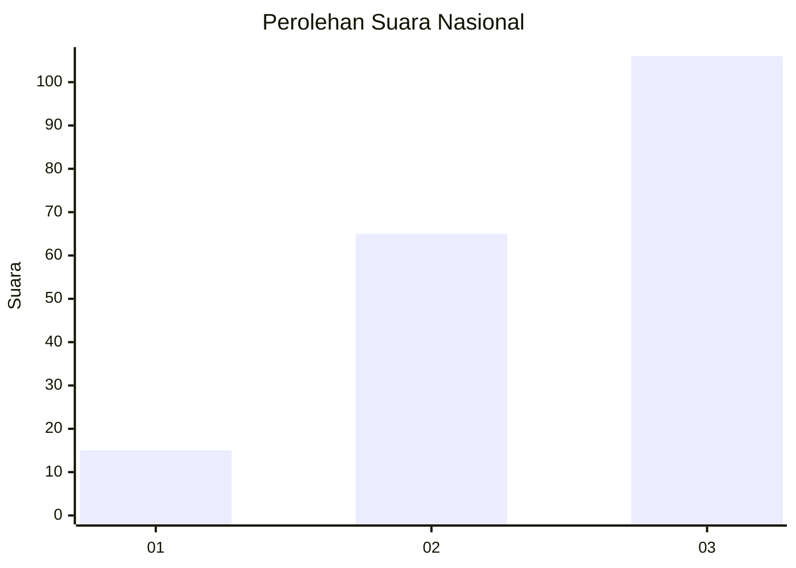
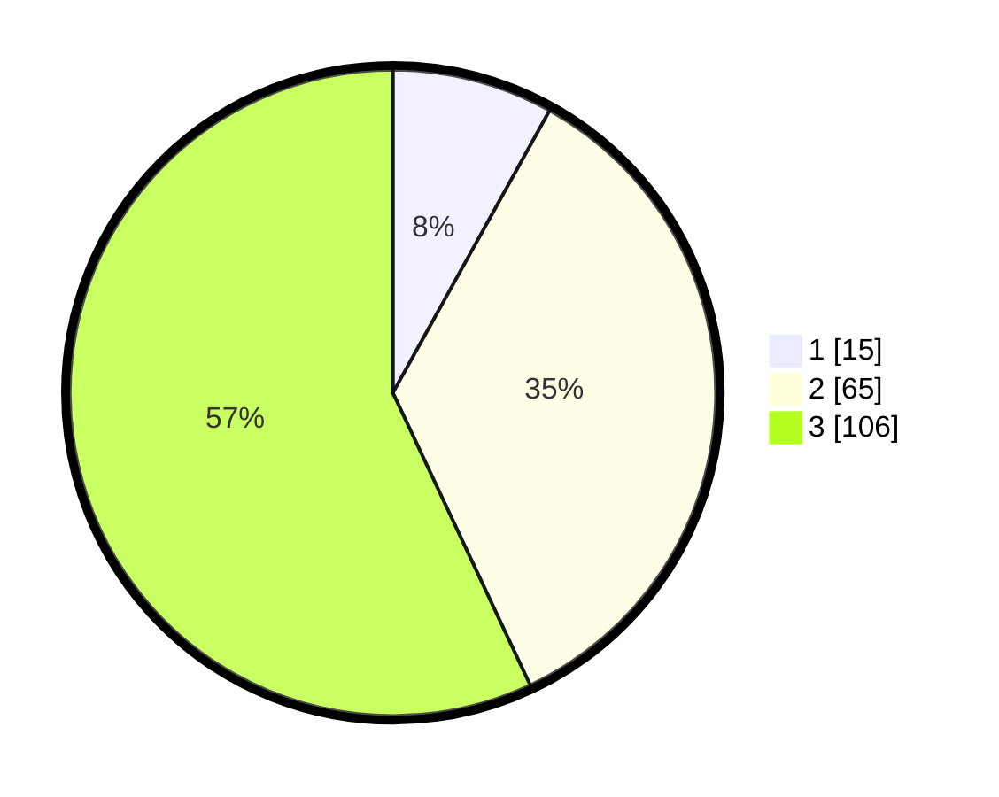

# Hasil

## Grafik

## Tabel

| No. | Nama Paslon    | Suara | Suara (raw) | Persentase |
|:--- |:-------------- | -----:| -----------:| ----------:|
| 1   | ANIES MUHAIMIN | 15    | [15][p-1]   | 8,06       |
| 2   | PRABOWO GIBRAN | 65    | [65][p-2]   | 34,95      |
| 3   | GANJAR MAHFUD  | 106   | [106][p-3]  | 56,99      |

[p-1]: https://github.com/gigit-pemilu/pemilu-2024/blob/main/pilpres/hitung-suara/sub/34-di-yogyakarta/sub/04-sleman/sub/04-minggir/sub/2002-sendangmulyo/sub/024-tps/sub/paslon-1.txt
[p-2]: https://github.com/gigit-pemilu/pemilu-2024/blob/main/pilpres/hitung-suara/sub/34-di-yogyakarta/sub/04-sleman/sub/04-minggir/sub/2002-sendangmulyo/sub/024-tps/sub/paslon-2.txt
[p-3]: https://github.com/gigit-pemilu/pemilu-2024/blob/main/pilpres/hitung-suara/sub/34-di-yogyakarta/sub/04-sleman/sub/04-minggir/sub/2002-sendangmulyo/sub/024-tps/sub/paslon-3.txt

## Foto C Plano

https://sirekap-obj-formc.kpu.go.id/0994/pemilu/ppwp/34/04/04/20/02/3404042002024-20240220-070703--d874f5bb-b8a7-459b-aef8-8952ef023f04.jpg

https://sirekap-obj-formc.kpu.go.id/0994/pemilu/ppwp/34/04/04/20/02/3404042002024-20240216-132910--b216dc51-9dce-4cf7-a3ef-c92c20dd32f9.jpg

https://sirekap-obj-formc.kpu.go.id/0994/pemilu/ppwp/34/04/04/20/02/3404042002024-20240216-132920--6f6121c9-9255-472f-b805-19a3c7e568be.jpg

## Metadata

| Key        | Value               |
| ---------- | ------------------- |
| Time Stamp | 2024-02-20 08:00:00 |

