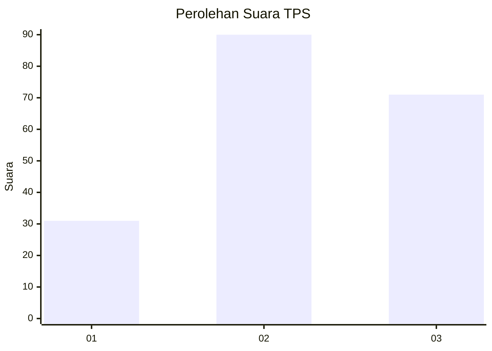
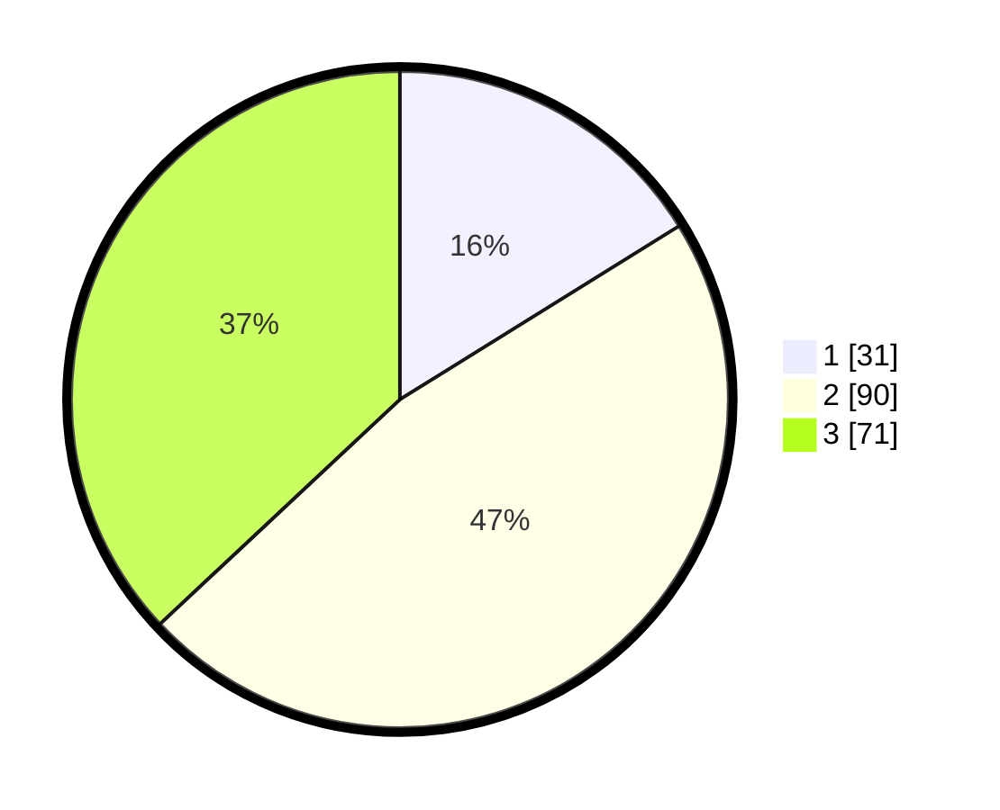

# Hasil

## Grafik

## Tabel

| No. | Nama Paslon    | Suara | Suara (raw) | Persentase |
|:--- |:-------------- | -----:| -----------:| ----------:|
| 1   | ANIES MUHAIMIN | 31    | [31][p-1]   | 16,15      |
| 2   | PRABOWO GIBRAN | 90    | [90][p-2]   | 46,88      |
| 3   | GANJAR MAHFUD  | 71    | [71][p-3]   | 36,98      |

[p-1]: https://github.com/gigit-pemilu/pemilu-2024-34-di-yogyakarta/blob/main/pilpres/hitung-suara/sub/34-di-yogyakarta/sub/04-sleman/sub/04-minggir/sub/2003-sendangagung/sub/003-tps/sub/paslon-1.txt
[p-2]: https://github.com/gigit-pemilu/pemilu-2024-34-di-yogyakarta/blob/main/pilpres/hitung-suara/sub/34-di-yogyakarta/sub/04-sleman/sub/04-minggir/sub/2003-sendangagung/sub/003-tps/sub/paslon-2.txt
[p-3]: https://github.com/gigit-pemilu/pemilu-2024-34-di-yogyakarta/blob/main/pilpres/hitung-suara/sub/34-di-yogyakarta/sub/04-sleman/sub/04-minggir/sub/2003-sendangagung/sub/003-tps/sub/paslon-3.txt

## Foto C Plano

https://sirekap-obj-formc.kpu.go.id/ea6a/pemilu/ppwp/34/04/04/20/03/3404042003003-20240214-193610--44ea37a3-b85d-4173-8322-5cd28eeb4d27.jpg

https://sirekap-obj-formc.kpu.go.id/ea6a/pemilu/ppwp/34/04/04/20/03/3404042003003-20240214-193635--3c0b2adf-ec7b-44d7-a323-e9f2b6ceb120.jpg

## Metadata

| Key        | Value               |
| ---------- | ------------------- |
| Time Stamp | 2024-02-15 19:00:26 |

