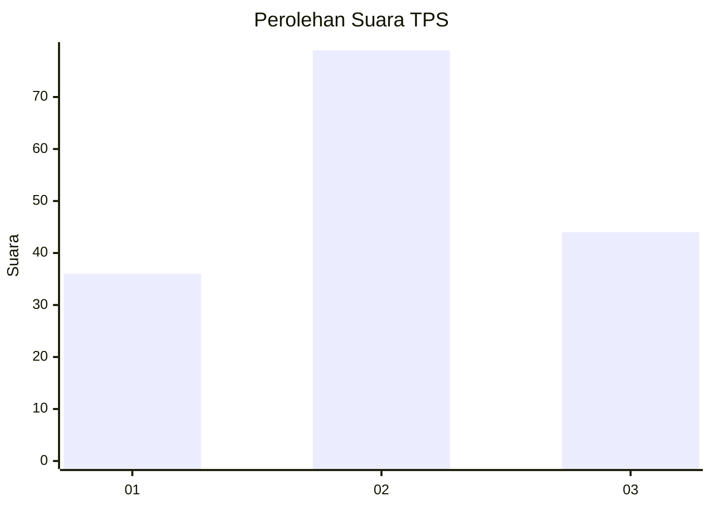
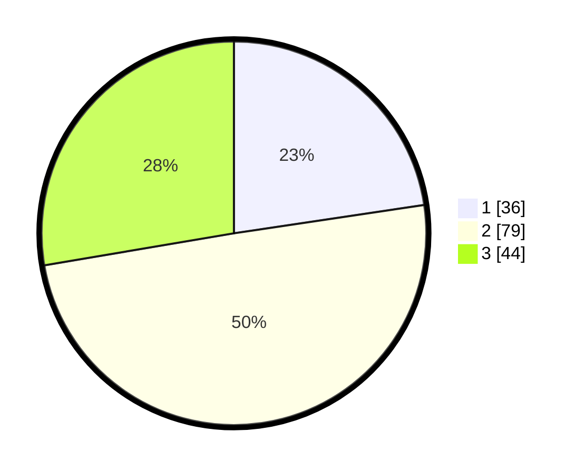

# Hasil

## Grafik

## Tabel

| No. | Nama Paslon    | Suara | Suara (raw) | Persentase |
|:--- |:-------------- | -----:| -----------:| ----------:|
| 1   | ANIES MUHAIMIN | 36    | [36][p-1]   | 22,64      |
| 2   | PRABOWO GIBRAN | 79    | [79][p-2]   | 49,69      |
| 3   | GANJAR MAHFUD  | 44    | [44][p-3]   | 27,67      |

[p-1]: https://github.com/gigit-pemilu/pemilu-2024-34-di-yogyakarta/blob/main/pilpres/hitung-suara/sub/34-di-yogyakarta/sub/04-sleman/sub/04-minggir/sub/2003-sendangagung/sub/012-tps/sub/paslon-1.txt
[p-2]: https://github.com/gigit-pemilu/pemilu-2024-34-di-yogyakarta/blob/main/pilpres/hitung-suara/sub/34-di-yogyakarta/sub/04-sleman/sub/04-minggir/sub/2003-sendangagung/sub/012-tps/sub/paslon-2.txt
[p-3]: https://github.com/gigit-pemilu/pemilu-2024-34-di-yogyakarta/blob/main/pilpres/hitung-suara/sub/34-di-yogyakarta/sub/04-sleman/sub/04-minggir/sub/2003-sendangagung/sub/012-tps/sub/paslon-3.txt

## Foto C Plano

https://sirekap-obj-formc.kpu.go.id/1a2b/pemilu/ppwp/34/04/04/20/03/3404042003012-20240215-015900--bee22954-24bf-4bd6-bdc4-062b8fbb3e08.jpg

https://sirekap-obj-formc.kpu.go.id/1a2b/pemilu/ppwp/34/04/04/20/03/3404042003012-20240215-121413--7c58dd36-783a-473a-935c-633d33603049.jpg

https://sirekap-obj-formc.kpu.go.id/1a2b/pemilu/ppwp/34/04/04/20/03/3404042003012-20240215-121440--47ac697e-2b42-42a8-a9d6-afba619955bc.jpg

## Metadata

| Key        | Value               |
| ---------- | ------------------- |
| Time Stamp | 2024-02-15 15:30:25 |

