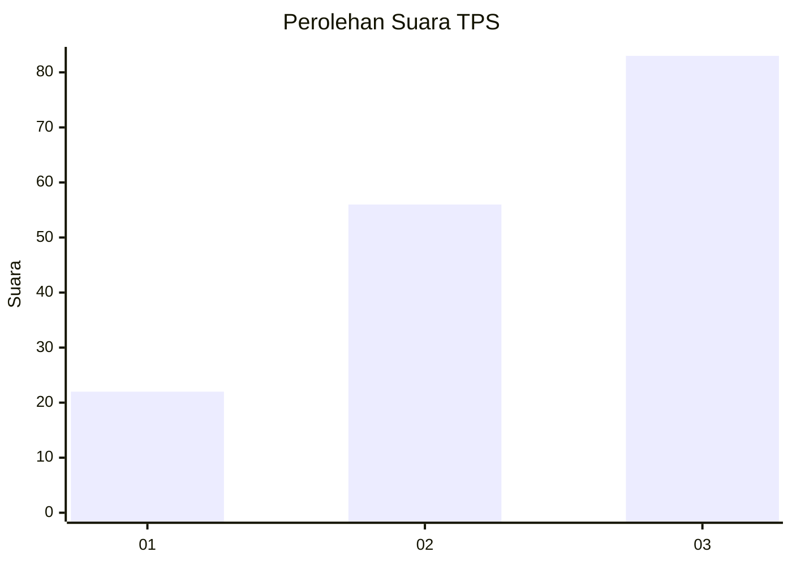
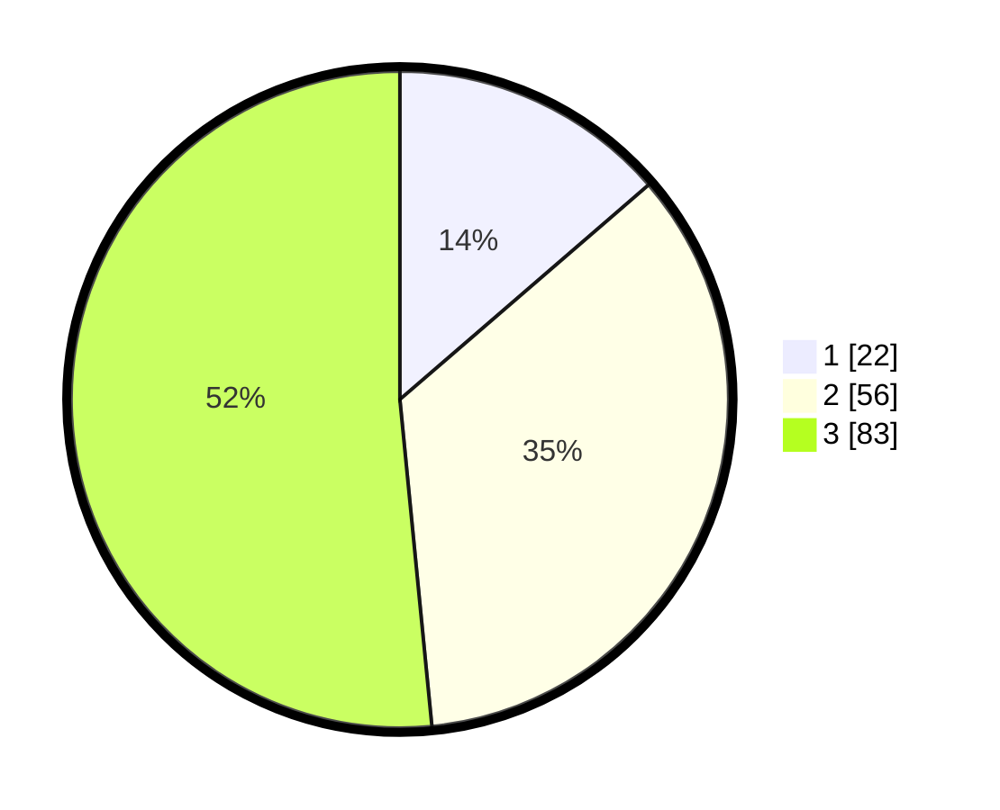

# Hasil

## Grafik

## Tabel

| No. | Nama Paslon    | Suara | Suara (raw) | Persentase |
|:--- |:-------------- | -----:| -----------:| ----------:|
| 1   | ANIES MUHAIMIN | 22    | [22][p-1]   | 13,66      |
| 2   | PRABOWO GIBRAN | 56    | [56][p-2]   | 34,78      |
| 3   | GANJAR MAHFUD  | 83    | [83][p-3]   | 51,55      |

[p-1]: https://github.com/gigit-pemilu/pemilu-2024-34-di-yogyakarta/blob/main/pilpres/hitung-suara/sub/34-di-yogyakarta/sub/04-sleman/sub/04-minggir/sub/2003-sendangagung/sub/013-tps/sub/paslon-1.txt
[p-2]: https://github.com/gigit-pemilu/pemilu-2024-34-di-yogyakarta/blob/main/pilpres/hitung-suara/sub/34-di-yogyakarta/sub/04-sleman/sub/04-minggir/sub/2003-sendangagung/sub/013-tps/sub/paslon-2.txt
[p-3]: https://github.com/gigit-pemilu/pemilu-2024-34-di-yogyakarta/blob/main/pilpres/hitung-suara/sub/34-di-yogyakarta/sub/04-sleman/sub/04-minggir/sub/2003-sendangagung/sub/013-tps/sub/paslon-3.txt

## Foto C Plano

https://sirekap-obj-formc.kpu.go.id/d64c/pemilu/ppwp/34/04/04/20/03/3404042003013-20240215-014213--3d2db6fe-018d-4b5b-8eff-e6407ab21b82.jpg

https://sirekap-obj-formc.kpu.go.id/d64c/pemilu/ppwp/34/04/04/20/03/3404042003013-20240215-014222--a70826ac-1f93-4f71-bba7-56b492cafb10.jpg

https://sirekap-obj-formc.kpu.go.id/d64c/pemilu/ppwp/34/04/04/20/03/3404042003013-20240215-014229--19ad7442-6806-4e99-9211-942c13288606.jpg

## Metadata

| Key        | Value               |
| ---------- | ------------------- |
| Time Stamp | 2024-02-15 21:01:18 |

