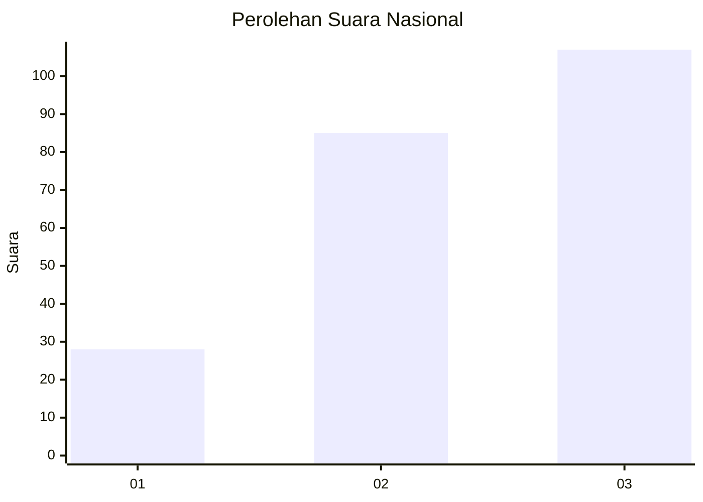
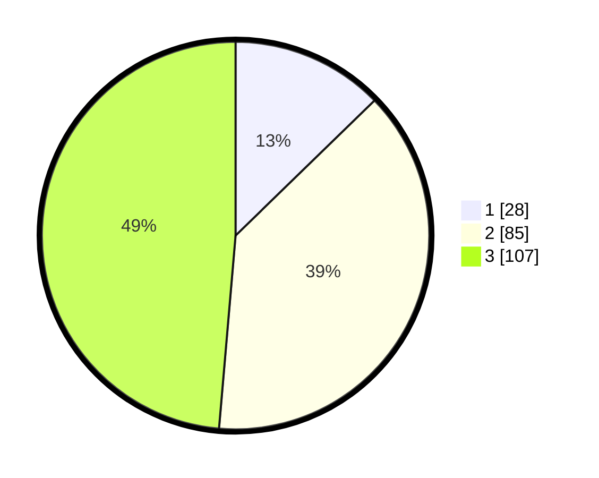

# Hasil

## Grafik

## Tabel

| No. | Nama Paslon    | Suara | Suara (raw) | Persentase |
|:--- |:-------------- | -----:| -----------:| ----------:|
| 1   | ANIES MUHAIMIN | 28    | [28][p-1]   | 12,73      |
| 2   | PRABOWO GIBRAN | 85    | [85][p-2]   | 38,64      |
| 3   | GANJAR MAHFUD  | 107   | [107][p-3]  | 48,64      |

[p-1]: https://github.com/gigit-pemilu/pemilu-2024/blob/main/pilpres/hitung-suara/sub/34-di-yogyakarta/sub/04-sleman/sub/04-minggir/sub/2003-sendangagung/sub/019-tps/sub/paslon-1.txt
[p-2]: https://github.com/gigit-pemilu/pemilu-2024/blob/main/pilpres/hitung-suara/sub/34-di-yogyakarta/sub/04-sleman/sub/04-minggir/sub/2003-sendangagung/sub/019-tps/sub/paslon-2.txt
[p-3]: https://github.com/gigit-pemilu/pemilu-2024/blob/main/pilpres/hitung-suara/sub/34-di-yogyakarta/sub/04-sleman/sub/04-minggir/sub/2003-sendangagung/sub/019-tps/sub/paslon-3.txt

## Foto C Plano

https://sirekap-obj-formc.kpu.go.id/ddb2/pemilu/ppwp/34/04/04/20/03/3404042003019-20240215-012208--60e24281-deda-458e-86a4-585b30393371.jpg

https://sirekap-obj-formc.kpu.go.id/ddb2/pemilu/ppwp/34/04/04/20/03/3404042003019-20240215-012217--365b42cc-b05a-4aa7-a192-e164358a765c.jpg

https://sirekap-obj-formc.kpu.go.id/ddb2/pemilu/ppwp/34/04/04/20/03/3404042003019-20240215-012221--e3530a62-1820-4a45-8b2a-5c4393ba2fe2.jpg

## Metadata

| Key        | Value               |
| ---------- | ------------------- |
| Time Stamp | 2024-02-15 15:30:25 |

