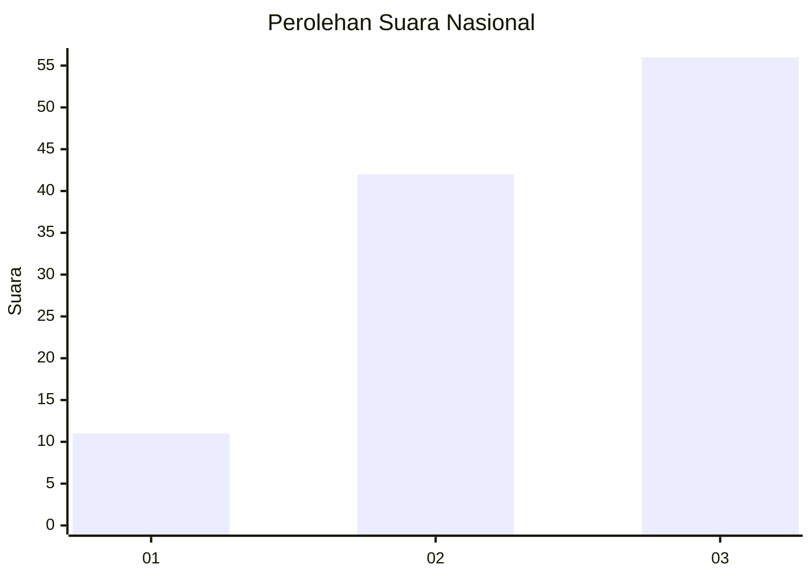
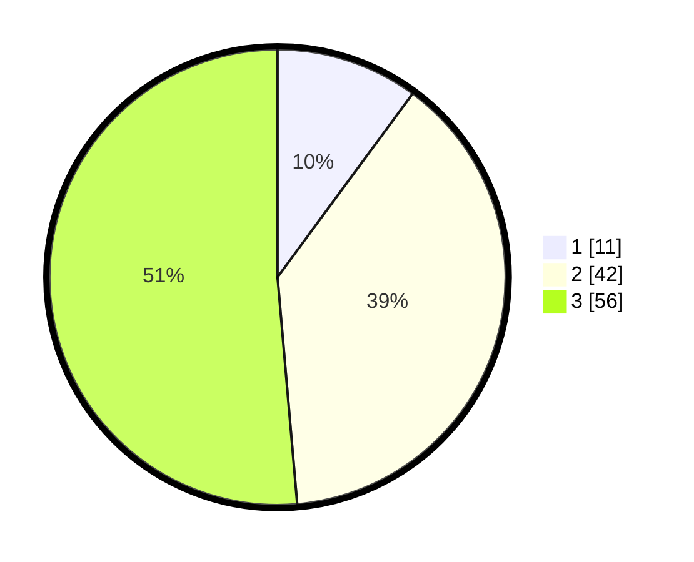

# Hasil

## Grafik

## Tabel

| No. | Nama Paslon    | Suara | Suara (raw) | Persentase |
|:--- |:-------------- | -----:| -----------:| ----------:|
| 1   | ANIES MUHAIMIN | 11    | [11][p-1]   | 10,09      |
| 2   | PRABOWO GIBRAN | 42    | [42][p-2]   | 38,53      |
| 3   | GANJAR MAHFUD  | 56    | [56][p-3]   | 51,38      |

[p-1]: https://github.com/gigit-pemilu/pemilu-2024/blob/main/pilpres/hitung-suara/sub/34-di-yogyakarta/sub/04-sleman/sub/04-minggir/sub/2003-sendangagung/sub/024-tps/sub/paslon-1.txt
[p-2]: https://github.com/gigit-pemilu/pemilu-2024/blob/main/pilpres/hitung-suara/sub/34-di-yogyakarta/sub/04-sleman/sub/04-minggir/sub/2003-sendangagung/sub/024-tps/sub/paslon-2.txt
[p-3]: https://github.com/gigit-pemilu/pemilu-2024/blob/main/pilpres/hitung-suara/sub/34-di-yogyakarta/sub/04-sleman/sub/04-minggir/sub/2003-sendangagung/sub/024-tps/sub/paslon-3.txt

## Foto C Plano

https://sirekap-obj-formc.kpu.go.id/0ca1/pemilu/ppwp/34/04/04/20/03/3404042003024-20240214-213618--3ef45cda-8012-49dd-96ba-65cfde1caa75.jpg

https://sirekap-obj-formc.kpu.go.id/0ca1/pemilu/ppwp/34/04/04/20/03/3404042003024-20240214-213721--c58c6e55-a449-4080-81b8-4d8949539194.jpg

https://sirekap-obj-formc.kpu.go.id/0ca1/pemilu/ppwp/34/04/04/20/03/3404042003024-20240214-213803--6aa062a8-2565-4ea4-90fb-00a3309146a6.jpg

## Metadata

| Key        | Value               |
| ---------- | ------------------- |
| Time Stamp | 2024-02-15 18:00:26 |

