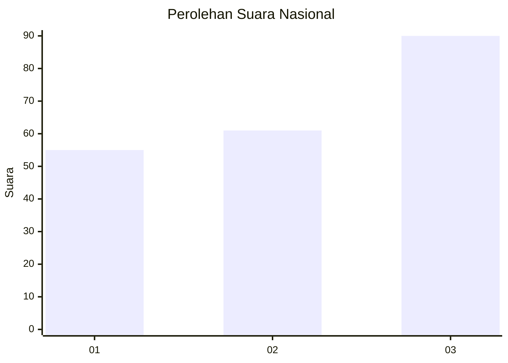
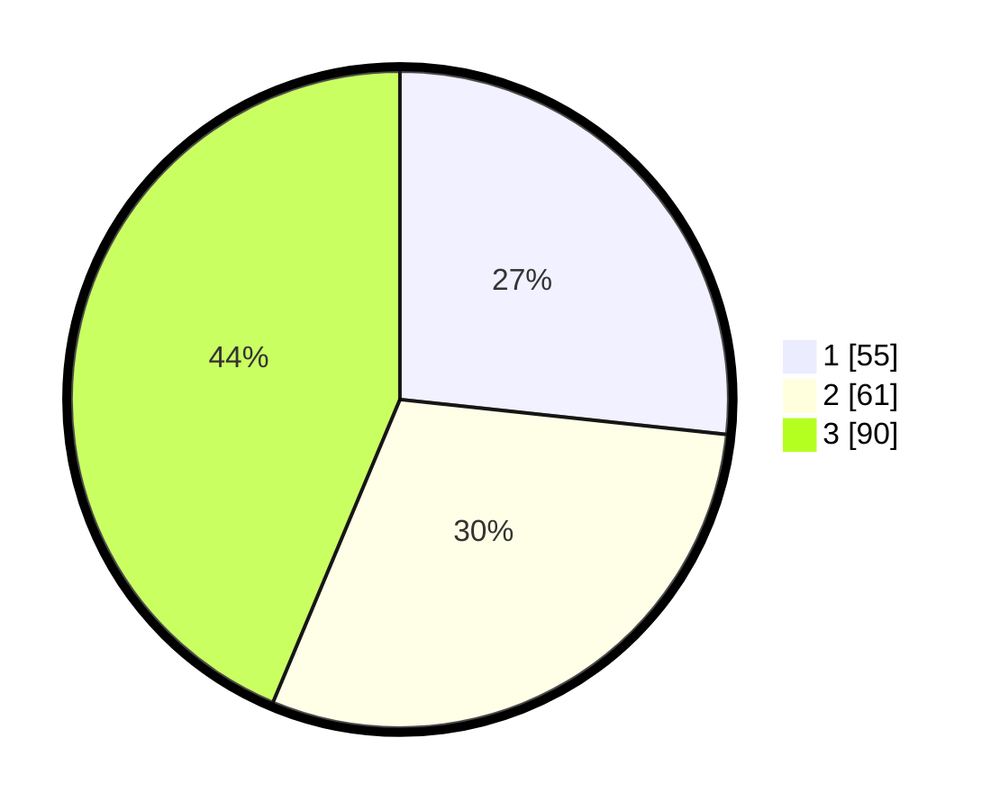

# Hasil

## Grafik

## Tabel

| No. | Nama Paslon    | Suara | Suara (raw) | Persentase |
|:--- |:-------------- | -----:| -----------:| ----------:|
| 1   | ANIES MUHAIMIN | 55    | [55][p-1]   | 26,70      |
| 2   | PRABOWO GIBRAN | 61    | [61][p-2]   | 29,61      |
| 3   | GANJAR MAHFUD  | 90    | [90][p-3]   | 43,69      |

[p-1]: https://github.com/gigit-pemilu/pemilu-2024/blob/main/pilpres/hitung-suara/sub/34-di-yogyakarta/sub/04-sleman/sub/04-minggir/sub/2003-sendangagung/sub/026-tps/sub/paslon-1.txt
[p-2]: https://github.com/gigit-pemilu/pemilu-2024/blob/main/pilpres/hitung-suara/sub/34-di-yogyakarta/sub/04-sleman/sub/04-minggir/sub/2003-sendangagung/sub/026-tps/sub/paslon-2.txt
[p-3]: https://github.com/gigit-pemilu/pemilu-2024/blob/main/pilpres/hitung-suara/sub/34-di-yogyakarta/sub/04-sleman/sub/04-minggir/sub/2003-sendangagung/sub/026-tps/sub/paslon-3.txt

## Foto C Plano

https://sirekap-obj-formc.kpu.go.id/f96c/pemilu/ppwp/34/04/04/20/03/3404042003026-20240214-194521--a4606da6-84ec-4ca3-879c-3b9345833508.jpg

https://sirekap-obj-formc.kpu.go.id/f96c/pemilu/ppwp/34/04/04/20/03/3404042003026-20240214-194530--4417b7ad-3c05-4111-a8b1-202aaef84cef.jpg

https://sirekap-obj-formc.kpu.go.id/f96c/pemilu/ppwp/34/04/04/20/03/3404042003026-20240214-194534--794f5447-f799-4696-9195-29a8e57059b0.jpg

## Metadata

| Key        | Value               |
| ---------- | ------------------- |
| Time Stamp | 2024-02-14 21:46:01 |

