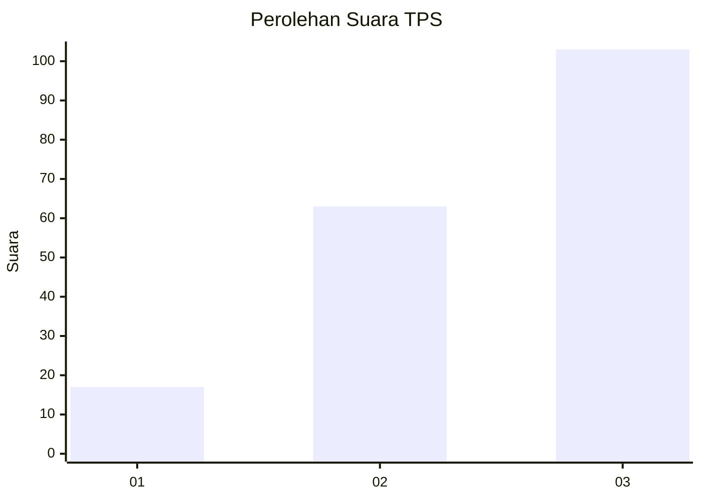
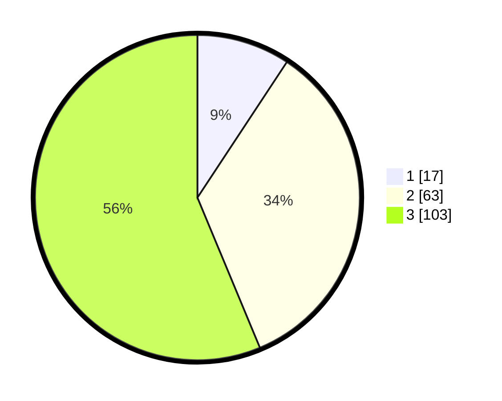

# Hasil

## Grafik

## Tabel

| No. | Nama Paslon    | Suara | Suara (raw) | Persentase |
|:--- |:-------------- | -----:| -----------:| ----------:|
| 1   | ANIES MUHAIMIN | 17    | [17][p-1]   | 9,29       |
| 2   | PRABOWO GIBRAN | 63    | [63][p-2]   | 34,43      |
| 3   | GANJAR MAHFUD  | 103   | [103][p-3]  | 56,28      |

[p-1]: https://github.com/gigit-pemilu/pemilu-2024-34-di-yogyakarta/blob/main/pilpres/hitung-suara/sub/34-di-yogyakarta/sub/04-sleman/sub/04-minggir/sub/2003-sendangagung/sub/027-tps/sub/paslon-1.txt
[p-2]: https://github.com/gigit-pemilu/pemilu-2024-34-di-yogyakarta/blob/main/pilpres/hitung-suara/sub/34-di-yogyakarta/sub/04-sleman/sub/04-minggir/sub/2003-sendangagung/sub/027-tps/sub/paslon-2.txt
[p-3]: https://github.com/gigit-pemilu/pemilu-2024-34-di-yogyakarta/blob/main/pilpres/hitung-suara/sub/34-di-yogyakarta/sub/04-sleman/sub/04-minggir/sub/2003-sendangagung/sub/027-tps/sub/paslon-3.txt

## Foto C Plano

https://sirekap-obj-formc.kpu.go.id/7052/pemilu/ppwp/34/04/04/20/03/3404042003027-20240214-204129--7fa250a9-8a7a-4de4-899b-3e515743b3ea.jpg

https://sirekap-obj-formc.kpu.go.id/7052/pemilu/ppwp/34/04/04/20/03/3404042003027-20240215-180911--bea5c474-880c-42bf-9a27-49b694af7a27.jpg

https://sirekap-obj-formc.kpu.go.id/7052/pemilu/ppwp/34/04/04/20/03/3404042003027-20240215-014237--6a6ba033-9e73-4c2a-89c2-5e20f9d4e83d.jpg

## Metadata

| Key        | Value               |
| ---------- | ------------------- |
| Time Stamp | 2024-02-15 21:30:27 |

