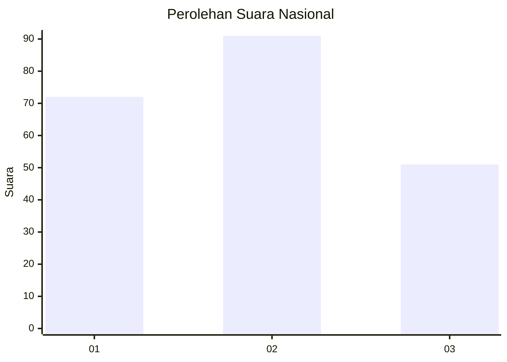
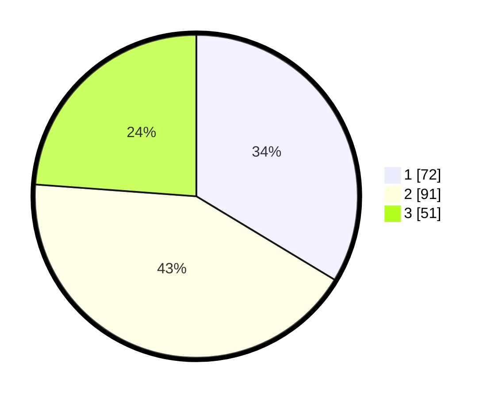

# Hasil

## Grafik

## Tabel

| No. | Nama Paslon    | Suara | Suara (raw) | Persentase |
|:--- |:-------------- | -----:| -----------:| ----------:|
| 1   | ANIES MUHAIMIN | 72    | [72][p-1]   | 33,64      |
| 2   | PRABOWO GIBRAN | 91    | [91][p-2]   | 42,52      |
| 3   | GANJAR MAHFUD  | 51    | [51][p-3]   | 23,83      |

[p-1]: https://github.com/gigit-pemilu/pemilu-2024/blob/main/pilpres/hitung-suara/sub/34-di-yogyakarta/sub/04-sleman/sub/04-minggir/sub/2004-sendangsari/sub/013-tps/sub/paslon-1.txt
[p-2]: https://github.com/gigit-pemilu/pemilu-2024/blob/main/pilpres/hitung-suara/sub/34-di-yogyakarta/sub/04-sleman/sub/04-minggir/sub/2004-sendangsari/sub/013-tps/sub/paslon-2.txt
[p-3]: https://github.com/gigit-pemilu/pemilu-2024/blob/main/pilpres/hitung-suara/sub/34-di-yogyakarta/sub/04-sleman/sub/04-minggir/sub/2004-sendangsari/sub/013-tps/sub/paslon-3.txt

## Foto C Plano

https://sirekap-obj-formc.kpu.go.id/ec42/pemilu/ppwp/34/04/04/20/04/3404042004013-20240214-220755--0ee8ad81-9d19-4137-a049-13e94ce5035a.jpg

https://sirekap-obj-formc.kpu.go.id/ec42/pemilu/ppwp/34/04/04/20/04/3404042004013-20240215-002703--c33c1b79-ded6-4d88-9921-0e1024122efd.jpg

https://sirekap-obj-formc.kpu.go.id/ec42/pemilu/ppwp/34/04/04/20/04/3404042004013-20240215-002754--18336210-99c9-4812-857a-5b3f578ed770.jpg

## Metadata

| Key        | Value               |
| ---------- | ------------------- |
| Time Stamp | 2024-02-15 22:30:27 |

