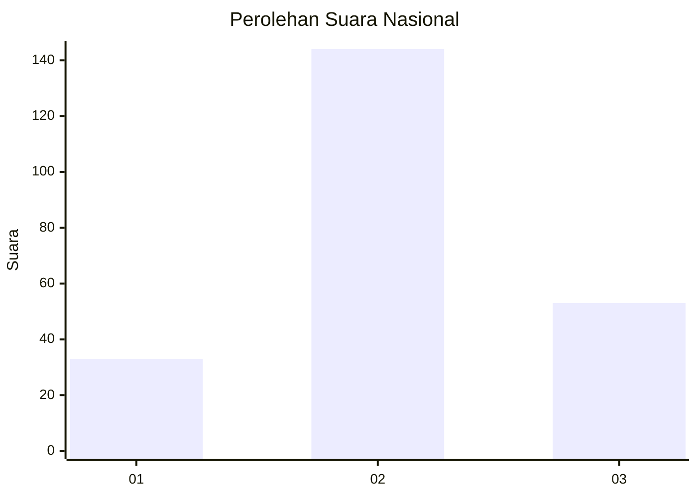
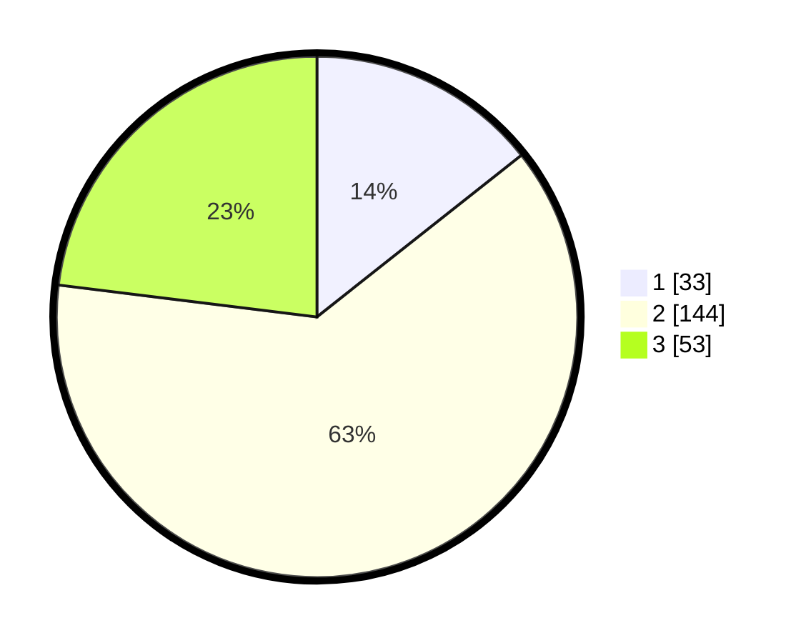

# Hasil

## Grafik

## Tabel

| No. | Nama Paslon    | Suara | Suara (raw) | Persentase |
|:--- |:-------------- | -----:| -----------:| ----------:|
| 1   | ANIES MUHAIMIN | 33    | [33][p-1]   | 14,35      |
| 2   | PRABOWO GIBRAN | 144   | [144][p-2]  | 62,61      |
| 3   | GANJAR MAHFUD  | 53    | [53][p-3]   | 23,04      |

[p-1]: https://github.com/gigit-pemilu/pemilu-2024/blob/main/pilpres/hitung-suara/sub/34-di-yogyakarta/sub/04-sleman/sub/05-seyegan/sub/2001-margoluwih/sub/001-tps/sub/paslon-1.txt
[p-2]: https://github.com/gigit-pemilu/pemilu-2024/blob/main/pilpres/hitung-suara/sub/34-di-yogyakarta/sub/04-sleman/sub/05-seyegan/sub/2001-margoluwih/sub/001-tps/sub/paslon-2.txt
[p-3]: https://github.com/gigit-pemilu/pemilu-2024/blob/main/pilpres/hitung-suara/sub/34-di-yogyakarta/sub/04-sleman/sub/05-seyegan/sub/2001-margoluwih/sub/001-tps/sub/paslon-3.txt

## Foto C Plano

https://sirekap-obj-formc.kpu.go.id/e626/pemilu/ppwp/34/04/05/20/01/3404052001001-20240214-214332--597008f4-f451-4604-bb5a-ad52642c627d.jpg

https://sirekap-obj-formc.kpu.go.id/e626/pemilu/ppwp/34/04/05/20/01/3404052001001-20240214-214334--47f8a2b8-2004-4029-a8a4-e96fe1a3762e.jpg

https://sirekap-obj-formc.kpu.go.id/e626/pemilu/ppwp/34/04/05/20/01/3404052001001-20240214-214337--1e7c4ccf-9ba1-4284-bff3-81afedde9321.jpg

## Metadata

| Key        | Value               |
| ---------- | ------------------- |
| Time Stamp | 2024-02-15 21:30:27 |

## DATA PEMILIH TETAP

Jumlah pemilih dalam DPT: **256**.
 * L: **126**.
 * P: **130**.

## DATA PENGGUNA HAK PILIH

Jumlah pengguna hak pilih dalam DPT: **227**.
 * L: **109**.
 * P: **118**.

Jumlah pengguna hak pilih dalam DPTb: **5**.
 * L: **3**.
 * P: **2**.

Jumlah pengguna hak pilih dalam DPK: **4**.
 * L: **2**.
 * P: **2**.

Jumlah pengguna hak pilih: **236**.
 * L: **114**.
 * P: **122**.

## JUMLAH SUARA SAH DAN TIDAK SAH

JUMLAH SELURUH SUARA SAH: **230**.

JUMLAH SUARA TIDAK SAH: **6**.

JUMLAH SELURUH SUARA SAH DAN SUARA TIDAK SAH: **236**.

