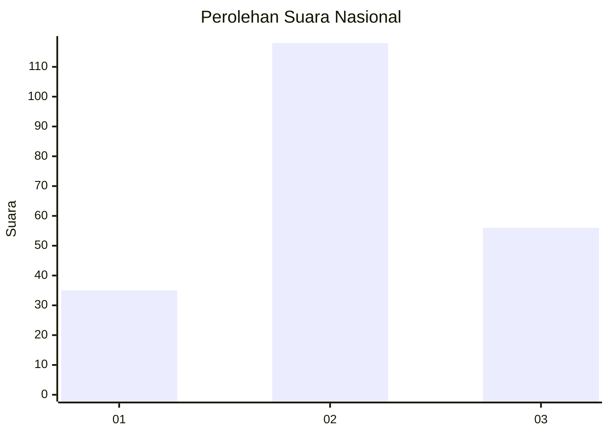
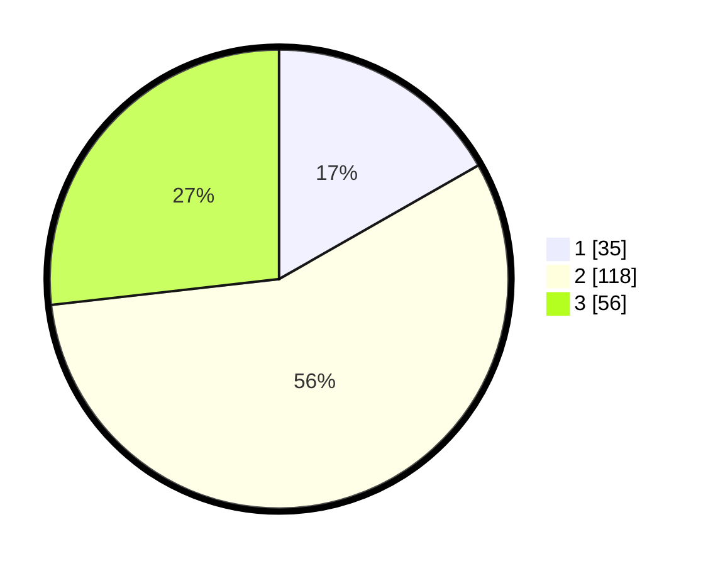

# Hasil

## Grafik

## Tabel

| No. | Nama Paslon    | Suara | Suara (raw) | Persentase |
|:--- |:-------------- | -----:| -----------:| ----------:|
| 1   | ANIES MUHAIMIN | 35    | [35][p-1]   | 16,75      |
| 2   | PRABOWO GIBRAN | 118   | [118][p-2]  | 56,46      |
| 3   | GANJAR MAHFUD  | 56    | [56][p-3]   | 26,79      |

[p-1]: https://github.com/gigit-pemilu/pemilu-2024/blob/main/pilpres/hitung-suara/sub/34-di-yogyakarta/sub/04-sleman/sub/05-seyegan/sub/2001-margoluwih/sub/002-tps/sub/paslon-1.txt
[p-2]: https://github.com/gigit-pemilu/pemilu-2024/blob/main/pilpres/hitung-suara/sub/34-di-yogyakarta/sub/04-sleman/sub/05-seyegan/sub/2001-margoluwih/sub/002-tps/sub/paslon-2.txt
[p-3]: https://github.com/gigit-pemilu/pemilu-2024/blob/main/pilpres/hitung-suara/sub/34-di-yogyakarta/sub/04-sleman/sub/05-seyegan/sub/2001-margoluwih/sub/002-tps/sub/paslon-3.txt

## Foto C Plano

https://sirekap-obj-formc.kpu.go.id/ddfa/pemilu/ppwp/34/04/05/20/01/3404052001002-20240214-205331--a8917fae-ba1f-4d06-b678-6c9be4917897.jpg

https://sirekap-obj-formc.kpu.go.id/ddfa/pemilu/ppwp/34/04/05/20/01/3404052001002-20240214-221037--fd58b868-15d3-4453-8ecd-1910411f62f2.jpg

https://sirekap-obj-formc.kpu.go.id/ddfa/pemilu/ppwp/34/04/05/20/01/3404052001002-20240214-212139--a3784418-39b9-4457-a31e-4e4f4625b584.jpg

## Metadata

| Key        | Value               |
| ---------- | ------------------- |
| Time Stamp | 2024-02-15 15:30:25 |

