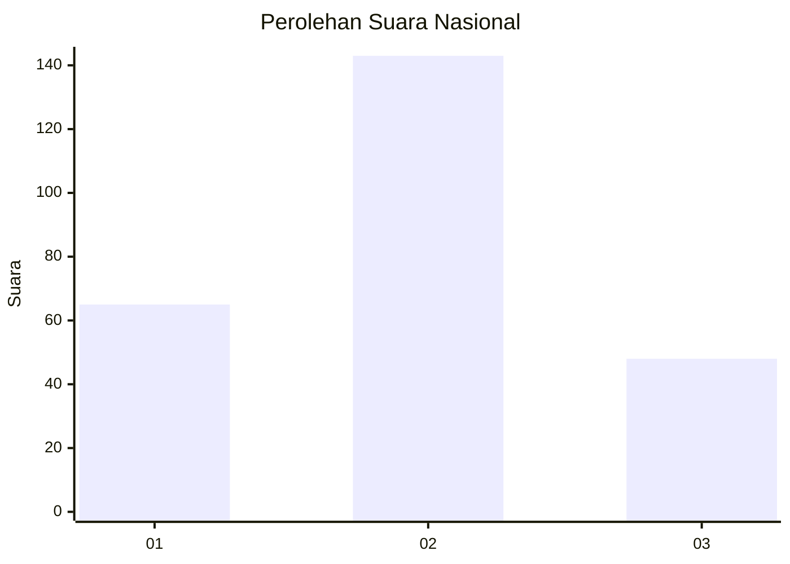
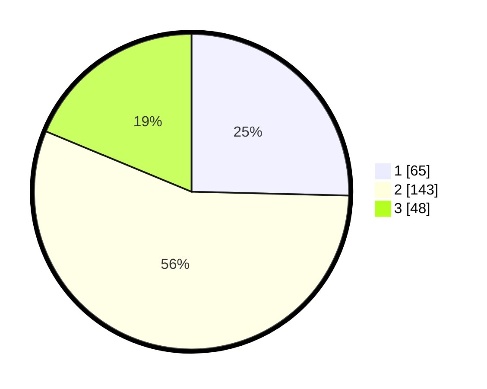

# Hasil

## Grafik

## Tabel

| No. | Nama Paslon    | Suara | Suara (raw) | Persentase |
|:--- |:-------------- | -----:| -----------:| ----------:|
| 1   | ANIES MUHAIMIN | 65    | [65][p-1]   | 25,39      |
| 2   | PRABOWO GIBRAN | 143   | [143][p-2]  | 55,86      |
| 3   | GANJAR MAHFUD  | 48    | [48][p-3]   | 18,75      |

[p-1]: https://github.com/gigit-pemilu/pemilu-2024/blob/main/pilpres/hitung-suara/sub/34-di-yogyakarta/sub/04-sleman/sub/05-seyegan/sub/2001-margoluwih/sub/005-tps/sub/paslon-1.txt
[p-2]: https://github.com/gigit-pemilu/pemilu-2024/blob/main/pilpres/hitung-suara/sub/34-di-yogyakarta/sub/04-sleman/sub/05-seyegan/sub/2001-margoluwih/sub/005-tps/sub/paslon-2.txt
[p-3]: https://github.com/gigit-pemilu/pemilu-2024/blob/main/pilpres/hitung-suara/sub/34-di-yogyakarta/sub/04-sleman/sub/05-seyegan/sub/2001-margoluwih/sub/005-tps/sub/paslon-3.txt

## Foto C Plano

https://sirekap-obj-formc.kpu.go.id/f436/pemilu/ppwp/34/04/05/20/01/3404052001005-20240216-135544--9fbf4441-ed59-4f0a-804a-fde6ea4e98de.jpg

https://sirekap-obj-formc.kpu.go.id/f436/pemilu/ppwp/34/04/05/20/01/3404052001005-20240216-135546--c5f23f12-d2a0-4ef9-b0ef-44474d32b072.jpg

https://sirekap-obj-formc.kpu.go.id/f436/pemilu/ppwp/34/04/05/20/01/3404052001005-20240216-135545--9ba7eba9-31b1-48b9-83b1-91e11bd1b001.jpg

## Metadata

| Key        | Value               |
| ---------- | ------------------- |
| Time Stamp | 2024-02-16 21:01:00 |

## DATA PEMILIH TETAP

Jumlah pemilih dalam DPT: **277**.
 * L: **128**.
 * P: **149**.

## DATA PENGGUNA HAK PILIH

Jumlah pengguna hak pilih dalam DPT: **241**.
 * L: **111**.
 * P: **130**.

Jumlah pengguna hak pilih dalam DPTb: **9**.
 * L: **4**.
 * P: **5**.

Jumlah pengguna hak pilih dalam DPK: **7**.
 * L: **3**.
 * P: **4**.

Jumlah pengguna hak pilih: **257**.
 * L: **118**.
 * P: **139**.

## JUMLAH SUARA SAH DAN TIDAK SAH

JUMLAH SELURUH SUARA SAH: **256**.

JUMLAH SUARA TIDAK SAH: **1**.

JUMLAH SELURUH SUARA SAH DAN SUARA TIDAK SAH: **257**.

