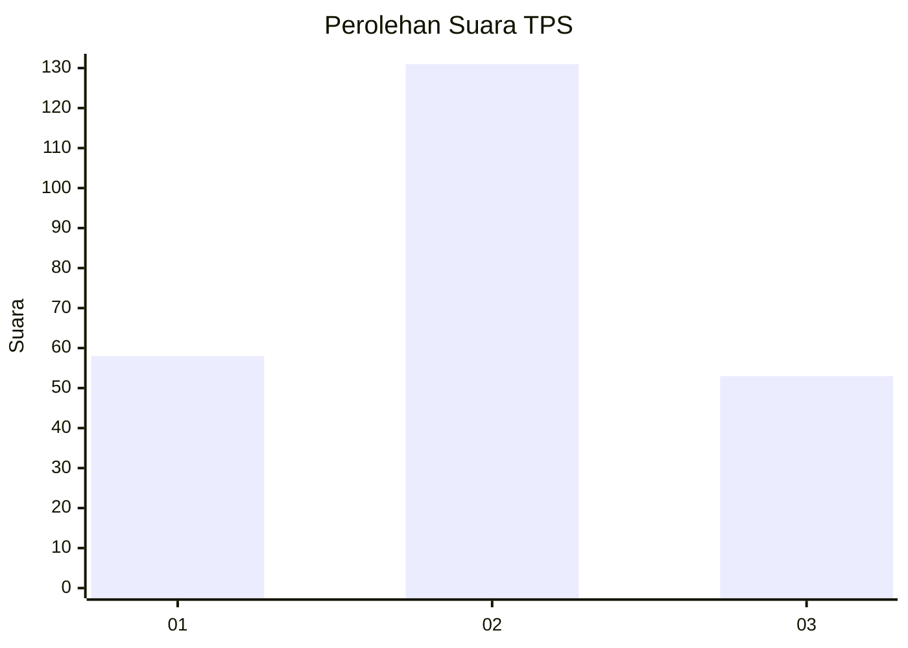
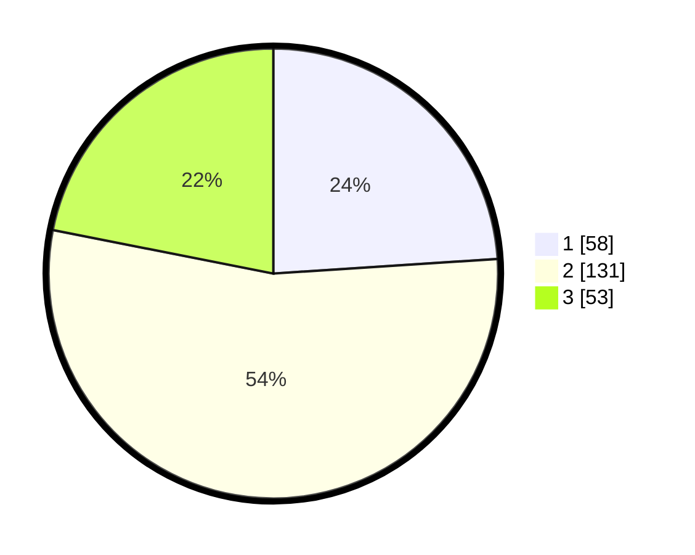

# Hasil

## Grafik

## Tabel

| No. | Nama Paslon    | Suara | Suara (raw) | Persentase |
|:--- |:-------------- | -----:| -----------:| ----------:|
| 1   | ANIES MUHAIMIN | 58    | [58][p-1]   | 23,97      |
| 2   | PRABOWO GIBRAN | 131   | [131][p-2]  | 54,13      |
| 3   | GANJAR MAHFUD  | 53    | [53][p-3]   | 21,90      |

[p-1]: https://github.com/gigit-pemilu/pemilu-2024-34-di-yogyakarta/blob/main/pilpres/hitung-suara/sub/34-di-yogyakarta/sub/04-sleman/sub/05-seyegan/sub/2001-margoluwih/sub/006-tps/sub/paslon-1.txt
[p-2]: https://github.com/gigit-pemilu/pemilu-2024-34-di-yogyakarta/blob/main/pilpres/hitung-suara/sub/34-di-yogyakarta/sub/04-sleman/sub/05-seyegan/sub/2001-margoluwih/sub/006-tps/sub/paslon-2.txt
[p-3]: https://github.com/gigit-pemilu/pemilu-2024-34-di-yogyakarta/blob/main/pilpres/hitung-suara/sub/34-di-yogyakarta/sub/04-sleman/sub/05-seyegan/sub/2001-margoluwih/sub/006-tps/sub/paslon-3.txt

## Foto C Plano

https://sirekap-obj-formc.kpu.go.id/054e/pemilu/ppwp/34/04/05/20/01/3404052001006-20240216-231628--c7ee624b-35ff-42c0-99ce-268104338b80.jpg

https://sirekap-obj-formc.kpu.go.id/054e/pemilu/ppwp/34/04/05/20/01/3404052001006-20240216-231703--91a137c8-12e5-4046-87d8-d5c19f3e2fc6.jpg

https://sirekap-obj-formc.kpu.go.id/054e/pemilu/ppwp/34/04/05/20/01/3404052001006-20240216-231743--a0a15f05-f991-447e-bca0-cd0e121fe7e3.jpg

## Metadata

| Key        | Value               |
| ---------- | ------------------- |
| Time Stamp | 2024-02-19 06:16:00 |

## DATA PEMILIH TETAP

Jumlah pemilih dalam DPT: **268**.
 * L: **822**.
 * P: **149**.

## DATA PENGGUNA HAK PILIH

Jumlah pengguna hak pilih dalam DPT: **245**.
 * L: **192**.
 * P: **233**.

Jumlah pengguna hak pilih dalam DPTb: **886**.
 * L: **843**.
 * P: **883**.

Jumlah pengguna hak pilih dalam DPK: **881**.
 * L: **880**.
 * P: **8**.

Jumlah pengguna hak pilih: **252**.
 * L: **115**.
 * P: **137**.

## JUMLAH SUARA SAH DAN TIDAK SAH

JUMLAH SELURUH SUARA SAH: **242**.

JUMLAH SUARA TIDAK SAH: **10**.

JUMLAH SELURUH SUARA SAH DAN SUARA TIDAK SAH: **252**.

