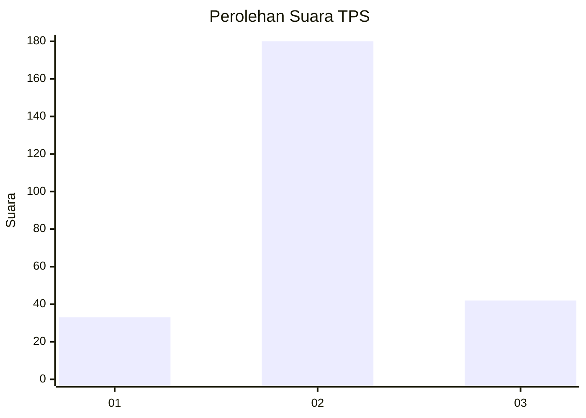
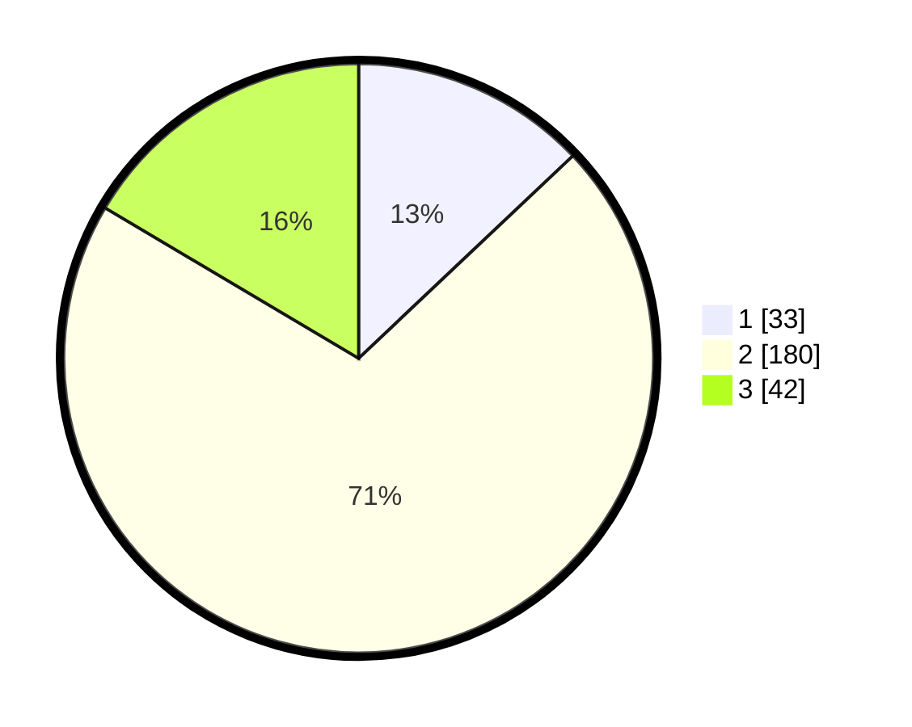

# Hasil

## Grafik

## Tabel

| No. | Nama Paslon    | Suara | Suara (raw) | Persentase |
|:--- |:-------------- | -----:| -----------:| ----------:|
| 1   | ANIES MUHAIMIN | 33    | [33][p-1]   | 12,94      |
| 2   | PRABOWO GIBRAN | 180   | [180][p-2]  | 70,59      |
| 3   | GANJAR MAHFUD  | 42    | [42][p-3]   | 16,47      |

[p-1]: https://github.com/gigit-pemilu/pemilu-2024-34-di-yogyakarta/blob/main/pilpres/hitung-suara/sub/34-di-yogyakarta/sub/04-sleman/sub/05-seyegan/sub/2001-margoluwih/sub/007-tps/sub/paslon-1.txt
[p-2]: https://github.com/gigit-pemilu/pemilu-2024-34-di-yogyakarta/blob/main/pilpres/hitung-suara/sub/34-di-yogyakarta/sub/04-sleman/sub/05-seyegan/sub/2001-margoluwih/sub/007-tps/sub/paslon-2.txt
[p-3]: https://github.com/gigit-pemilu/pemilu-2024-34-di-yogyakarta/blob/main/pilpres/hitung-suara/sub/34-di-yogyakarta/sub/04-sleman/sub/05-seyegan/sub/2001-margoluwih/sub/007-tps/sub/paslon-3.txt

## Foto C Plano

https://sirekap-obj-formc.kpu.go.id/91b9/pemilu/ppwp/34/04/05/20/01/3404052001007-20240215-001902--b3a0c494-f28f-4900-97e3-93ba0ef129cc.jpg

https://sirekap-obj-formc.kpu.go.id/91b9/pemilu/ppwp/34/04/05/20/01/3404052001007-20240215-002120--e8f835a1-483a-48a2-9f64-2afce791494c.jpg

https://sirekap-obj-formc.kpu.go.id/91b9/pemilu/ppwp/34/04/05/20/01/3404052001007-20240215-002257--1a4bab0c-5711-42e6-90d1-ef8a4137c46b.jpg

## Metadata

| Key        | Value               |
| ---------- | ------------------- |
| Time Stamp | 2024-02-15 21:01:18 |

