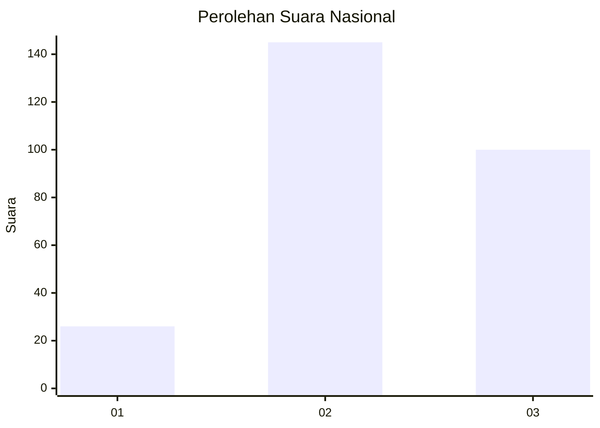
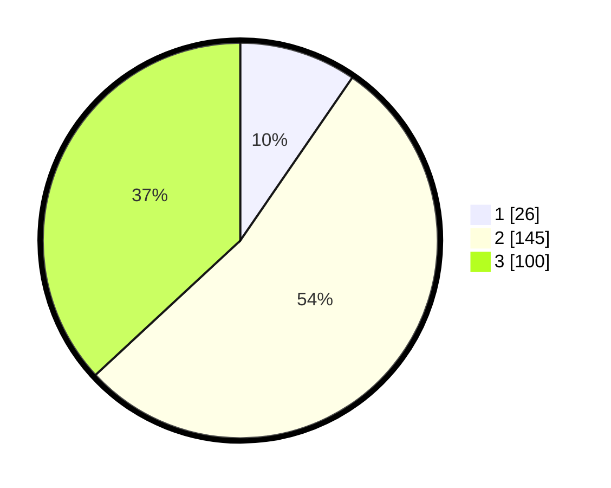

# Hasil

## Grafik

## Tabel

| No. | Nama Paslon    | Suara | Suara (raw) | Persentase |
|:--- |:-------------- | -----:| -----------:| ----------:|
| 1   | ANIES MUHAIMIN | 26    | [26][p-1]   | 9,59       |
| 2   | PRABOWO GIBRAN | 145   | [145][p-2]  | 53,51      |
| 3   | GANJAR MAHFUD  | 100   | [100][p-3]  | 36,90      |

[p-1]: https://github.com/gigit-pemilu/pemilu-2024/blob/main/pilpres/hitung-suara/sub/34-di-yogyakarta/sub/04-sleman/sub/05-seyegan/sub/2001-margoluwih/sub/011-tps/sub/paslon-1.txt
[p-2]: https://github.com/gigit-pemilu/pemilu-2024/blob/main/pilpres/hitung-suara/sub/34-di-yogyakarta/sub/04-sleman/sub/05-seyegan/sub/2001-margoluwih/sub/011-tps/sub/paslon-2.txt
[p-3]: https://github.com/gigit-pemilu/pemilu-2024/blob/main/pilpres/hitung-suara/sub/34-di-yogyakarta/sub/04-sleman/sub/05-seyegan/sub/2001-margoluwih/sub/011-tps/sub/paslon-3.txt

## Foto C Plano

https://sirekap-obj-formc.kpu.go.id/89b3/pemilu/ppwp/34/04/05/20/01/3404052001011-20240217-092410--169c1fa2-56ed-4795-9583-1f4cf74ebf7b.jpg

https://sirekap-obj-formc.kpu.go.id/89b3/pemilu/ppwp/34/04/05/20/01/3404052001011-20240217-092512--e9e94c39-0cdb-4abc-bb7f-7e043b6f0e37.jpg

https://sirekap-obj-formc.kpu.go.id/89b3/pemilu/ppwp/34/04/05/20/01/3404052001011-20240217-092558--d0f99740-11cc-49eb-8233-f7bb309d48e4.jpg

## Metadata

| Key        | Value               |
| ---------- | ------------------- |
| Time Stamp | 2024-02-19 06:16:00 |

## DATA PEMILIH TETAP

Jumlah pemilih dalam DPT: **267**.
 * L: **130**.
 * P: **137**.

## DATA PENGGUNA HAK PILIH

Jumlah pengguna hak pilih dalam DPT: **257**.
 * L: **130**.
 * P: **137**.

Jumlah pengguna hak pilih dalam DPTb: **885**.
 * L: **884**.
 * P: **882**.

Jumlah pengguna hak pilih dalam DPK: **883**.
 * L: **881**.
 * P: **882**.

Jumlah pengguna hak pilih: **275**.
 * L: **175**.
 * P: **141**.

## JUMLAH SUARA SAH DAN TIDAK SAH

JUMLAH SELURUH SUARA SAH: **271**.

JUMLAH SUARA TIDAK SAH: **5**.

JUMLAH SELURUH SUARA SAH DAN SUARA TIDAK SAH: **276**.

