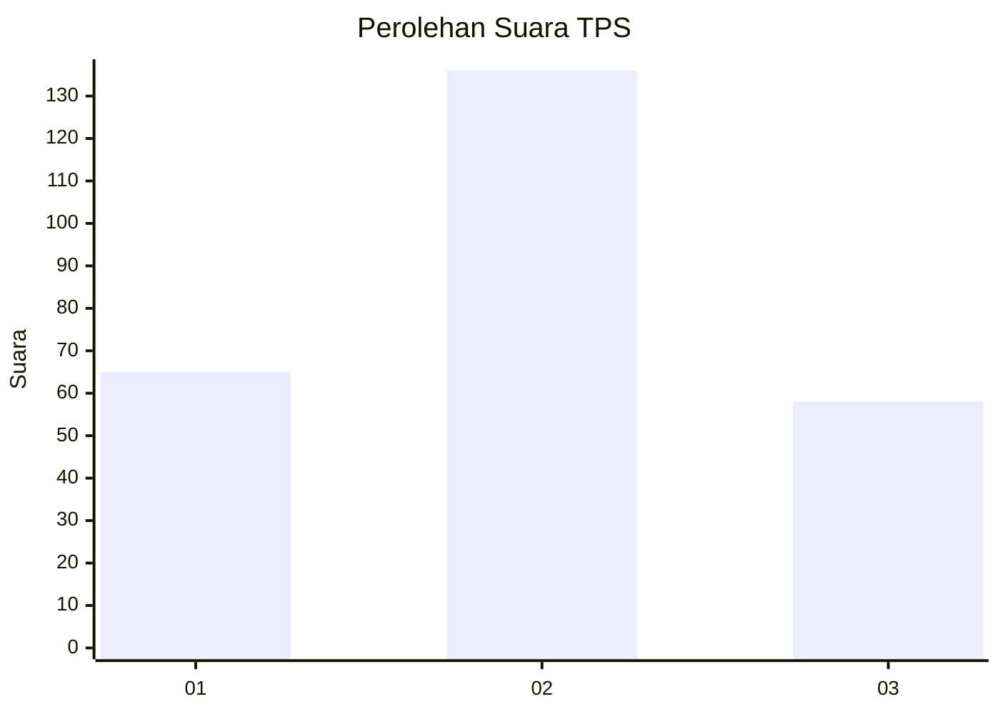
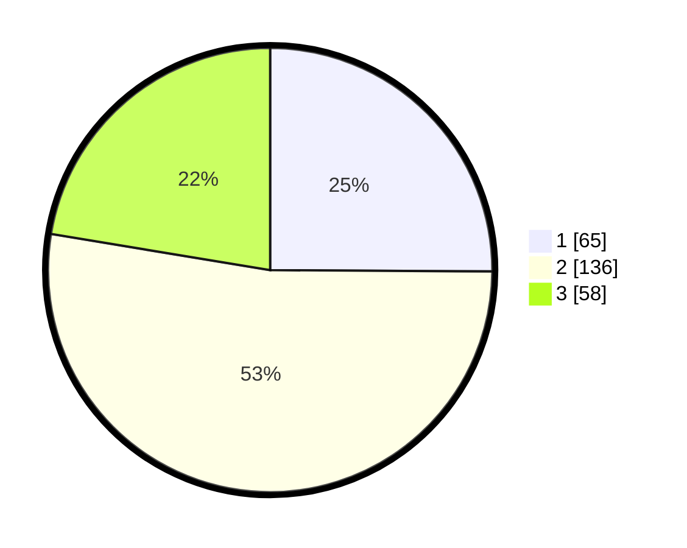

# Hasil

## Grafik

## Tabel

| No. | Nama Paslon    | Suara | Suara (raw) | Persentase |
|:--- |:-------------- | -----:| -----------:| ----------:|
| 1   | ANIES MUHAIMIN | 65    | [65][p-1]   | 25,10      |
| 2   | PRABOWO GIBRAN | 136   | [136][p-2]  | 52,51      |
| 3   | GANJAR MAHFUD  | 58    | [58][p-3]   | 22,39      |

[p-1]: https://github.com/gigit-pemilu/pemilu-2024-34-di-yogyakarta/blob/main/pilpres/hitung-suara/sub/34-di-yogyakarta/sub/04-sleman/sub/05-seyegan/sub/2001-margoluwih/sub/024-tps/sub/paslon-1.txt
[p-2]: https://github.com/gigit-pemilu/pemilu-2024-34-di-yogyakarta/blob/main/pilpres/hitung-suara/sub/34-di-yogyakarta/sub/04-sleman/sub/05-seyegan/sub/2001-margoluwih/sub/024-tps/sub/paslon-2.txt
[p-3]: https://github.com/gigit-pemilu/pemilu-2024-34-di-yogyakarta/blob/main/pilpres/hitung-suara/sub/34-di-yogyakarta/sub/04-sleman/sub/05-seyegan/sub/2001-margoluwih/sub/024-tps/sub/paslon-3.txt

## Foto C Plano

https://sirekap-obj-formc.kpu.go.id/8e6b/pemilu/ppwp/34/04/05/20/01/3404052001024-20240216-094223--c19ee8ac-1016-4835-8867-d958d5f2f763.jpg

https://sirekap-obj-formc.kpu.go.id/8e6b/pemilu/ppwp/34/04/05/20/01/3404052001024-20240215-032629--d347284b-5c74-4657-a96e-065164e05425.jpg

https://sirekap-obj-formc.kpu.go.id/8e6b/pemilu/ppwp/34/04/05/20/01/3404052001024-20240215-032655--0e74fee4-94ef-42cf-801b-233e1ba77fd2.jpg

## Metadata

| Key        | Value               |
| ---------- | ------------------- |
| Time Stamp | 2024-02-16 10:00:28 |

