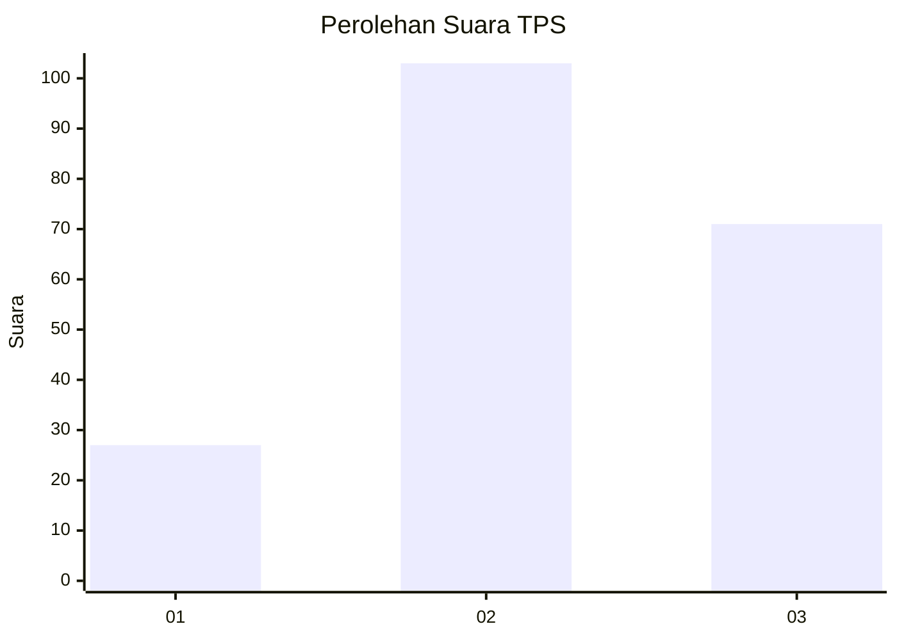
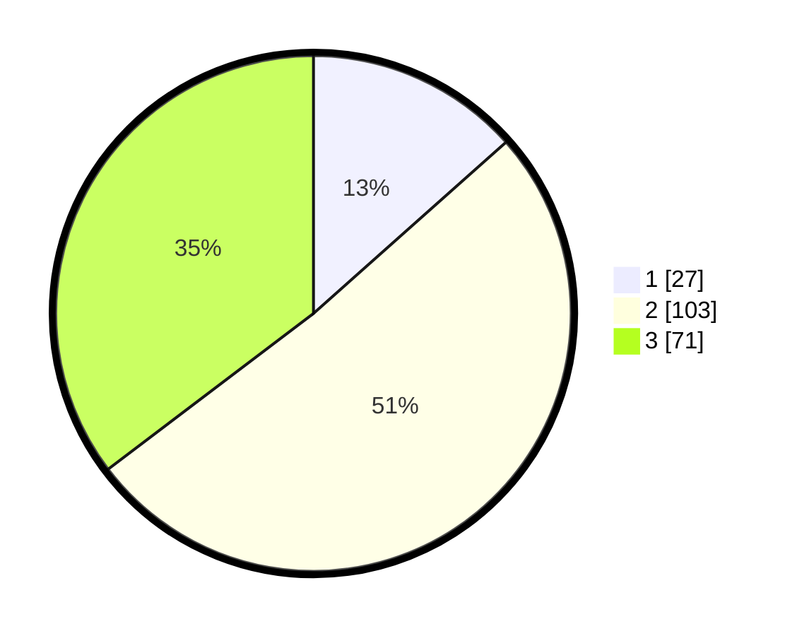

# Hasil

## Grafik

## Tabel

| No. | Nama Paslon    | Suara | Suara (raw) | Persentase |
|:--- |:-------------- | -----:| -----------:| ----------:|
| 1   | ANIES MUHAIMIN | 27    | [27][p-1]   | 13,43      |
| 2   | PRABOWO GIBRAN | 103   | [103][p-2]  | 51,24      |
| 3   | GANJAR MAHFUD  | 71    | [71][p-3]   | 35,32      |

[p-1]: https://github.com/gigit-pemilu/pemilu-2024-34-di-yogyakarta/blob/main/pilpres/hitung-suara/sub/34-di-yogyakarta/sub/04-sleman/sub/05-seyegan/sub/2001-margoluwih/sub/032-tps/sub/paslon-1.txt
[p-2]: https://github.com/gigit-pemilu/pemilu-2024-34-di-yogyakarta/blob/main/pilpres/hitung-suara/sub/34-di-yogyakarta/sub/04-sleman/sub/05-seyegan/sub/2001-margoluwih/sub/032-tps/sub/paslon-2.txt
[p-3]: https://github.com/gigit-pemilu/pemilu-2024-34-di-yogyakarta/blob/main/pilpres/hitung-suara/sub/34-di-yogyakarta/sub/04-sleman/sub/05-seyegan/sub/2001-margoluwih/sub/032-tps/sub/paslon-3.txt

## Foto C Plano

https://sirekap-obj-formc.kpu.go.id/671a/pemilu/ppwp/34/04/05/20/01/3404052001032-20240214-223843--01bcfffe-d4e6-416f-82f7-54fba58a8909.jpg

https://sirekap-obj-formc.kpu.go.id/671a/pemilu/ppwp/34/04/05/20/01/3404052001032-20240214-223428--e4419a69-d259-4b48-93f2-6b37293e5dce.jpg

https://sirekap-obj-formc.kpu.go.id/671a/pemilu/ppwp/34/04/05/20/01/3404052001032-20240214-223550--85a925ed-af6a-4f91-a791-482679367c9c.jpg

## Metadata

| Key        | Value               |
| ---------- | ------------------- |
| Time Stamp | 2024-02-15 21:30:27 |

