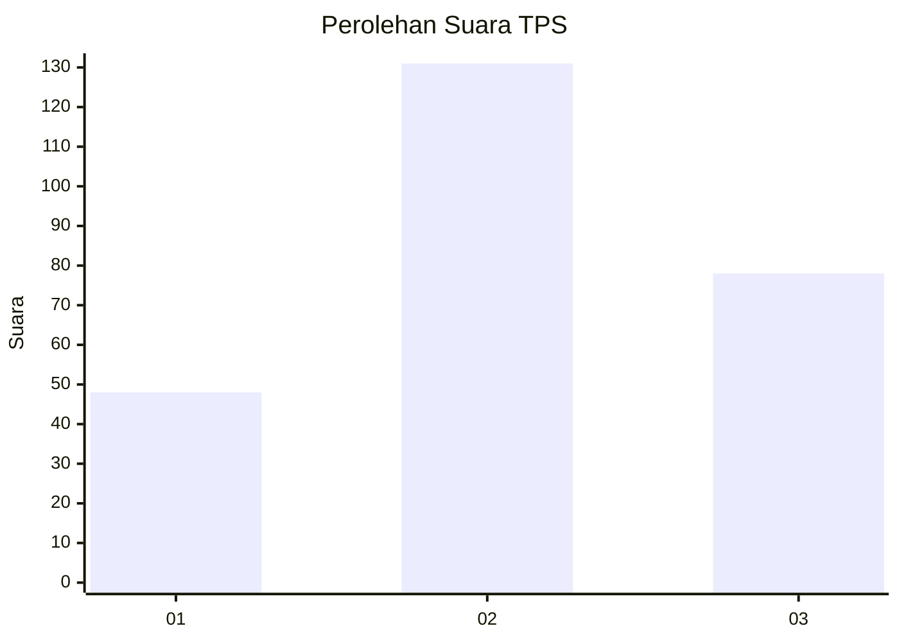
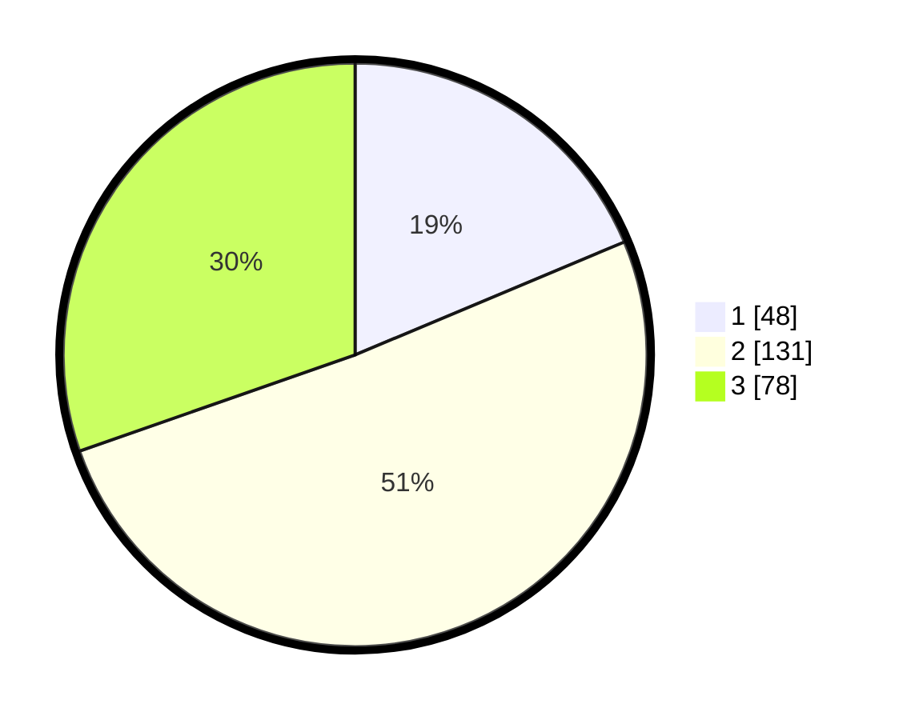

# Hasil

## Grafik

## Tabel

| No. | Nama Paslon    | Suara | Suara (raw) | Persentase |
|:--- |:-------------- | -----:| -----------:| ----------:|
| 1   | ANIES MUHAIMIN | 48    | [48][p-1]   | 18,68      |
| 2   | PRABOWO GIBRAN | 131   | [131][p-2]  | 50,97      |
| 3   | GANJAR MAHFUD  | 78    | [78][p-3]   | 30,35      |

[p-1]: https://github.com/gigit-pemilu/pemilu-2024-34-di-yogyakarta/blob/main/pilpres/hitung-suara/sub/34-di-yogyakarta/sub/04-sleman/sub/05-seyegan/sub/2002-margodadi/sub/008-tps/sub/paslon-1.txt
[p-2]: https://github.com/gigit-pemilu/pemilu-2024-34-di-yogyakarta/blob/main/pilpres/hitung-suara/sub/34-di-yogyakarta/sub/04-sleman/sub/05-seyegan/sub/2002-margodadi/sub/008-tps/sub/paslon-2.txt
[p-3]: https://github.com/gigit-pemilu/pemilu-2024-34-di-yogyakarta/blob/main/pilpres/hitung-suara/sub/34-di-yogyakarta/sub/04-sleman/sub/05-seyegan/sub/2002-margodadi/sub/008-tps/sub/paslon-3.txt

## Foto C Plano

https://sirekap-obj-formc.kpu.go.id/b28c/pemilu/ppwp/34/04/05/20/02/3404052002008-20240214-203521--df4d7dbb-026e-4b59-b12a-8a720db8c4ef.jpg

https://sirekap-obj-formc.kpu.go.id/b28c/pemilu/ppwp/34/04/05/20/02/3404052002008-20240214-203523--a30e6435-62f5-4501-9981-505075656412.jpg

https://sirekap-obj-formc.kpu.go.id/b28c/pemilu/ppwp/34/04/05/20/02/3404052002008-20240214-203527--2628b7d7-da79-491b-9931-7cef714e98f3.jpg

## Metadata

| Key        | Value               |
| ---------- | ------------------- |
| Time Stamp | 2024-02-15 15:30:25 |

